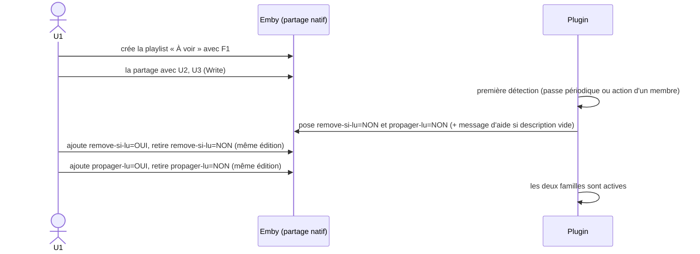
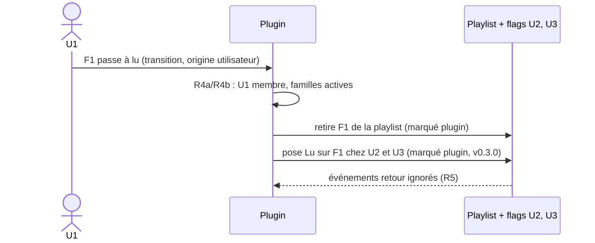
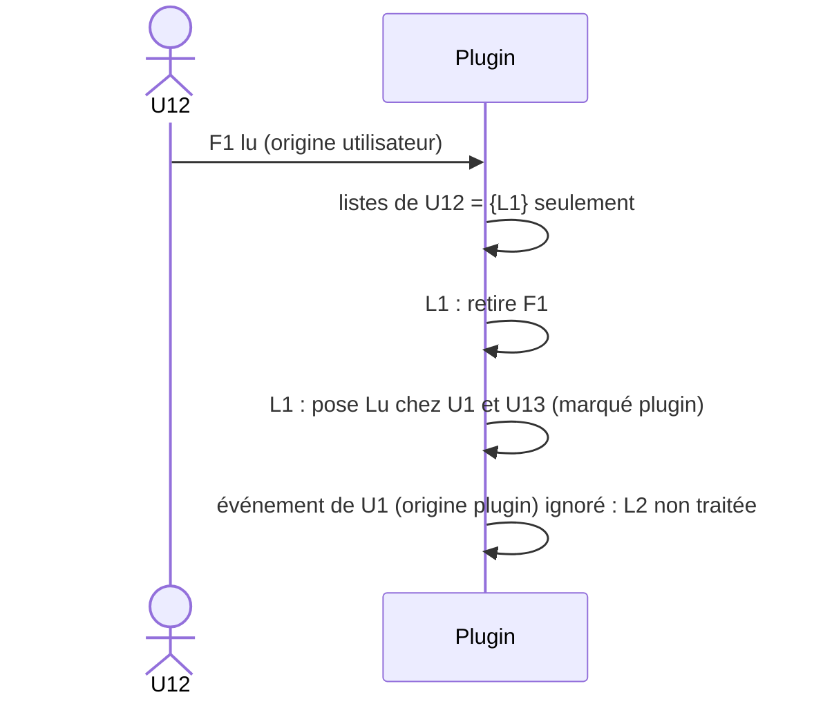
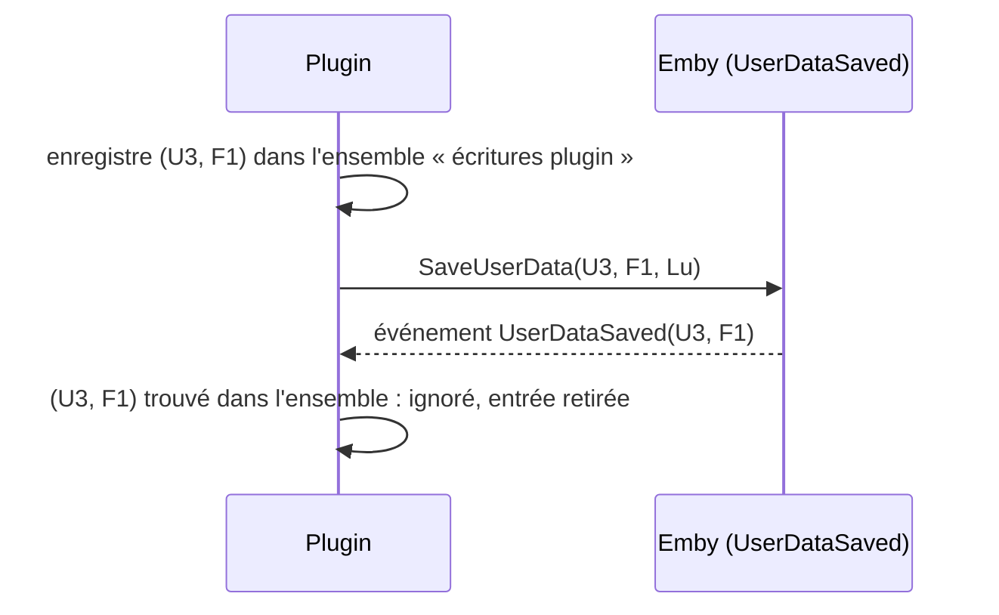
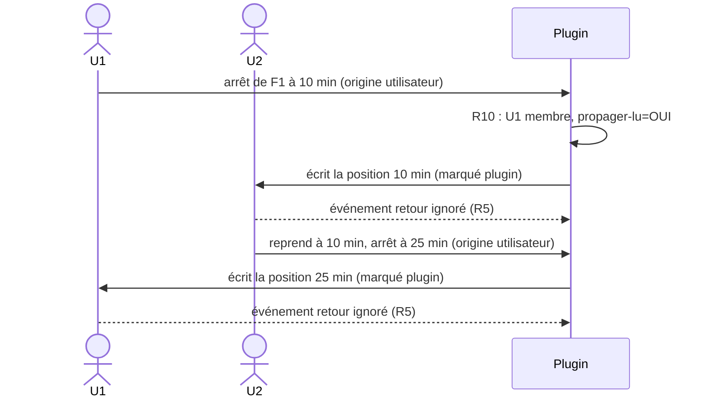

# Plugin Emby — Playlists « À voir » partagées

Document de référence fonctionnelle. Les chronogrammes ci-dessous font foi pour l'implémentation et les tests.

## 0. Résultat du spike : partage natif Emby (2026-09-26)

Analyse par réflexion des DLL de `libs/`, puis vérification à l'exécution par REST sur QUALIF (`emby2`, Emby 4.10.0.40). Le partage natif est **confirmé** (points 1 et 2 ci-dessous : OK).

| Élément du SDK | Ce que ça permet |
|---|---|
| `UserItemShare { UserId, ItemId, ShareLevel }` | Partage **natif** d'un élément avec un utilisateur |
| `UserItemShareLevel` = `None`, `Read`, `Write`, `Manage`, `ManageDelete` | Niveaux de droits : `Read` = lecture seule, `Write` = ajout/retrait, `Manage` = gérer les accès |
| `ILibraryManager.SaveUserItemShares`, `IItemRepository.GetUserItemShares` / `DeleteUserItemShares` | Créer, lister, supprimer les partages |
| `Playlist.SupportsManageAccess`, `CanManageAccess`, `CanLeaveSharedContent`, `PlaylistCreationRequest.IsPublic`, `ILibraryManager.MakePublic` | Les playlists supportent nativement le partage et la publication |
| `IPlaylistManager.AddToPlaylist` / `RemoveFromPlaylist` et événements `PlaylistItemsAdded/Removed/Moved` | Modification du contenu et écoute des changements |
| `IUserDataManager.UserDataSaved` (`UserDataSaveEventArgs { User, Item, UserData, SaveReason }`), `SaveUserData` | Écoute et écriture du flag lu |

**Conséquence de conception (confirmée pour les points 1 et 2) :** une liste partagée est **une seule playlist Emby**, partagée nativement avec les membres. Il n'y a plus de copies ni de synchronisation de contenu :
- R2 : seuls `Manage`/`ManageDelete` gèrent les accès. Donner `Write` aux membres, `Manage` au seul propriétaire.
- R3 et D1 (lecture/écriture) : assurés par Emby (niveau `Write`), sans conflit à gérer (un seul objet).
- D2 : retirer un membre = supprimer son partage ; supprimer la liste = supprimer la playlist.
- R8 : les droits de bibliothèque sont ceux d'Emby.
- **Reste à la charge du plugin** : R4a (retrait du média lu, étiquette `remove-si-lu`), R4b (propagation du flag lu, étiquette `propager-lu`), R5 (anti-écho sur les flags), R6, R7, R10 (avancement de lecture, étiquette `propager-lu`).

### Résultats à l'exécution (REST sur `emby2`)

- **Partage** : `POST /Items/Access {ItemIds, UserIds, ItemAccess}`. La playlist a le **même Id** chez tous les membres.
- **Niveaux** : `Write` ajoute et retire des médias ; `Read` est refusé (403) à l'ajout et au retrait.
- **Flag lu** : reste propre à chaque utilisateur.
- **Repartage** : un membre `Write` ne peut pas repartager (403) : R2 est assuré nativement.
- **Lister les membres** : `GET /Users/ItemAccess?ItemId=` côté propriétaire (403 pour un membre sans droit de gestion) : membres et niveau de chacun.
- **Métadonnées** : un propriétaire non admin peut modifier nom, description et étiquettes de sa playlist (`POST /Items/{Id}`, `POST /Items/{Id}/Tags/Add`, 204). Un membre `Write` reçoit un 403 (« does not have access to ManageServer feature »). Recherche par étiquette : `GET /Items?Recursive=true&IncludeItemTypes=Playlist&Tags=<étiquette>`. Les étiquettes sont dans `TagItems` (`[{Name,Id}]`), le champ `Tags` du DTO reste `null` à la lecture.

### Condition : permission du propriétaire

Le partage est **masqué** tant que la permission utilisateur `Policy.AllowSharingPersonalItems` est à `false` (valeur par défaut) : `CanManageAccess` est absent du DTO, le menu de partage n'apparaît pas, `GET /Users/ItemAccess` renvoie une liste vide, et `MakePublic` renvoie 403.

- Elle n'est requise que pour le **propriétaire**. Les destinataires n'ont rien à activer : leurs droits viennent du niveau de partage.
- Où la régler : Tableau de bord → Utilisateurs → l'utilisateur → onglet Profil (nom d'onglet non vérifié à l'écran). Libellé : « Permettre le partage de contenus personnels tels que des listes de lecture avec d'autres utilisateurs sur ce serveur ».
- Une fois cochée : menu « … » de la playlist → « Gérer la collaboration ».
- Côté REST : `POST /Users/{id}/Policy` (politique complète relue puis renvoyée, 204).
- Le niveau `ManageDelete` n'est pas la clé : il ne débloque pas le partage.
- Les champs `CanManageAccess`, `CanEditItems`, `CanLeaveContent` dépendent des `Fields` demandés : ne pas les interpréter sans préciser `Fields`.

### Résultats du spike v0.1.0 (plugin 0.1.0.1, QUALIF `emby2`)

> **Tout ce tableau est vérifié en simulation API** (appels REST, `Sessions/Playing*`, endpoints de diagnostic `Spike/*`) avec les comptes `test_u1..u3`. **Aucune lecture réelle avec un client** n'a encore été faite. Source : `_work/reports/qa-spike-20260926-144953.md` (verdict : validé avec réserves, aucun blocage de design).

| # | Incertitude | Verdict | Conséquence de design |
|---|---|---|---|
| U1 | `UserDataSaved`, `SaveReason`, distinction plugin/utilisateur | **OK** | Le moteur détecte la **transition** `played` non lu → lu, **quel que soit le `SaveReason`** (voir essais réels ci-dessous) ; `TogglePlayed` avec `played=true` en est une transition certaine. `PlaybackFinished` est **aussi émis à l'arrêt d'une lecture non terminée** (`played=false`) : toujours lire `played`. Anti-écho : une écriture du plugin est reconnue puis consommée ; l'écriture utilisateur suivante sur le même couple est vue comme utilisateur. Réserve : une écriture enregistrée dont l'événement n'est jamais émis (donnée inchangée) reste 5 min et peut marquer à tort la suivante. |
| U2 | Retrait par le plugin sur la playlist d'un autre | **OK partiel** | Le retrait est visible immédiatement par tous les membres. Les `PlaylistItemId` **ne sont pas stables** (renumérotés à chaque modification) : résoudre l'entrée **à l'instant du retrait, par `ItemId`**, et retirer les doublons **un par un** avec relecture entre chaque. L'événement `PlaylistItemsRemoved` n'expose ni utilisateur ni média. Défauts de code du spike à corriger avant le moteur (réponse `entries` toujours vide, pas de validation d'une entrée inexistante). |
| U3 | Étiquettes et description écrites par le plugin | **OK** | Format `propager-lu=NON` / `propager-lu=OUI` **validé tel quel** (`=` et casse acceptés, retrouvé par la recherche serveur `Tags=`, coexiste avec les étiquettes du propriétaire, pas de boucle : un seul `ItemUpdated` après l'écriture du plugin). « Retirer NON puis ajouter OUI » passe par un état **sans aucune étiquette** `propager-lu*` : ne jamais poser NON sur `ItemUpdated`. « Ajouter OUI puis retirer NON » passe par {NON, OUI} (inactif, sans risque). Écart mesuré entre deux sauvegardes scriptées : 1,2 s (plancher). **Délai de grâce : au moins 2 passes de réconciliation sans étiquette, soit 10 min au défaut de 5 min.** (Validé avec `propager-lu` ; le format s'applique tel quel à `remove-si-lu`.) |
| U4 | Découverte des playlists partagées | **OK partiel** | **Aucun événement** n'est émis à la création d'un partage : découverte par **scan planifié** (réconciliation), dont la période borne le délai de prise en compte. `GetUserItemShares` fonctionne côté plugin sans contexte utilisateur (propriétaire `ManageDelete`, membres `Write`/`Read`, `ownerUserId` renseigné). Un utilisateur voit aussi les playlists **publiques** d'autres comptes : à considérer à la découverte. |
| U5 | Pose de `AllowSharingPersonalItems` par le plugin | **OK** | Faisable via `IUserManager` : valeur relue par REST, aucun autre champ de `UserPolicy` modifié, restauration identique à l'état initial (D8 réalisable). L'existence d'un événement de création d'utilisateur n'est pas établie : pose au démarrage et à chaque réconciliation. |
| U6 | Création de partages par le plugin | **OK** | Non bloquant (le propriétaire partage via l'interface native). |
| U7 | Signatures SDK réelles | **OK** | Compilation Release sans erreur ni avertissement contre les DLL du SDK 4.10 ; toutes les API utilisées ont été appelées avec succès. |
| U8 | Clients TV/mobile | **Non évalué** | Manuel (voir ci-dessous). |
| U9 | Environnement de build | **OK** | Build et tests via le SDK .NET 6 Windows en local ; CI Ubuntu inchangée. |
| U10 | Avancement de lecture | **OK** | À l'**arrêt** : `SaveReason=PlaybackFinished` avec la position d'arrêt, **même non terminé** (`played=false` ; `played=true` seulement à ≥ ~98 %). À la **pause** : `PlaybackProgress` avec la position (`IsPaused`), pas de `SaveReason` dédié. Au démarrage : `PlaybackStart`. Le plugin peut écrire la position d'un **autre** utilisateur sans toucher `Played` ni `PlayCount` ; l'écriture est reconnue comme écriture du plugin ; le média apparaît dans « reprendre la lecture » de cet utilisateur, dans les deux sens ; un tiers n'est pas affecté. Aucun arbitrage de conflit : « dernière lecture gagne ». |

### Essais réels d'un utilisateur (Emby Web 4.10.0.40, Chrome/Windows, plugin 0.1.0.2)

Source : `_work/reports/qa-real-20260926-151848.md` (lecture seule du journal). Un vrai client confirme U1 et corrige la simulation :

- **`played=true` peut arriver sur un `PlaybackProgress`**, avant le `PlaybackFinished` final : le moteur réagit à la **transition** `played` faux → vrai, pas à un `SaveReason` particulier.
- **À la fin d'un média, Emby remet `PlaybackPositionTicks` à 0** avec `played=true` : ne jamais propager une position quand `played=true` (on propage le flag lu).
- Un `PlaybackStart` reprend la **position sauvegardée**, non 0 ; le client envoie un `PlaybackProgress` **immédiat à la position 0** au démarrage, et un arrêt très court donne `PlaybackFinished` avec la position 0 : à ignorer pour l'avancement.
- Arrêt en cours de lecture : `PlaybackFinished` avec la position d'arrêt et `played=false` (aucune transition, aucun retrait).
- Un membre `Write` reçoit **403 sur l'éditeur de métadonnées** de la playlist : seul le propriétaire pose ou modifie les étiquettes.
- Non vérifié en réel : saisie d'une étiquette `...=OUI` dans l'éditeur web puis lecture par le plugin (playlist supprimée pendant l'essai ; vérifié par API seulement).

### Reste à vérifier avec un vrai client (manuel, `MANUAL.md`)

- Clients TV/mobile (U8) : visibilité de la playlist partagée, ajout/retrait, refus pour un membre `Read`, édition des étiquettes possible ou non.
- Éditeur d'étiquettes du client web (« Modifier les métadonnées » > Mot-clé) : acceptation de `=` et de la casse, remplacement NON → OUI en un seul enregistrement.
- Retrait pendant la lecture d'une file de lecture (comportement du client).
- Ouverture de la page de configuration du plugin (Tableau de bord > Plugins) : des requêtes `configurationpage?name=EmbySharedPlaylist` ont renvoyé 404 pendant le spike (non élucidé).
- Avancement avec un vrai client : « reprendre » chez l'autre membre après l'écriture du plugin (v0.3.1).
- Rendu réel de l'interface (analyse du code du client web uniquement pour le reste).

### Incertitude U11 (v0.2.0) : ré-entrance

Le plugin peut-il appeler `RemoveFromPlaylist`, `UpdateToRepositoryAsync` ou `SaveUserData` **depuis** les gestionnaires `UserDataSaved`, `PlaylistItems*` et `ItemUpdated`, sans blocage, interblocage, `database is locked` ni boucle, avec une latence acceptable (cible : p95 ≤ 300 ms, max ≤ 2 s) ? Un essai technique (#52) le tranche avant le moteur et fixe le mode d'exécution définitif (§4 R12).

## 1. Vocabulaire

| Terme | Définition |
|---|---|
| **Liste partagée** | Playlist Emby native partagée avec au moins un membre autre que son propriétaire (ligne de partage explicite). Elle est **gérée** par le plugin dès qu'elle est partagée, sans liste d'identifiants à maintenir. Un propriétaire peut en avoir plusieurs, indépendantes. Les playlists **publiques** sans partage explicite sont ignorées. |
| **Membre** | Propriétaire + destinataires du partage natif (`Write` ou `Read`). |
| **Étiquette `remove-si-lu`** | Famille d'étiquettes qui active le **retrait** du média quand il passe de non lu à lu. Seule famille avec un effet en v0.2.0. |
| **Étiquette `propager-lu`** | Famille d'étiquettes qui active la **propagation** de l'état des médias (lu, avancement) aux autres membres. Posée et lue en NON dès v0.2.0 ; effet en v0.3.0 (lu) et v0.3.1 (avancement). |
| **Valeurs** | Chaque famille s'écrit `<famille>=NON` (défaut posé par le plugin, inerte) ou `<famille>=OUI` (posé par le propriétaire). Comparaison insensible à la casse, espaces tolérés autour du `=`. Les variantes voisines (`remove-si-lu=OUIX`, `remove-si-lu-oui`) et les étiquettes étrangères sont ignorées. |
| **Famille active** | `<famille>=OUI` présent et `<famille>=NON` absent. |
| **Legacy** | Playlist partagée dont la famille concernée n'est pas active : le plugin ne fait rien pour cette famille, le comportement natif d'Emby s'applique. |
| **Transition vers lu** | Passage du flag `Played` d'un couple (utilisateur, média) de non lu à lu : marquage manuel (`TogglePlayed`) ou `played` qui passe à vrai en cours ou en fin de lecture, quel que soit le `SaveReason`. |
| **Flag lu** | Champ `Played` des données utilisateur Emby, propre à un couple (utilisateur, média). |
| **Position de lecture** | Champ `PlaybackPositionTicks` des données utilisateur, propre à un couple (utilisateur, média). |
| **Origine utilisateur** | Changement fait par l'utilisateur (lecture, marquage manuel). |
| **Origine plugin** | Changement écrit par le plugin lui-même. Il est marqué et ignoré à son retour (anti-écho). |

### Machine d'états d'une famille d'étiquettes

Elle s'applique **indépendamment** à `remove-si-lu` et à `propager-lu` : aucune interdépendance (retrait sans propagation et propagation sans retrait sont valides).

| Étiquettes de la famille présentes | État | Action du plugin |
|---|---|---|
| aucune | NON par défaut (`None`) | Poser `<famille>=NON` : **immédiatement à la première détection** de la playlist ; ensuite seulement après le **délai de grâce** ; inactif |
| `=NON` seule | inactif (legacy) | rien |
| `=OUI` seule | **actif** | `remove-si-lu` : retrait à la transition vers lu ; `propager-lu` : propagation (v0.3.0 / v0.3.1) |
| `=OUI` + `=NON` | inactif (**NON l'emporte**) | rien ; **aucune étiquette n'est supprimée** |

Règles complémentaires :

- Le plugin **ne supprime jamais** une étiquette.
- Une playlist non partagée (aucun membre) n'est jamais gérée, quelle que soit l'étiquette.
- **Première détection** : la première fois que le plugin voit une playlist partagée depuis son démarrage. Elle a lieu (1) à la passe périodique, ou (2) à l'action : une transition vers lu d'un membre sur une playlist non encore vue, ou un événement d'ajout/retrait/modification sur une playlist **non encore vue**. Le plugin marque la playlist comme « vue » **avant** d'écrire, pour ne pas réagir à ses propres écritures.
- **Grâce** : pour une playlist déjà vue, une famille absente est reposée en NON seulement après **2 passes consécutives** (`GracePasses`, soit 10 min pour une passe toutes les 5 min). Le plugin ne pose **jamais** NON sur un événement `ItemUpdated` d'une playlist déjà vue.
- Conséquence pour le propriétaire : il doit **ajouter `...=OUI` et retirer `...=NON` dans la même édition** (ou ajouter OUI d'abord). Retirer NON seul puis enregistrer laisse la famille absente : NON est reposé après la grâce. Si le propriétaire supprime toutes les étiquettes d'une famille, NON est reposé après la grâce.
- Le plugin lit les étiquettes **au moment de l'événement** (relecture fraîche, pas de cache long).

### Message d'aide

Chaque fois que la description d'une playlist gérée est **vide** (à la première détection, ou après la grâce), le plugin y écrit le message suivant. Il n'écrit **jamais par-dessus** un texte existant :

```
Playlist partagée gérée par Emby Shared Playlist.
Deux étiquettes (Modifier les métadonnées > Mot-clé) règlent son comportement. Elles sont à NON par défaut : rien ne change.
- remove-si-lu=OUI : un média qui passe à « lu » est retiré de la playlist.
- propager-lu=OUI : l'état de lecture (lu, avancement) est propagé aux autres membres (fonction à venir).
Pour activer une option, remplacez NON par OUI : ajoutez l'étiquette « ...=OUI » et retirez « ...=NON » (si les deux sont présentes, NON l'emporte).
```

Le plugin ne mémorise rien : si le propriétaire vide ensuite la description, le message est **réécrit après la grâce** (comportement accepté).

## 2. Règles

| # | Règle |
|---|---|
| R1 | Ajouter/retirer un média d'une liste est **indépendant** du flag lu. |
| R2 | Seul le **propriétaire** gère les membres et les étiquettes. Un destinataire ne peut pas repartager la liste ni modifier ses métadonnées (403 natif). |
| R3 | Contenu : la playlist est **unique** et partagée nativement ; les ajouts et retraits explicites des membres `Write` sont visibles immédiatement par tous, sans réplication. |
| R4a | **Retrait (`remove-si-lu`)** : quand un membre **U** (propriétaire, `Write` ou `Read`) fait passer un média de non lu à lu (**transition**, origine utilisateur), pour **chaque playlist partagée dont U est membre, qui contient le média et dont `remove-si-lu=OUI` est actif** : toutes les entrées du média sont retirées de la playlist, **pour tous les membres**. Sinon (NON, aucune étiquette, OUI+NON), le plugin **ne fait rien** (legacy). Livrée en **v0.2.0**. |
| R4b | **Propagation du lu (`propager-lu`)** : sur la même transition, si `propager-lu=OUI` est actif, le flag lu est posé chez les autres membres. **Indépendante** de R4a (voir la matrice ci-dessous). Livrée en **v0.3.0**. |
| R4c | **Transition et relecture** : seule la **transition** non lu → lu déclenche R4a et R4b. Un média **déjà lu** que l'on relit jusqu'au bout ne déclenche **rien**. Décocher puis recocher « lu » est une transition : le média est retiré. Un arrêt en cours de lecture (`played=false`) ne déclenche rien. Sortie manuelle d'un média lu qui est resté dans la liste : décocher/recocher « lu », ou le retirer directement. |
| R5 | Un changement d'origine **plugin** ne déclenche rien (ni retrait, ni propagation). C'est ce qui garantit l'absence de transitivité entre listes. En v0.2.0 le plugin n'écrit aucune donnée utilisateur ; l'anti-écho du flag lu est livré avec la propagation (v0.3.0). |
| R6 | Seul le passage à **lu** se propage. Le retour à « non lu » ne se propage pas. |
| R7 | Si un membre a déjà le flag lu, le plugin n'y touche pas (compteur et date intacts). |
| R8 | Un média auquel un membre n'a pas accès (droits de bibliothèque) est ignoré silencieusement pour ce membre : le flag lu n'est pas posé chez lui. |
| R9 | Retirer un média (explicite ou parce que lu) ne modifie aucun flag ; les deux causes donnent le même état de liste. |
| R10 | **Avancement (D9, `propager-lu`)** : à l'arrêt ou à la pause d'une lecture par un membre (origine utilisateur), pour chaque playlist partagée contenant le média, dont il est membre et dont `propager-lu=OUI` est actif, la position de lecture (`PlaybackPositionTicks`) est écrite chez les autres membres. La **dernière lecture gagne**, dans les deux sens. Pas de transitivité entre listes. Anti-écho identique au lu (R5). **Jamais de position propagée quand `played=true`** (Emby remet la position à 0 à la fin) ni de position 0 issue du démarrage ; à la transition vers lu, R4a/R4b prennent le relais. Sans `propager-lu=OUI` : aucune écriture. Les autres données utilisateur (favori, note) ne sont pas touchées. Livrée en **v0.3.1** (issues #44–#48). |
| R11 | **Aucun état persisté** : ni fichier, ni configuration. Le plugin garde en mémoire les playlists déjà vues et les compteurs de grâce ; après un redémarrage tout repart à zéro (première détection immédiate). « Le plugin replace ce qui manque » : étiquette absente reposée, message d'aide réécrit si la description est vide. |
| R12 | **Exécution** : le traitement d'une transition est **immédiat**, dans le gestionnaire d'événement, sous un **verrou par playlist** (jamais deux verrous à la fois), **sans file**. La passe périodique et tous les gestionnaires prennent le même verrou. Le plugin n'utilise que les appels internes d'Emby (jamais de SQL). Une exception n'échappe jamais au gestionnaire. L'essai de ré-entrance (U11, #52) fixe le mode définitif : immédiat, sinon repli sur un autre fil (`Task.Run`) toujours sous le verrou. |

### Matrice des deux étiquettes

| `remove-si-lu` | `propager-lu` | Quand un membre passe un média à lu |
|---|---|---|
| NON / absent / OUI+NON | NON / absent / OUI+NON | Rien (legacy) |
| **OUI** | NON / absent / OUI+NON | Retrait de la playlist, aucun flag posé (v0.2.0) |
| NON / absent / OUI+NON | **OUI** | Flag lu posé chez les autres membres, le média **reste** dans la liste (v0.3.0) |
| **OUI** | **OUI** | Retrait + flag lu posé chez les autres membres (v0.3.0) |

## 3. Notation

- `▣ F1` : F1 est dans la playlist. `□` : F1 absent.
- `Lu` / `Nl` : flag lu posé / non posé.
- `(u)` : posé par l'utilisateur. `(p)` : posé par le plugin (ignoré au retour).
- Sauf mention contraire, les scénarios supposent `remove-si-lu=OUI` et `propager-lu=OUI` (la propagation est livrée en v0.3.0 ; en v0.2.0 seules les lignes de retrait ont lieu).

## 4. Scénarios

> Il n'y a qu'**une seule playlist** par liste, partagée nativement. Les flags lu et les positions de lecture, eux, restent propres à chaque utilisateur.

### S1 — Création, partage et pose des étiquettes

U1 crée la playlist `À voir` avec F1, la partage avec U2 et U3 (`Write`), puis active les deux options.



| t | Événement | Playlist | Étiquettes | Flag F1 U1 | U2 | U3 |
|---|---|---|---|---|---|---|
| 0 | U1 crée la playlist avec F1 | ▣ | (non partagée) | Nl | Nl | Nl |
| 1 | U1 partage avec U2, U3 | ▣ (visible par U2, U3) | aucune | Nl | Nl | Nl |
| 2 | plugin : première détection | ▣ | `remove-si-lu=NON`, `propager-lu=NON` (p) + message d'aide | Nl | Nl | Nl |
| 3 | U1 : ajoute les deux `=OUI`, retire les deux `=NON` | ▣ | `remove-si-lu=OUI`, `propager-lu=OUI` : **actives** (u) | Nl | Nl | Nl |

### S2 — Cas 1 : le propriétaire U1 lit F1 (retrait et propagation)



| t | Événement | Playlist | Flag U1 | U2 | U3 |
|---|---|---|---|---|---|
| 0 | état initial | ▣ | Nl | Nl | Nl |
| 1 | U1 lit F1 jusqu'au bout | ▣ | Lu (u) | Nl | Nl |
| 2 | plugin : retrait (R4a) | □ (p) | Lu | Nl | Nl |
| 3 | plugin : propagation lu (R4b, v0.3.0) | □ | Lu | Lu (p) | Lu (p) |
| 4 | retours d'événements | □ | Lu | Lu | Lu (ignorés) |

### S3 — Cas 2 : le destinataire U2 lit F1

| t | Événement | Playlist | Flag U1 | U2 | U3 |
|---|---|---|---|---|---|
| 0 | état initial | ▣ | Nl | Nl | Nl |
| 1 | U2 lit F1 | ▣ | Nl | Lu (u) | Nl |
| 2 | plugin : retrait (R4a) | □ (p) | Nl | Lu | Nl |
| 3 | plugin : propagation lu (R4b, v0.3.0) | □ | Lu (p) | Lu | Lu (p) |
| 4 | retours d'événements | □ | Lu | Lu | Lu (ignorés) |

Un membre `Read` (U3) qui passe F1 à lu déclenche aussi le retrait : la playlist étant unique, F1 disparaît pour tous.

### S3b — Retrait seul (v0.2.0) : `remove-si-lu=OUI`, `propager-lu=NON`

| t | Événement | Playlist | Flag U1 | U2 | U3 |
|---|---|---|---|---|---|
| 0 | état initial | ▣ | Nl | Nl | Nl |
| 1 | U2 lit F1 jusqu'au bout | ▣ | Nl | Lu (u) | Nl |
| 2 | plugin : retrait (R4a) | □ (p) | Nl | Lu | Nl |

Aucun flag posé chez U1 et U3 : sans `propager-lu=OUI`, l'état de lecture n'est pas propagé.

### S3c — Propagation seule (v0.3.0) : `remove-si-lu=NON`, `propager-lu=OUI`

| t | Événement | Playlist | Flag U1 | U2 | U3 |
|---|---|---|---|---|---|
| 0 | état initial | ▣ | Nl | Nl | Nl |
| 1 | U2 lit F1 jusqu'au bout | ▣ | Nl | Lu (u) | Nl |
| 2 | plugin : propagation lu (R4b) | ▣ | Lu (p) | Lu | Lu (p) |

F1 reste dans la liste : le retrait dépend uniquement de `remove-si-lu`.

### S3d — Legacy : aucune étiquette `=OUI`

| t | Événement | Playlist | Flag U1 | U2 | U3 |
|---|---|---|---|---|---|
| 0 | état initial (`=NON` posées, ou `OUI`+`NON`) | ▣ | Nl | Nl | Nl |
| 1 | U2 lit F1 jusqu'au bout | ▣ | Nl | Lu (u) | Nl |

Le plugin ne fait rien : F1 reste dans la liste, aucun flag posé (comportement natif d'Emby).

### S3e — Transition et relecture (R4c)

`remove-si-lu=OUI`. F1 est ▣ dans la playlist alors que U2 l'a déjà lu (ajouté après coup).

| t | Événement | Playlist | Flag U2 | Effet |
|---|---|---|---|---|
| 0 | F1 est ▣, U2 l'a déjà lu (`Lu`) | ▣ | Lu | — |
| 1 | U2 relit F1 jusqu'au bout | ▣ | Lu | Aucune transition : **rien** |
| 2 | U2 décoche « lu » | ▣ | Nl | Aucune transition vers lu : rien |
| 3 | U2 recoche « lu » (`TogglePlayed`) | □ (p) | Lu | Transition : retrait |
| 4 | U2 arrête un autre média F2 à 47 % (`played=false`) | ▣ F2 | Nl | Rien |

### S4 — Retrait explicite par le propriétaire (aucun flag)

| t | Événement | Playlist | Flag U1 | U2 | U3 |
|---|---|---|---|---|---|
| 0 | état initial | ▣ | Nl | Nl | Nl |
| 1 | U1 retire F1 de sa playlist | □ (u) | Nl | Nl | Nl |

Le retrait est natif : U2 et U3 voient immédiatement la playlist sans F1. Aucun flag n'est modifié (R1, R9).

### S5 — Repartage et étiquettes interdits aux destinataires

| t | Événement | Résultat |
|---|---|---|
| 1 | U2 (`Write`) tente de partager la playlist avec U4 | Refusé (403 natif). Seul U1 modifie les membres (R2). |
| 2 | U2 (`Write`) tente de modifier les étiquettes de la playlist | Refusé (403 natif). Seul le propriétaire pose les étiquettes. |

### S6 — Plusieurs listes, sans transitivité

Configuration :
- **L1** : propriétaire U1, membres U12, U13.
- **L2** : propriétaire U1, membres U21, U23.
- Les deux playlists portent `remove-si-lu=OUI` et `propager-lu=OUI` (propagation : v0.3.0). F1 est dans L1 et dans L2. Le flag lu de F1 est noté par utilisateur.

État initial :

| Liste | Playlist |
|---|---|
| L1 | ▣ (membres U1, U12, U13) |
| L2 | ▣ (membres U1, U21, U23) |

Flags : tous `Nl`.

#### S6a — U12 lit F1 (transition non lu → lu)



| t | Événement | L1 | L2 | Flag U1 | U12 | U13 | U21 | U23 |
|---|---|---|---|---|---|---|---|---|
| 0 | état initial | ▣ | ▣ | Nl | Nl | Nl | Nl | Nl |
| 1 | U12 lit F1 | ▣ | ▣ | Nl | Lu (u) | Nl | Nl | Nl |
| 2 | plugin : retrait dans L1 | □ | ▣ | Nl | Lu | Nl | Nl | Nl |
| 3 | plugin : propagation à U1, U13 | □ | ▣ | Lu (p) | Lu | Lu (p) | Nl | Nl |
| 4 | retour de U1 ignoré (R5) | □ | ▣ | Lu | Lu | Lu | Nl | Nl |

Conséquence acceptée : U1 a le flag lu mais F1 reste dans L2 (pas de transitivité). L2 n'est pas modifiée.

#### S6b — U1 lit F1 (à partir de l'état initial)

U1 est membre de L1 et L2, donc les deux listes sont traitées.

| t | Événement | L1 | L2 | Flag U1 | U12 | U13 | U21 | U23 |
|---|---|---|---|---|---|---|---|---|
| 0 | état initial | ▣ | ▣ | Nl | Nl | Nl | Nl | Nl |
| 1 | U1 lit F1 | ▣ | ▣ | Lu (u) | Nl | Nl | Nl | Nl |
| 2 | plugin : retrait dans L1 et L2 | □ | □ | Lu | Nl | Nl | Nl | Nl |
| 3 | plugin : propagation | □ | □ | Lu | Lu (p) | Lu (p) | Lu (p) | Lu (p) |

#### S6c — U21 lit F1 (à partir de l'état initial)

| t | Événement | L1 | L2 | Flag U1 | U12 | U13 | U21 | U23 |
|---|---|---|---|---|---|---|---|---|
| 1 | U21 lit F1 | ▣ | ▣ | Nl | Nl | Nl | Lu (u) | Nl |
| 2 | plugin : retrait dans L2 | ▣ | □ | Nl | Nl | Nl | Lu | Nl |
| 3 | plugin : propagation | ▣ | □ | Lu (p) | Nl | Nl | Lu | Lu (p) |

L1 n'est pas modifiée.

### S7 — Anti-écho : un flag posé par le plugin ne déclenche rien (livré avec la propagation, v0.3.0)



### S8 — Cas limites

| Cas | Comportement attendu |
|---|---|
| Membre a déjà Lu sur F1 | Ni compteur ni date modifiés (R7). |
| U3 repasse F1 en « non lu » | Non propagé (R6). F1 déjà retiré de la liste, il n'y revient pas. |
| F1 déjà lu par U3 avant l'ajout à la liste | Ajouté normalement (R1). Il n'est retiré qu'à une **transition** vers lu (R4c). |
| Média présent plusieurs fois dans la playlist | Toutes les entrées sont retirées, une à la fois (entrée résolue par `ItemId`, relecture entre chaque). |
| Membre sans accès à F1 | Le flag lu n'est pas posé chez lui (R8). |
| Famille non active (`=NON`, aucune étiquette, OUI+NON) | Legacy pour cette famille : le plugin ne fait rien (ni retrait, ni flag, ni position). |
| `=OUI` + `=NON` | **NON l'emporte** : inactif. Le plugin ne supprime aucune étiquette. |
| Aucune étiquette d'une famille | Le plugin pose `<famille>=NON` (première détection, ou après la grâce) et traite la famille comme NON. |
| Propriétaire supprime toutes les étiquettes d'une famille | NON est reposé après la grâce (2 passes). |
| Propriétaire retire NON puis ajoute OUI en deux sauvegardes | La famille n'est pas reposée pendant la grâce (jamais sur `ItemUpdated` d'une playlist vue) : le remplacement aboutit. |
| Propriétaire vide la description | Le message d'aide est réécrit après la grâce (accepté). Un texte existant n'est jamais écrasé. |
| Playlist non partagée, ou publique sans partage explicite | Jamais gérée, quelle que soit l'étiquette. |
| Membre `Read` fait passer F1 à lu | Retrait pour tous (si `remove-si-lu=OUI`). |
| Retrait d'un membre du partage | Le partage natif est supprimé pour ce membre (D2). |
| Suppression de la playlist | La playlist est supprimée pour tous (D2). |
| Redémarrage du serveur | Aucun état persisté : première détection immédiate de toutes les playlists partagées, sans doublon d'étiquette. |
| Évènements simultanés sur la même playlist | Sérialisés par le verrou de la playlist : chaque retrait est appliqué une seule fois. |
| Écho des écritures du plugin (`ItemUpdated`, `PlaylistItemsRemoved`) | Ignoré (playlist déjà vue, drapeau de ré-entrance). |

### S9 — Avancement : U1 commence, U2 poursuit (R10)

U1 et U2 sont membres de la playlist `À voir` (`propager-lu=OUI` seule) qui contient F1.



| t | Événement | Playlist | Position U1 | Position U2 |
|---|---|---|---|---|
| 0 | état initial | ▣ | 0 | 0 |
| 1 | U1 lit F1 et arrête à 10 min | ▣ | 10 min (u) | 0 |
| 2 | plugin : propagation de l'avancement | ▣ | 10 min | 10 min (p) |
| 3 | retour d'événement | ▣ | 10 min | 10 min (ignoré) |
| 4 | U2 reprend à 10 min, arrête à 25 min | ▣ | 10 min | 25 min (u) |
| 5 | plugin : propagation (dernière lecture gagne) | ▣ | 25 min (p) | 25 min |
| 6 | retour d'événement | ▣ | 25 min | 25 min (ignoré) |
| 7 | U2 termine F1 (transition non lu → lu) | ▣ | 25 min | Lu (u) |
| 8 | plugin : règles du lu (R4a retrait si `remove-si-lu=OUI`, R4b propagation) | □ (p) | Lu (p) | Lu |

Sans `propager-lu=OUI` seule, seules les lignes des actions utilisateur ont lieu : aucune écriture du plugin. Propagation livrée en **v0.3.1** (#44–#48) ; comportement de `SaveReason`, écriture pour un autre utilisateur et « reprendre la lecture » à valider par le spike U10 (#44).

## 5. Algorithme de référence (lecture)

```
sur UserDataSaved(user, item, saveReason, played):
    si (user, item) ∈ écritures_plugin:                    # v0.3.0
        retirer de l'ensemble ; return                     # R5
    si non transition_vers_lu(user, item, saveReason, played): return   # chemin rapide en mémoire
    pour chaque playlist L partagée où user ∈ L.membres et item ∈ L:
        prendre le verrou de L ; relire L (étiquettes, contenu)
        si L non vue: première_détection(L)                 # pose des défauts, L marquée vue avant d'écrire
        si famille(L, remove-si-lu) = OUI:                  # R4a
            tant qu'une entrée de item existe (plafond 50):
                relire ; retirer une entrée résolue par ItemId
        si famille(L, propager-lu) = OUI:                   # R4b (v0.3.0)
            pour chaque m ∈ L.membres \ {user}:
                si non Played(m, item) et accès(m, item):
                    marquer (m, item) ; SaveUserData(m, item, Played)   # R7, R8
        libérer le verrou

transition_vers_lu(user, item, saveReason, played):
    si saveReason = PlaybackStart: mémoriser played du couple ; return faux
    si saveReason = TogglePlayed et played: return vrai
    si played et dernière valeur connue ≠ vrai: mémoriser ; return vrai   # inconnue = transition (retrait idempotent)
    mémoriser played ; return faux                          # déjà lu relu : aucune transition (R4c)

sur UserDataSaved (arrêt/pause, played = faux, position > 0), si propager-lu(L) = OUI:   # R10 (v0.3.1)
    pour chaque m ∈ L.membres \ {user} avec accès: SaveUserData(m, item, PlaybackPositionTicks)

famille(L, f):
    tags = étiquettes de L (casse ignorée, espaces autour de « = » tolérés)
    si "f=NON" ∈ tags: return NON                           # NON l'emporte
    si "f=OUI" ∈ tags: return OUI
    return NON                                              # absente : NON posé par le plugin

première_détection(L):                                      # sous le verrou de L, une seule lecture-écriture
    pour chaque famille f absente: ajouter "f=NON"
    si description vide: écrire le message d'aide
    # jamais de suppression ; chaque ajout re-vérifié au moment de l'écriture

passe périodique (tâche planifiée Emby : démarrage + 5 min):
    pour chaque playlist L partagée (GetUserItemShares), sous son verrou:
        si L non vue: première_détection(L)
        sinon:
            pour chaque famille absente: compteur++ ; à 2 passes consécutives: ajouter "f=NON" ; compteur = 0
            si description vide: idem (compteur « description »)
        # jamais de pose sur ItemUpdated d'une playlist vue ; jamais de suppression d'étiquette
```

## 6. Décisions (2026-09-26)

| # | Décision |
|---|---|
| D1 | **Droits : lecture/écriture pour les membres `Write`**, assurés par le partage natif d'Emby sur une playlist unique. Seul le propriétaire gère les membres et les étiquettes (R2). |
| D2 | **Fin de partage** : retirer un membre supprime son partage natif ; supprimer la liste supprime la playlist. |
| D3 | **Deux familles d'étiquettes indépendantes** (`remove-si-lu` pour le retrait, `propager-lu` pour la propagation de l'état des médias). L'ancienne règle « `propager-lu` = retrait » est **abandonnée**. Pour chaque famille : sans `=OUI` seule, le plugin ne fait rien (legacy) ; **NON l'emporte** sur OUI ; le plugin **ne supprime jamais** d'étiquette ; famille absente = NON posé (première détection immédiate, ensuite après 2 passes, jamais sur `ItemUpdated` d'une playlist déjà vue). |
| D4 | **Version d'Emby Server : celle des DLL de `libs/`** (identiques à `Emby_Badges`). |
| D5 | **Site marketing : oui** (`marketing.site = "auto"`). |
| D6 | **Playlist « gérée » = partagée avec au moins un membre** autre que le propriétaire. Aucune liste d'identifiants dans la config du plugin. |
| D7 | **Permission propriétaire** : `AllowSharingPersonalItems` requise pour le propriétaire uniquement (voir §0). |
| D8 | **Permission posée automatiquement** : le plugin pose `AllowSharingPersonalItems=true` pour tous les utilisateurs (existants et nouveaux), avec un interrupteur de configuration (`AutoEnableSharing`, **actif par défaut**). Désactiver l'interrupteur **ne révoque rien**. Cette décision **élargit les droits** des utilisateurs : à auditer (issue #29). Livrée en v0.4.0. |
| D9 | **Avancement de lecture** : la position de lecture est propagée aux autres membres quand `propager-lu=OUI` est actif (R10). Dernière lecture gagne, pas de transitivité, anti-écho identique au lu. Livrée en v0.3.1. |
| D10 | **Retrait sur la transition non lu → lu** (R4c) : marquage manuel, ou `played` qui passe à vrai en cours/fin de lecture quel que soit le `SaveReason`. Un média déjà lu relu ne déclenche rien ; décocher puis recocher « lu » retire. Un membre en lecture seule (`Read`) déclenche le retrait pour tous. Les playlists publiques sans partage explicite sont ignorées. |
| D11 | **Aucun état persisté** (R11) : mémoire seulement (playlists vues, compteurs de grâce). « Le plugin replace ce qui manque » : une description vidée ou des étiquettes supprimées sont reposées après la grâce (accepté). |
| D12 | **Exécution immédiate sous verrou par playlist, sans file** (R12), appels internes d'Emby uniquement ; passe périodique pour ce qu'aucun événement ne signale (partage créé sans action, repose après grâce). Mode définitif fixé par l'essai de ré-entrance U11 (#52). |
| D13 | **Message d'aide** (FR seul) écrit chaque fois que la description est vide, jamais par-dessus un texte. **Effet visible au démarrage de v0.2.0** : pose des deux `=NON` et du message sur **toutes** les playlists partagées existantes, comptes réels inclus. |
| D14 | **v0.2.0 reste en QUALIF seulement.** La propagation du lu (v0.3.0, #20) est indépendante de `remove-si-lu` (matrice 2×2) ; la propagation de l'avancement est en v0.3.1 (#45). |

## 7. Points ouverts

1. **Ré-entrance (U11, #52)** : mode d'exécution définitif (immédiat dans le gestionnaire, ou repli `Task.Run` sous verrou) selon l'essai (latence p95 ≤ 300 ms, aucun `database is locked`, aucune boucle).
2. **Clients** : TV/mobile (U8), édition des étiquettes (`=`, casse, remplacement NON → OUI en une sauvegarde) dans l'éditeur web réel et sur TV/mobile, page de configuration du plugin (404 observé), retrait pendant la lecture d'une file.
3. **Période de réconciliation** : c'est celle de la tâche planifiée Emby (défaut 5 min, modifiable au tableau de bord), non un champ de configuration du plugin ; elle borne le délai de prise en compte d'un nouveau partage et la grâce (2 passes).
4. **Message d'aide en v0.3.0** : mettre à jour le texte « fonction à venir » uniquement si la description est encore identique au message de v0.2.0, ou ne rien toucher (à trancher par l'utilisateur).
5. **Anti-écho** (v0.3.0, #21) : une entrée d'écriture plugin dont l'événement n'est jamais émis reste 5 min et peut marquer à tort l'écriture utilisateur suivante.
6. **D8 (v0.4.0)** : comptes désactivés et profils enfants inclus ? Appliquer une seule fois par utilisateur pour respecter un décochage volontaire ? Événement de création d'utilisateur non établi.
7. **Avancement (D9, v0.3.1)** : seuil minimal de position, lectures simultanées, comportement près de la fin.
8. **Langue du message d'aide** : français seul jusqu'à la localisation FR/EN.

## 8. Guide utilisateur

### Prérequis

Pour partager une playlist, son **propriétaire** doit avoir la permission « Permettre le partage de contenus personnels tels que des listes de lecture avec d'autres utilisateurs sur ce serveur » (désactivée par défaut dans Emby). Un administrateur la coche dans : Tableau de bord → Utilisateurs → l'utilisateur → onglet Profil. Les destinataires n'ont rien à activer. *(Une pose automatique par le plugin est prévue en v0.4.0.)*

### Partager une liste

1. Le propriétaire crée sa playlist « À voir ».
2. Menu « … » de la playlist → **Gérer la collaboration**.
3. Choisir pour chaque utilisateur le niveau **Écriture** (peut ajouter et retirer des médias) ou **Lecture** (consultation seule).

Seul le propriétaire gère les membres. Un membre en écriture ne peut ni repartager la liste ni modifier son nom, sa description ou ses **étiquettes**.

### Ce que fait le plugin sur une liste partagée

Dès qu'une playlist est partagée, le plugin lui ajoute deux étiquettes, **`remove-si-lu=NON`** et **`propager-lu=NON`**, et, si la description est vide, un message d'aide (voir §1). **Tant que les étiquettes sont à `NON`, rien ne change** : Emby se comporte comme d'habitude. Au démarrage de la version 0.2.0, ces étiquettes et ce message sont posés sur toutes les playlists déjà partagées.

### Activer une option

**Remplacez `NON` par `OUI`** pour l'option voulue :

1. Menu « … » de la playlist → **Modifier les métadonnées**.
2. Section **Mot-clé** (Étiquette) → **Ajouter** `remove-si-lu=OUI` (ou `propager-lu=OUI`), et **retirer** `remove-si-lu=NON` (ou `propager-lu=NON`), **dans la même édition**.
3. Enregistrer. Sans `OUI`, rien ne change.

Les deux options sont indépendantes :
- **`remove-si-lu=OUI`** : quand un membre (propriétaire, écriture ou lecture) fait passer un média à « lu », il est **retiré de la liste pour tous** ;
- **`propager-lu=OUI`** : l'état de lecture est **copié chez les autres membres** : le « lu » (version 0.3.0) et la position de lecture à l'arrêt ou à la pause (version 0.3.1) : commencez avec un compte, poursuivez avec l'autre (la dernière lecture gagne).

Bon à savoir :
- Seul le **propriétaire** peut modifier les étiquettes.
- Seule la **transition** non lu → lu retire le média : relire jusqu'au bout un média déjà lu ne le retire pas. Pour sortir à la main un média lu resté dans la liste, décochez puis recochez « lu », ou retirez-le directement.
- Si `OUI` et `NON` sont présents ensemble, **NON l'emporte** : rien ne se passe. Le plugin ne supprime jamais vos étiquettes.
- Retirer `NON` seul ne suffit pas : ajoutez `OUI`. Si vous supprimez toutes les étiquettes d'une option, le plugin repose `NON` après quelques minutes (10 min environ) ; de même, le message d'aide est réécrit si vous videz la description.
- La casse et les espaces autour du `=` sont sans importance.
- Les playlists publiques non partagées explicitement sont ignorées.

### Limites

Ces écrans sont décrits d'après le code du client web (non testés dans un navigateur) ; le comportement des applis TV et mobile (visibilité, retrait, édition des étiquettes, reprise de lecture) n'est pas vérifié.
