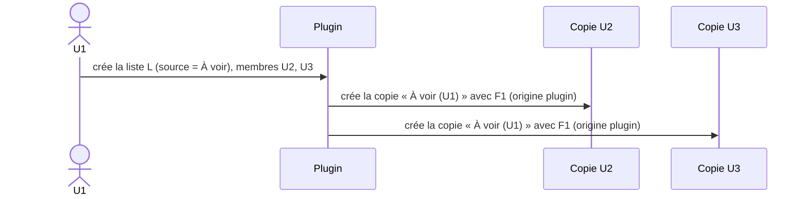
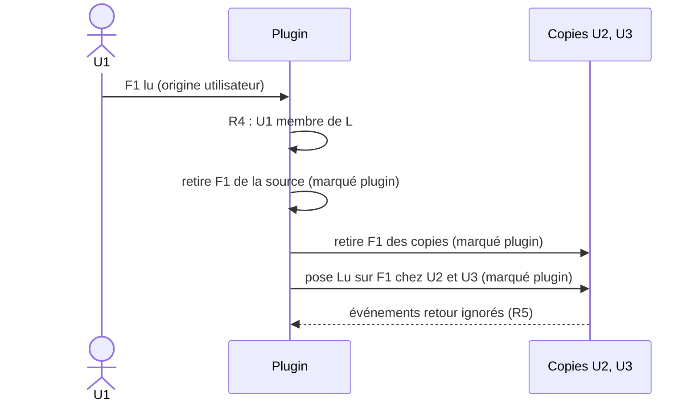
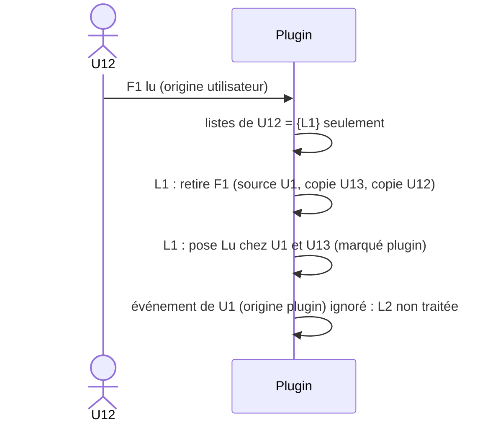
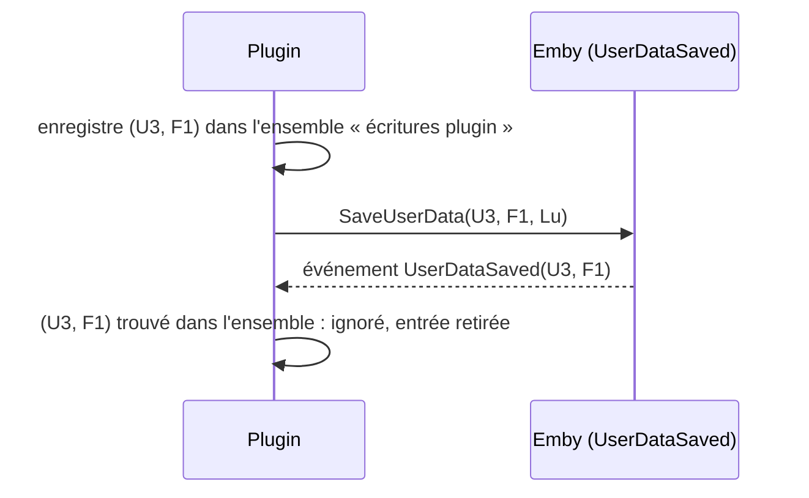

# Plugin Emby — Playlists « À voir » partagées

Document de référence fonctionnelle. Les chronogrammes ci-dessous font foi pour l'implémentation et les tests.

## 0. Résultat du spike : partage natif Emby (2026-09-26)

Analyse par réflexion des DLL de `libs/`, puis vérification à l'exécution par REST sur QUALIF (`emby2`, Emby 4.10.0.40). Le partage natif est **confirmé** (points 1 et 2 ci-dessous : OK).

| Élément du SDK | Ce que ça permet |
|---|---|
| `UserItemShare { UserId, ItemId, ShareLevel }` | Partage **natif** d'un élément avec un utilisateur |
| `UserItemShareLevel` = `None`, `Read`, `Write`, `Manage`, `ManageDelete` | Niveaux de droits : `Read` = lecture seule, `Write` = ajout/retrait, `Manage` = gérer les accès |
| `ILibraryManager.SaveUserItemShares`, `IItemRepository.GetUserItemShares` / `DeleteUserItemShares` | Créer, lister, supprimer les partages |
| `Playlist.SupportsManageAccess`, `CanManageAccess`, `CanLeaveSharedContent`, `PlaylistCreationRequest.IsPublic`, `ILibraryManager.MakePublic` | Les playlists supportent nativement le partage et la publication |
| `IPlaylistManager.AddToPlaylist` / `RemoveFromPlaylist` et événements `PlaylistItemsAdded/Removed/Moved` | Modification du contenu et écoute des changements |
| `IUserDataManager.UserDataSaved` (`UserDataSaveEventArgs { User, Item, UserData, SaveReason }`), `SaveUserData` | Écoute et écriture du flag lu |

**Conséquence de conception (confirmée pour les points 1 et 2) :** une liste partagée est **une seule playlist Emby**, partagée nativement avec les membres. Il n'y a plus de copies ni de synchronisation de contenu :
- R2 : seuls `Manage`/`ManageDelete` gèrent les accès. Donner `Write` aux membres, `Manage` au seul propriétaire.
- R3 et D1 (lecture/écriture) : assurés par Emby (niveau `Write`), sans conflit à gérer (un seul objet).
- D2 : retirer un membre = supprimer son partage ; supprimer la liste = supprimer la playlist.
- R8 : les droits de bibliothèque sont ceux d'Emby.
- **Reste à la charge du plugin** : R4 (retrait d'un média lu de toute playlist gérée dont l'utilisateur est membre, propagation du flag lu si la playlist porte l'étiquette `propager-lu`), R5 (anti-écho sur les flags), R6, R7.

### Résultats à l'exécution (REST sur `emby2`)

- **Partage** : `POST /Items/Access {ItemIds, UserIds, ItemAccess}`. La playlist a le **même Id** chez tous les membres.
- **Niveaux** : `Write` ajoute et retire des médias ; `Read` est refusé (403) à l'ajout et au retrait.
- **Flag lu** : reste propre à chaque utilisateur.
- **Repartage** : un membre `Write` ne peut pas repartager (403) : R2 est assuré nativement.
- **Lister les membres** : `GET /Users/ItemAccess?ItemId=` côté propriétaire (403 pour un membre sans droit de gestion) : membres et niveau de chacun.
- **Métadonnées** : un propriétaire non admin peut modifier nom, description et étiquettes de sa playlist (`POST /Items/{Id}`, `POST /Items/{Id}/Tags/Add`, 204). Un membre `Write` reçoit un 403 (« does not have access to ManageServer feature »). Recherche par étiquette : `GET /Items?Recursive=true&IncludeItemTypes=Playlist&Tags=<étiquette>`. Les étiquettes sont dans `TagItems` (`[{Name,Id}]`), le champ `Tags` du DTO reste `null` à la lecture.

### Condition : permission du propriétaire

Le partage est **masqué** tant que la permission utilisateur `Policy.AllowSharingPersonalItems` est à `false` (valeur par défaut) : `CanManageAccess` est absent du DTO, le menu de partage n'apparaît pas, `GET /Users/ItemAccess` renvoie une liste vide, et `MakePublic` renvoie 403.

- Elle n'est requise que pour le **propriétaire**. Les destinataires n'ont rien à activer : leurs droits viennent du niveau de partage.
- Où la régler : Tableau de bord → Utilisateurs → l'utilisateur → onglet Profil (nom d'onglet non vérifié à l'écran). Libellé : « Permettre le partage de contenus personnels tels que des listes de lecture avec d'autres utilisateurs sur ce serveur ».
- Une fois cochée : menu « … » de la playlist → « Gérer la collaboration ».
- Côté REST : `POST /Users/{id}/Policy` (politique complète relue puis renvoyée, 204).
- Le niveau `ManageDelete` n'est pas la clé : il ne débloque pas le partage.
- Les champs `CanManageAccess`, `CanEditItems`, `CanLeaveContent` dépendent des `Fields` demandés : ne pas les interpréter sans préciser `Fields`.

### Non vérifié

- Rendu réel de l'interface (analyse du code du client web uniquement, pas de navigateur).
- Applis TV et mobile.
- Pose de la permission depuis le plugin C# (`IUserManager`, mise à jour de la `UserPolicy`).
- Points 3 à 5 de la liste initiale : création des partages et retrait par le plugin (`SaveUserItemShares`, `RemoveFromPlaylist`), comportement de `UserDataSaved` et de `SaveReason`, identification des playlists gérées (résolu par la décision D3/D6 : partagée = gérée, voir §6).

## 1. Vocabulaire

| Terme | Définition |
|---|---|
| **Liste partagée** | Playlist Emby partagée avec au moins un membre (plus de liste d'identifiants dans la config du plugin). Un propriétaire peut en avoir plusieurs, indépendantes. |
| **Étiquette `propager-lu`** | Étiquette posée par le propriétaire sur sa playlist pour activer la propagation du flag lu (comparaison insensible à la casse). |
| **Playlist source** | Playlist Emby native du propriétaire. Référence du contenu. |
| **Copie** | Playlist Emby native créée par le plugin chez chaque membre non propriétaire, miroir de la source. |
| **Membre** | Propriétaire + destinataires. |
| **Flag lu** | Champ `Played` des données utilisateur Emby, propre à un couple (utilisateur, média). |
| **Origine utilisateur** | Changement fait par l'utilisateur (lecture, marquage manuel). |
| **Origine plugin** | Changement écrit par le plugin lui-même. Il est marqué et ignoré à son retour (anti-écho). |

## 2. Règles

| # | Règle |
|---|---|
| R1 | Ajouter/retirer un média d'une liste est **indépendant** du flag lu. |
| R2 | Seul le **propriétaire** gère les membres. Un destinataire ne peut pas repartager la liste. |
| R3 | Contenu : les modifications de la playlist source (ajout/retrait explicite) sont répliquées dans les copies. |
| R4 | Quand un utilisateur **U** passe un média en lu (origine utilisateur), pour **chaque liste dont U est membre** : le média est retiré de la source et des copies, puis, **si la playlist porte l'étiquette `propager-lu`**, le flag lu est posé chez les autres membres de cette liste. Le retrait est actif pour toute playlist partagée (**à confirmer par l'utilisateur**). |
| R5 | Un changement d'origine **plugin** ne déclenche rien (ni retrait, ni propagation). C'est ce qui garantit l'absence de transitivité entre listes. |
| R6 | Seul le passage à **lu** se propage. Le retour à « non lu » ne se propage pas. |
| R7 | Si un membre a déjà le flag lu, le plugin n'y touche pas (compteur et date intacts). |
| R8 | Un média auquel un membre n'a pas accès (droits de bibliothèque) est ignoré silencieusement dans sa copie. |
| R9 | Retirer un média (explicite ou parce que lu) ne modifie aucun flag ; les deux causes donnent le même état de liste. |

## 3. Notation

- `▣ F1` : F1 est dans la playlist. `□` : F1 absent.
- `Lu` / `Nl` : flag lu posé / non posé.
- `(u)` : posé par l'utilisateur. `(p)` : posé par le plugin (ignoré au retour).

## 4. Scénarios

> **Lecture des tables avec le partage natif** : les colonnes « Copie Ux » désignent la playlist *telle que la voit Ux*. Avec le partage natif, c'est la même playlist pour tous : les étapes « plugin : réplique/retire des copies » deviennent un seul retrait de la playlist partagée. Les flags lu, eux, restent propres à chaque utilisateur.

### S1 — Création et partage

U1 crée la playlist `À voir` avec F1, puis la partage avec U2 et U3.



| t | Événement | Source U1 | Copie U2 | Copie U3 | Flag F1 U1 | U2 | U3 |
|---|---|---|---|---|---|---|---|
| 0 | U1 crée la playlist avec F1 | ▣ | — | — | Nl | Nl | Nl |
| 1 | U1 partage avec U2, U3 | ▣ | ▣ (p) | ▣ (p) | Nl | Nl | Nl |

### S2 — Cas 1 : le propriétaire U1 lit F1



| t | Événement | Source U1 | Copie U2 | Copie U3 | Flag U1 | U2 | U3 |
|---|---|---|---|---|---|---|---|
| 0 | état initial | ▣ | ▣ | ▣ | Nl | Nl | Nl |
| 1 | U1 lit F1 | ▣ | ▣ | ▣ | Lu (u) | Nl | Nl |
| 2 | plugin : retrait | □ | □ (p) | □ (p) | Lu | Nl | Nl |
| 3 | plugin : propagation lu | □ | □ | □ | Lu | Lu (p) | Lu (p) |
| 4 | retours d'événements | □ | □ | □ | Lu | Lu | Lu (ignorés) |

### S3 — Cas 2 : le destinataire U2 lit F1

| t | Événement | Source U1 | Copie U2 | Copie U3 | Flag U1 | U2 | U3 |
|---|---|---|---|---|---|---|---|
| 0 | état initial | ▣ | ▣ | ▣ | Nl | Nl | Nl |
| 1 | U2 lit F1 | ▣ | ▣ | ▣ | Nl | Lu (u) | Nl |
| 2 | plugin : retrait | □ (p) | □ (p) | □ (p) | Nl | Lu | Nl |
| 3 | plugin : propagation lu | □ | □ | □ | Lu (p) | Lu | Lu (p) |
| 4 | retours d'événements | □ | □ | □ | Lu | Lu | Lu (ignorés) |

### S4 — Retrait explicite par le propriétaire (aucun flag)

| t | Événement | Source U1 | Copie U2 | Copie U3 | Flag U1 | U2 | U3 |
|---|---|---|---|---|---|---|---|
| 0 | état initial | ▣ | ▣ | ▣ | Nl | Nl | Nl |
| 1 | U1 retire F1 de sa playlist | □ (u) | ▣ | ▣ | Nl | Nl | Nl |
| 2 | plugin : réplique le retrait | □ | □ (p) | □ (p) | Nl | Nl | Nl |

Aucun flag n'est modifié (R1, R9).

### S5 — Repartage interdit

| t | Événement | Résultat |
|---|---|---|
| 1 | U2 tente de partager sa copie avec U4 | Refusé. La copie est gérée par le plugin, seul U1 modifie les membres (R2). |

### S6 — Plusieurs listes, sans transitivité

Configuration :
- **L1** : propriétaire U1, membres U12, U13.
- **L2** : propriétaire U1, membres U21, U23.
- F1 est dans L1 et dans L2. Le flag propagé de F1 est noté par utilisateur.

État initial :

| Liste | Source U1 | Copies |
|---|---|---|
| L1 | ▣ | U12 ▣, U13 ▣ |
| L2 | ▣ | U21 ▣, U23 ▣ |

Flags : tous `Nl`.

#### S6a — U12 lit F1



| t | Événement | L1 (U1 / U12 / U13) | L2 (U1 / U21 / U23) | Flag U1 | U12 | U13 | U21 | U23 |
|---|---|---|---|---|---|---|---|---|
| 0 | état initial | ▣ / ▣ / ▣ | ▣ / ▣ / ▣ | Nl | Nl | Nl | Nl | Nl |
| 1 | U12 lit F1 | ▣ / ▣ / ▣ | ▣ / ▣ / ▣ | Nl | Lu (u) | Nl | Nl | Nl |
| 2 | plugin : retrait dans L1 | □ / □ / □ | ▣ / ▣ / ▣ | Nl | Lu | Nl | Nl | Nl |
| 3 | plugin : propagation à U1, U13 | □ / □ / □ | ▣ / ▣ / ▣ | Lu (p) | Lu | Lu (p) | Nl | Nl |
| 4 | retour de U1 ignoré (R5) | □ / □ / □ | ▣ / ▣ / ▣ | Lu | Lu | Lu | Nl | Nl |

Conséquence acceptée : U1 a le flag lu mais F1 reste dans L2 (pas de transitivité). L2 n'est pas modifiée.

#### S6b — U1 lit F1 (à partir de l'état initial)

U1 est membre de L1 et L2, donc les deux listes sont traitées.

| t | Événement | L1 (U1 / U12 / U13) | L2 (U1 / U21 / U23) | Flag U1 | U12 | U13 | U21 | U23 |
|---|---|---|---|---|---|---|---|---|
| 0 | état initial | ▣ / ▣ / ▣ | ▣ / ▣ / ▣ | Nl | Nl | Nl | Nl | Nl |
| 1 | U1 lit F1 | ▣ / ▣ / ▣ | ▣ / ▣ / ▣ | Lu (u) | Nl | Nl | Nl | Nl |
| 2 | plugin : retrait dans L1 et L2 | □ / □ / □ | □ / □ / □ | Lu | Nl | Nl | Nl | Nl |
| 3 | plugin : propagation | □ / □ / □ | □ / □ / □ | Lu | Lu (p) | Lu (p) | Lu (p) | Lu (p) |

#### S6c — U21 lit F1 (à partir de l'état initial)

| t | Événement | L1 | L2 (U1 / U21 / U23) | Flag U1 | U12 | U13 | U21 | U23 |
|---|---|---|---|---|---|---|---|---|
| 1 | U21 lit F1 | ▣ / ▣ / ▣ | ▣ / ▣ / ▣ | Nl | Nl | Nl | Lu (u) | Nl |
| 2 | plugin : retrait dans L2 | ▣ / ▣ / ▣ | □ / □ / □ | Nl | Nl | Nl | Lu | Nl |
| 3 | plugin : propagation | ▣ / ▣ / ▣ | □ / □ / □ | Lu (p) | Nl | Nl | Lu | Lu (p) |

L1 n'est pas modifiée.

### S7 — Anti-écho : un flag posé par le plugin ne déclenche rien



### S8 — Cas limites

| Cas | Comportement attendu |
|---|---|
| Membre a déjà Lu sur F1 | Ni compteur ni date modifiés (R7). |
| U3 repasse F1 en « non lu » | Non propagé (R6). F1 déjà retiré de la liste, il n'y revient pas. |
| F1 déjà lu par U3 avant l'ajout à la liste | Ajouté normalement (R1). Retiré dès qu'un membre le lit. |
| Membre sans accès à F1 | F1 absent de sa copie (R8). Le flag lu n'est pas posé chez lui. |
| Playlist sans l'étiquette `propager-lu` (défaut) | R4 se limite au retrait de la liste. Aucun flag posé chez les autres. |
| Suppression d'un membre de la liste | Sa copie est supprimée (D2). |
| Suppression de la liste | Toutes les copies sont supprimées, la source reste chez le propriétaire (D2). |
| Retrait explicite chez un destinataire | Répliqué à la source puis aux autres copies (D1, lecture/écriture pour tous). |

## 5. Algorithme de référence (lecture)

```
sur UserDataSaved(user, item):
    si (user, item) ∈ écritures_plugin:
        retirer de l'ensemble ; return              # R5
    si non item.Played: return                      # R6
    pour chaque liste L (playlist partagée) où user ∈ L.membres:
        retirer item de L.source et des copies       # marqué plugin
        si "propager-lu" ∈ L.étiquettes (insensible à la casse):
            pour chaque m ∈ L.membres \ {user}:
                si non Played(m, item) et accès(m, item):
                    marquer (m, item) ; SaveUserData(m, item, Played)   # R7, R8
```

## 6. Décisions (2026-09-26)

| # | Décision |
|---|---|
| D1 | **Droits : lecture/écriture pour tous les membres.** Tout membre peut ajouter ou retirer un média ; la modification est répliquée à la source puis aux autres copies (bidirectionnel). Seul le propriétaire gère les membres (R2). |
| D2 | **Fin de partage : la copie est supprimée** (membre retiré ou liste supprimée). La source reste chez le propriétaire. |
| D3 | **Propagation du « lu » : désactivée par défaut** (comportement legacy). Le propriétaire l'active par liste en posant l'étiquette `propager-lu` sur sa playlist (opt-in). Le retrait du média lu (R4 point 1) reste actif pour toutes les playlists partagées ; seule la propagation du flag lu aux autres membres dépend de l'étiquette. **Point « retrait actif par défaut » à confirmer par l'utilisateur.** |
| D4 | **Version d'Emby Server : celle des DLL de `libs/`** (identiques à `Emby_Badges`). |
| D5 | **Site marketing : oui** (`marketing.site = "auto"`). |
| D6 | **Playlist « gérée » = partagée avec au moins un membre.** Plus de liste d'identifiants dans la config du plugin ; l'option « `propagerLu` par liste » devient l'étiquette. La config du plugin ne porte plus que des options globales (à définir plus tard). |
| D7 | **Permission propriétaire** : `AllowSharingPersonalItems` requise pour le propriétaire uniquement (voir §0). |

## 7. Points ouverts

1. Anti-écho sur les flags lu : `UserDataSaved` et moyen de distinguer une écriture du plugin d'une action utilisateur (`SaveReason` ou ensemble d'écritures en cours).
2. Pose de la permission `AllowSharingPersonalItems` depuis le plugin C# (`IUserManager`, `UserPolicy`) : à confirmer par réflexion sur les DLL.
3. Rendu réel de l'écran d'édition des métadonnées et comportement des applis TV/mobile (non testés).
4. Moyen d'expliquer l'étiquette `propager-lu` aux utilisateurs (en discussion).
5. Confirmation par l'utilisateur : retrait du média lu actif par défaut sur toutes les playlists partagées (D3).

## 8. Guide utilisateur

### Prérequis

Le **propriétaire** de la liste doit avoir la permission « Permettre le partage de contenus personnels tels que des listes de lecture avec d'autres utilisateurs sur ce serveur » (désactivée par défaut). Un administrateur la coche dans : Tableau de bord → Utilisateurs → l'utilisateur → onglet Profil. Les destinataires n'ont rien à activer.

### Partager une liste

1. Le propriétaire crée sa playlist « À voir ».
2. Menu « … » de la playlist → **Gérer la collaboration**.
3. Choisir pour chaque utilisateur le niveau **Écriture** (peut ajouter et retirer des médias) ou **Lecture** (consultation seule).

Seul le propriétaire gère les membres. Un membre en écriture ne peut ni repartager la liste ni modifier son nom, sa description ou ses étiquettes.

### Activer la propagation du « lu »

Par défaut, un média lu est retiré de la liste, mais son état « lu » n'est pas copié chez les autres membres. Pour le propager, le propriétaire pose l'étiquette `propager-lu` sur sa playlist :

1. Menu « … » de la playlist → **Modifier les métadonnées**.
2. Section **Mot-clé** (Étiquette) → **Ajouter**, saisir `propager-lu`.
3. Enregistrer.

Retirer l'étiquette désactive la propagation. Ces écrans sont décrits d'après le code du client web (non testés dans un navigateur) ; applis TV/mobile non vérifiées.
