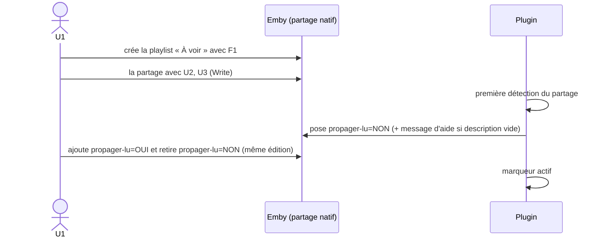
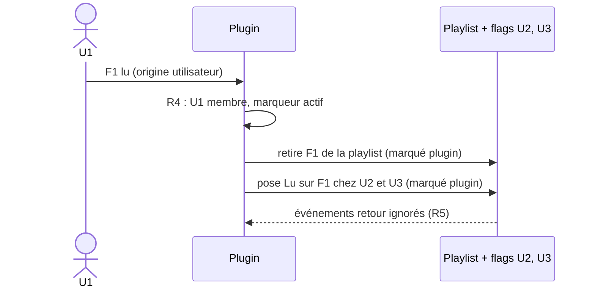
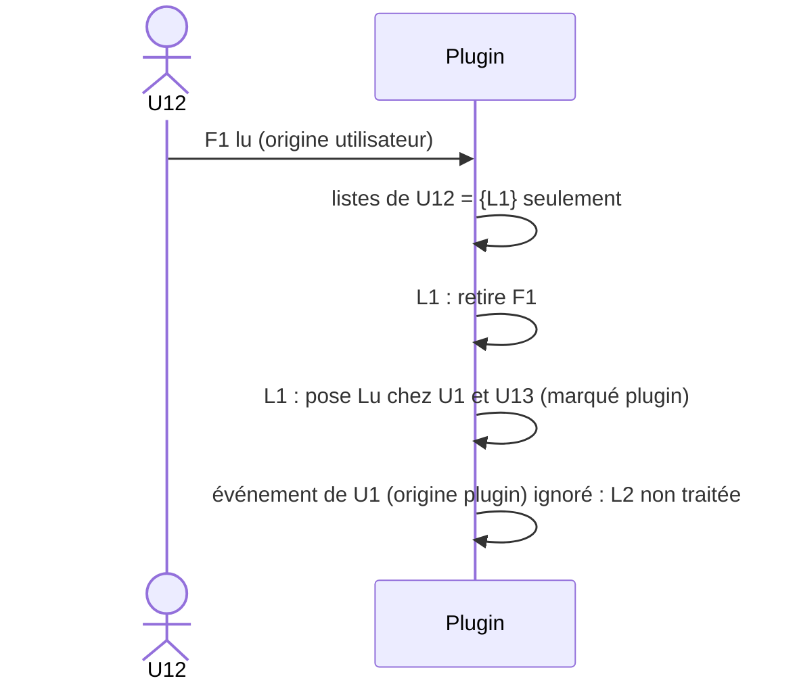
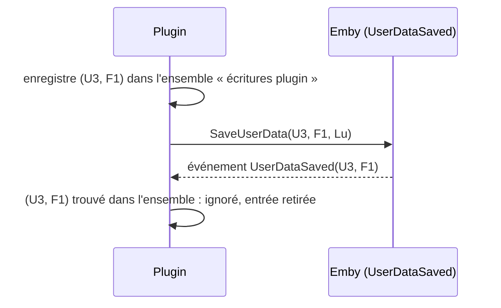
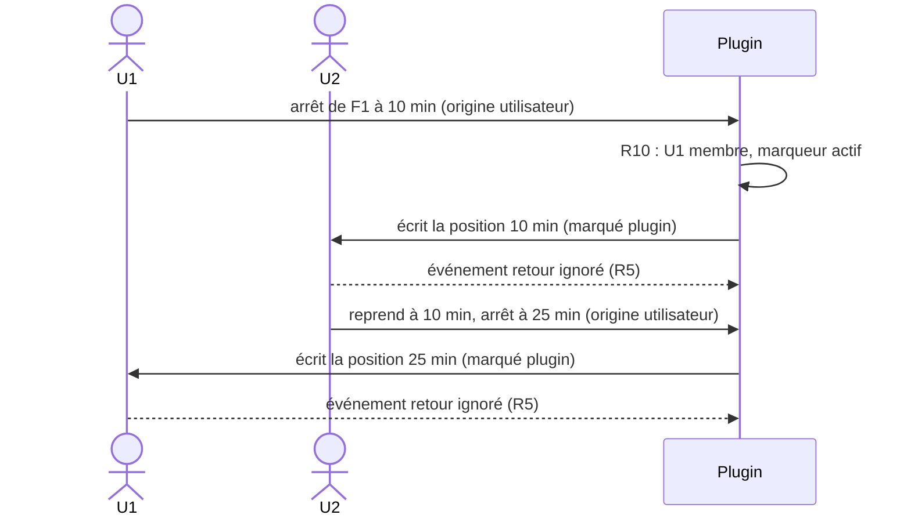

# Plugin Emby — Playlists « À voir » partagées

Document de référence fonctionnelle. Les chronogrammes ci-dessous font foi pour l'implémentation et les tests.

## 0. Résultat du spike : partage natif Emby (2026-09-26)

Analyse par réflexion des DLL de `libs/`, puis vérification à l'exécution par REST sur QUALIF (`emby2`, Emby 4.10.0.40). Le partage natif est **confirmé** (points 1 et 2 ci-dessous : OK).

| Élément du SDK | Ce que ça permet |
|---|---|
| `UserItemShare { UserId, ItemId, ShareLevel }` | Partage **natif** d'un élément avec un utilisateur |
| `UserItemShareLevel` = `None`, `Read`, `Write`, `Manage`, `ManageDelete` | Niveaux de droits : `Read` = lecture seule, `Write` = ajout/retrait, `Manage` = gérer les accès |
| `ILibraryManager.SaveUserItemShares`, `IItemRepository.GetUserItemShares` / `DeleteUserItemShares` | Créer, lister, supprimer les partages |
| `Playlist.SupportsManageAccess`, `CanManageAccess`, `CanLeaveSharedContent`, `PlaylistCreationRequest.IsPublic`, `ILibraryManager.MakePublic` | Les playlists supportent nativement le partage et la publication |
| `IPlaylistManager.AddToPlaylist` / `RemoveFromPlaylist` et événements `PlaylistItemsAdded/Removed/Moved` | Modification du contenu et écoute des changements |
| `IUserDataManager.UserDataSaved` (`UserDataSaveEventArgs { User, Item, UserData, SaveReason }`), `SaveUserData` | Écoute et écriture du flag lu |

**Conséquence de conception (confirmée pour les points 1 et 2) :** une liste partagée est **une seule playlist Emby**, partagée nativement avec les membres. Il n'y a plus de copies ni de synchronisation de contenu :
- R2 : seuls `Manage`/`ManageDelete` gèrent les accès. Donner `Write` aux membres, `Manage` au seul propriétaire.
- R3 et D1 (lecture/écriture) : assurés par Emby (niveau `Write`), sans conflit à gérer (un seul objet).
- D2 : retirer un membre = supprimer son partage ; supprimer la liste = supprimer la playlist.
- R8 : les droits de bibliothèque sont ceux d'Emby.
- **Reste à la charge du plugin** : R4 (retrait du média lu et propagation du flag lu, seulement si le marqueur `propager-lu=OUI` est actif), R5 (anti-écho sur les flags), R6, R7, R10 (avancement de lecture).

### Résultats à l'exécution (REST sur `emby2`)

- **Partage** : `POST /Items/Access {ItemIds, UserIds, ItemAccess}`. La playlist a le **même Id** chez tous les membres.
- **Niveaux** : `Write` ajoute et retire des médias ; `Read` est refusé (403) à l'ajout et au retrait.
- **Flag lu** : reste propre à chaque utilisateur.
- **Repartage** : un membre `Write` ne peut pas repartager (403) : R2 est assuré nativement.
- **Lister les membres** : `GET /Users/ItemAccess?ItemId=` côté propriétaire (403 pour un membre sans droit de gestion) : membres et niveau de chacun.
- **Métadonnées** : un propriétaire non admin peut modifier nom, description et étiquettes de sa playlist (`POST /Items/{Id}`, `POST /Items/{Id}/Tags/Add`, 204). Un membre `Write` reçoit un 403 (« does not have access to ManageServer feature »). Recherche par étiquette : `GET /Items?Recursive=true&IncludeItemTypes=Playlist&Tags=<étiquette>`. Les étiquettes sont dans `TagItems` (`[{Name,Id}]`), le champ `Tags` du DTO reste `null` à la lecture.

### Condition : permission du propriétaire

Le partage est **masqué** tant que la permission utilisateur `Policy.AllowSharingPersonalItems` est à `false` (valeur par défaut) : `CanManageAccess` est absent du DTO, le menu de partage n'apparaît pas, `GET /Users/ItemAccess` renvoie une liste vide, et `MakePublic` renvoie 403.

- Elle n'est requise que pour le **propriétaire**. Les destinataires n'ont rien à activer : leurs droits viennent du niveau de partage.
- Où la régler : Tableau de bord → Utilisateurs → l'utilisateur → onglet Profil (nom d'onglet non vérifié à l'écran). Libellé : « Permettre le partage de contenus personnels tels que des listes de lecture avec d'autres utilisateurs sur ce serveur ».
- Une fois cochée : menu « … » de la playlist → « Gérer la collaboration ».
- Côté REST : `POST /Users/{id}/Policy` (politique complète relue puis renvoyée, 204).
- Le niveau `ManageDelete` n'est pas la clé : il ne débloque pas le partage.
- Les champs `CanManageAccess`, `CanEditItems`, `CanLeaveContent` dépendent des `Fields` demandés : ne pas les interpréter sans préciser `Fields`.

### Non vérifié

- Rendu réel de l'interface (analyse du code du client web uniquement, pas de navigateur).
- Applis TV et mobile.
- **U3** : remplacement `propager-lu=NON` → `propager-lu=OUI` par le propriétaire en deux sauvegardes successives, dans les deux ordres (état intermédiaire, événements `ItemUpdated`, absence de boucle) ; acceptation du `=` dans le nom de l'étiquette ; calibrage du délai de grâce.
- **U5** : pose de `AllowSharingPersonalItems` depuis le plugin C# (`IUserManager`, `UserPolicy`) et existence d'un événement de création d'utilisateur exploitable.
- **U10** (avancement) : valeurs de `SaveReason` à l'arrêt et à la pause d'une lecture, écriture de `PlaybackPositionTicks` pour un autre utilisateur sans marquer le média lu, apparition du média dans « reprendre la lecture » de cet utilisateur.
- Création des partages par le plugin (`SaveUserItemShares`), retrait par le plugin sur la playlist d'un autre (`RemoveFromPlaylist`, U2), `UserDataSaved` et `SaveReason` pour le lu (U1), découverte des playlists partagées (U4).

## 1. Vocabulaire

| Terme | Définition |
|---|---|
| **Liste partagée** | Playlist Emby native partagée avec au moins un membre. Elle est **gérée** par le plugin dès qu'elle est partagée, sans liste d'identifiants à maintenir. Un propriétaire peut en avoir plusieurs, indépendantes. L'état interne du plugin (playlists déjà connues, messages d'aide déjà écrits, paramètres) n'est **pas** une liste de gestion. |
| **Membre** | Propriétaire + destinataires du partage natif (`Write` ou `Read`). |
| **Marqueur `propager-lu`** | Étiquette de la playlist, sous la forme `propager-lu=NON` ou `propager-lu=OUI`. Comparaison insensible à la casse, espaces tolérés autour du `=`. |
| **Marqueur actif** | `propager-lu=OUI` présent et `propager-lu=NON` absent. |
| **Legacy** | Playlist partagée dont le marqueur n'est pas actif : le plugin ne fait rien, le comportement natif d'Emby s'applique. |
| **Flag lu** | Champ `Played` des données utilisateur Emby, propre à un couple (utilisateur, média). |
| **Position de lecture** | Champ `PlaybackPositionTicks` des données utilisateur, propre à un couple (utilisateur, média). |
| **Origine utilisateur** | Changement fait par l'utilisateur (lecture, marquage manuel). |
| **Origine plugin** | Changement écrit par le plugin lui-même. Il est marqué et ignoré à son retour (anti-écho). |

### Machine d'états du marqueur

| Étiquettes `propager-lu*` présentes | État | Action du plugin |
|---|---|---|
| aucune | NON par défaut | Poser `propager-lu=NON` (immédiatement à la **première détection** de la playlist partagée ; ensuite seulement après le **délai de grâce**, voir ci-dessous) ; inactif |
| `=NON` seule | inactif (legacy) | rien |
| `=OUI` seule | **actif** | retrait du média lu (R4), propagation du lu (R4), propagation de l'avancement (R10) |
| `=OUI` + `=NON` | inactif (**NON l'emporte**) | rien ; **aucune étiquette n'est supprimée** |

Règles complémentaires :

- Le plugin **ne supprime jamais** une étiquette.
- Une playlist non partagée (aucun membre) n'est jamais gérée, quelle que soit l'étiquette.
- Le plugin ne pose **jamais** NON sur un événement `ItemUpdated`. Il ne le fait qu'à la première détection du partage et lors de la réconciliation planifiée ; pour une playlist déjà connue, seulement si elle est restée sans étiquette `propager-lu*` sur deux passes consécutives (délai de grâce, valeur par défaut 5 min, à calibrer d'après U3).
- Conséquence pour le propriétaire : il doit **ajouter OUI et retirer NON dans la même édition** (ou ajouter OUI d'abord). Retirer NON seul, puis enregistrer, laisse la playlist sans étiquette : NON est reposé après le délai de grâce.
- Si le propriétaire supprime toutes les étiquettes `propager-lu*`, NON est reposé après le délai de grâce.
- Le plugin lit les étiquettes au moment de l'événement (pas de cache long).

### Message d'aide

À la **première pose** de NON, si la description de la playlist est **vide**, le plugin y écrit un court message : liste gérée par Emby Shared Playlist ; pour propager le lu et retirer les médias lus, **remplacez `propager-lu=NON` par `propager-lu=OUI`** (Modifier les métadonnées > Mot-clé). Le message est écrit **une seule fois** (l'identifiant de la playlist est mémorisé), jamais réécrit, même si le propriétaire vide ou modifie ensuite la description. Une description existante n'est jamais écrasée.

## 2. Règles

| # | Règle |
|---|---|
| R1 | Ajouter/retirer un média d'une liste est **indépendant** du flag lu. |
| R2 | Seul le **propriétaire** gère les membres. Un destinataire ne peut pas repartager la liste (403 natif). |
| R3 | Contenu : la playlist est **unique** et partagée nativement ; les ajouts et retraits explicites des membres `Write` sont visibles immédiatement par tous, sans réplication. |
| R4 | Quand un utilisateur **U** passe un média en lu (origine utilisateur), pour **chaque playlist partagée dont U est membre, qui contient le média et dont le marqueur est actif** : le média est retiré de la playlist, puis le flag lu est posé chez les autres membres. Si le marqueur n'est pas actif (NON, aucune étiquette, OUI+NON), le plugin **ne fait rien** (legacy). |
| R5 | Un changement d'origine **plugin** ne déclenche rien (ni retrait, ni propagation). C'est ce qui garantit l'absence de transitivité entre listes. |
| R6 | Seul le passage à **lu** se propage. Le retour à « non lu » ne se propage pas. |
| R7 | Si un membre a déjà le flag lu, le plugin n'y touche pas (compteur et date intacts). |
| R8 | Un média auquel un membre n'a pas accès (droits de bibliothèque) est ignoré silencieusement pour ce membre : le flag lu n'est pas posé chez lui. |
| R9 | Retirer un média (explicite ou parce que lu) ne modifie aucun flag ; les deux causes donnent le même état de liste. |
| R10 | **Avancement (D9)** : à l'arrêt ou à la pause d'une lecture par un membre (origine utilisateur), pour chaque playlist partagée contenant le média, dont il est membre et dont le marqueur est actif, la position de lecture (`PlaybackPositionTicks`) est écrite chez les autres membres. La **dernière lecture gagne**, dans les deux sens. Pas de transitivité entre listes. Anti-écho identique au lu (R5). Quand le média est terminé, la règle du lu (R4) prend le relais. Sans marqueur actif : aucune écriture. Les autres données utilisateur (favori, note) ne sont pas touchées. Livrée en **v0.3.1** (issues #44–#48, spike #44). |

## 3. Notation

- `▣ F1` : F1 est dans la playlist. `□` : F1 absent.
- `Lu` / `Nl` : flag lu posé / non posé.
- `(u)` : posé par l'utilisateur. `(p)` : posé par le plugin (ignoré au retour).
- Sauf mention contraire, les scénarios supposent un marqueur **actif** (`propager-lu=OUI`).

## 4. Scénarios

> Il n'y a qu'**une seule playlist** par liste, partagée nativement. Les flags lu et les positions de lecture, eux, restent propres à chaque utilisateur.

### S1 — Création, partage et pose du marqueur

U1 crée la playlist `À voir` avec F1, la partage avec U2 et U3 (`Write`), puis active la propagation.



| t | Événement | Playlist | Marqueur | Flag F1 U1 | U2 | U3 |
|---|---|---|---|---|---|---|
| 0 | U1 crée la playlist avec F1 | ▣ | (non partagée) | Nl | Nl | Nl |
| 1 | U1 partage avec U2, U3 | ▣ (visible par U2, U3) | aucune étiquette | Nl | Nl | Nl |
| 2 | plugin : première détection | ▣ | `=NON` (p) + message d'aide | Nl | Nl | Nl |
| 3 | U1 : ajoute OUI, retire NON | ▣ | `=OUI` : **actif** (u) | Nl | Nl | Nl |

### S2 — Cas 1 : le propriétaire U1 lit F1



| t | Événement | Playlist | Flag U1 | U2 | U3 |
|---|---|---|---|---|---|
| 0 | état initial | ▣ | Nl | Nl | Nl |
| 1 | U1 lit F1 | ▣ | Lu (u) | Nl | Nl |
| 2 | plugin : retrait | □ (p) | Lu | Nl | Nl |
| 3 | plugin : propagation lu | □ | Lu | Lu (p) | Lu (p) |
| 4 | retours d'événements | □ | Lu | Lu | Lu (ignorés) |

### S3 — Cas 2 : le destinataire U2 lit F1

| t | Événement | Playlist | Flag U1 | U2 | U3 |
|---|---|---|---|---|---|
| 0 | état initial | ▣ | Nl | Nl | Nl |
| 1 | U2 lit F1 | ▣ | Nl | Lu (u) | Nl |
| 2 | plugin : retrait | □ (p) | Nl | Lu | Nl |
| 3 | plugin : propagation lu | □ | Lu (p) | Lu | Lu (p) |
| 4 | retours d'événements | □ | Lu | Lu | Lu (ignorés) |

### S4 — Retrait explicite par le propriétaire (aucun flag)

| t | Événement | Playlist | Flag U1 | U2 | U3 |
|---|---|---|---|---|---|
| 0 | état initial | ▣ | Nl | Nl | Nl |
| 1 | U1 retire F1 de sa playlist | □ (u) | Nl | Nl | Nl |

Le retrait est natif : U2 et U3 voient immédiatement la playlist sans F1. Aucun flag n'est modifié (R1, R9).

### S5 — Repartage interdit

| t | Événement | Résultat |
|---|---|---|
| 1 | U2 (`Write`) tente de partager la playlist avec U4 | Refusé (403 natif). Seul U1 modifie les membres (R2). |
| 2 | U2 (`Write`) tente de modifier les étiquettes de la playlist | Refusé (403 natif). Le marqueur reste réservé au propriétaire. |

### S6 — Plusieurs listes, sans transitivité

Configuration :
- **L1** : propriétaire U1, membres U12, U13.
- **L2** : propriétaire U1, membres U21, U23.
- Les deux playlists portent `propager-lu=OUI`. F1 est dans L1 et dans L2. Le flag lu de F1 est noté par utilisateur.

État initial :

| Liste | Playlist |
|---|---|
| L1 | ▣ (membres U1, U12, U13) |
| L2 | ▣ (membres U1, U21, U23) |

Flags : tous `Nl`.

#### S6a — U12 lit F1



| t | Événement | L1 | L2 | Flag U1 | U12 | U13 | U21 | U23 |
|---|---|---|---|---|---|---|---|---|
| 0 | état initial | ▣ | ▣ | Nl | Nl | Nl | Nl | Nl |
| 1 | U12 lit F1 | ▣ | ▣ | Nl | Lu (u) | Nl | Nl | Nl |
| 2 | plugin : retrait dans L1 | □ | ▣ | Nl | Lu | Nl | Nl | Nl |
| 3 | plugin : propagation à U1, U13 | □ | ▣ | Lu (p) | Lu | Lu (p) | Nl | Nl |
| 4 | retour de U1 ignoré (R5) | □ | ▣ | Lu | Lu | Lu | Nl | Nl |

Conséquence acceptée : U1 a le flag lu mais F1 reste dans L2 (pas de transitivité). L2 n'est pas modifiée.

#### S6b — U1 lit F1 (à partir de l'état initial)

U1 est membre de L1 et L2, donc les deux listes sont traitées.

| t | Événement | L1 | L2 | Flag U1 | U12 | U13 | U21 | U23 |
|---|---|---|---|---|---|---|---|---|
| 0 | état initial | ▣ | ▣ | Nl | Nl | Nl | Nl | Nl |
| 1 | U1 lit F1 | ▣ | ▣ | Lu (u) | Nl | Nl | Nl | Nl |
| 2 | plugin : retrait dans L1 et L2 | □ | □ | Lu | Nl | Nl | Nl | Nl |
| 3 | plugin : propagation | □ | □ | Lu | Lu (p) | Lu (p) | Lu (p) | Lu (p) |

#### S6c — U21 lit F1 (à partir de l'état initial)

| t | Événement | L1 | L2 | Flag U1 | U12 | U13 | U21 | U23 |
|---|---|---|---|---|---|---|---|---|
| 1 | U21 lit F1 | ▣ | ▣ | Nl | Nl | Nl | Lu (u) | Nl |
| 2 | plugin : retrait dans L2 | ▣ | □ | Nl | Nl | Nl | Lu | Nl |
| 3 | plugin : propagation | ▣ | □ | Lu (p) | Nl | Nl | Lu | Lu (p) |

L1 n'est pas modifiée.

### S7 — Anti-écho : un flag posé par le plugin ne déclenche rien



### S8 — Cas limites

| Cas | Comportement attendu |
|---|---|
| Membre a déjà Lu sur F1 | Ni compteur ni date modifiés (R7). |
| U3 repasse F1 en « non lu » | Non propagé (R6). F1 déjà retiré de la liste, il n'y revient pas. |
| F1 déjà lu par U3 avant l'ajout à la liste | Ajouté normalement (R1). Retiré dès qu'un membre le lit (marqueur actif). |
| Membre sans accès à F1 | Le flag lu n'est pas posé chez lui (R8). |
| Marqueur non actif (`=NON`, aucune étiquette, OUI+NON) | Legacy : le plugin ne fait rien. Ni retrait, ni flag posé, ni position écrite. |
| `=OUI` + `=NON` | **NON l'emporte** : inactif. Le plugin ne supprime aucune étiquette. |
| Aucune étiquette `propager-lu*` | Le plugin pose `propager-lu=NON` (première détection, ou après le délai de grâce) et traite la playlist comme NON. |
| Propriétaire supprime toutes les étiquettes `propager-lu*` | NON est reposé après le délai de grâce. |
| Propriétaire retire NON puis ajoute OUI en deux sauvegardes | L'état intermédiaire « aucune étiquette » ne déclenche pas de repose de NON (jamais sur `ItemUpdated`). À valider par le spike U3. |
| Étiquette différente (`propager-lu` seule, `propager-lu=oui ` avec casse ou espaces) | Casse et espaces autour du `=` tolérés ; toute autre forme est ignorée. |
| Playlist non partagée | Jamais gérée, quelle que soit l'étiquette. |
| Retrait d'un membre du partage | Le partage natif est supprimé pour ce membre (D2). |
| Suppression de la playlist | La playlist est supprimée pour tous (D2). |
| Retrait explicite par un membre `Write` | Immédiatement visible par tous (playlist unique, D1). |

### S9 — Avancement : U1 commence, U2 poursuit (R10)

U1 et U2 sont membres de la playlist `À voir` (marqueur actif) qui contient F1.



| t | Événement | Playlist | Position U1 | Position U2 |
|---|---|---|---|---|
| 0 | état initial | ▣ | 0 | 0 |
| 1 | U1 lit F1 et arrête à 10 min | ▣ | 10 min (u) | 0 |
| 2 | plugin : propagation de l'avancement | ▣ | 10 min | 10 min (p) |
| 3 | retour d'événement | ▣ | 10 min | 10 min (ignoré) |
| 4 | U2 reprend à 10 min, arrête à 25 min | ▣ | 10 min | 25 min (u) |
| 5 | plugin : propagation (dernière lecture gagne) | ▣ | 25 min (p) | 25 min |
| 6 | retour d'événement | ▣ | 25 min | 25 min (ignoré) |
| 7 | U2 termine F1 | ▣ | 25 min | Lu (u) |
| 8 | plugin : règle du lu (R4) | □ (p) | Lu (p) | Lu |

Sans marqueur actif, seules les lignes des actions utilisateur ont lieu : aucune écriture du plugin. Propagation livrée en **v0.3.1** (#44–#48) ; comportement de `SaveReason`, écriture pour un autre utilisateur et « reprendre la lecture » à valider par le spike U10 (#44).

## 5. Algorithme de référence (lecture)

```
sur UserDataSaved(user, item):
    si (user, item) ∈ écritures_plugin:
        retirer de l'ensemble ; return                    # R5
    pour chaque playlist L partagée où user ∈ L.membres et item ∈ L:
        si marqueur(L) ≠ ACTIF: continuer                 # legacy : ne rien faire
        si item.Played:                                   # R4, R6
            retirer item de L                              # marqué plugin
            pour chaque m ∈ L.membres \ {user}:
                si non Played(m, item) et accès(m, item):
                    marquer (m, item) ; SaveUserData(m, item, Played)   # R7, R8
        sinon si arrêt/pause de lecture:                  # R10
            pour chaque m ∈ L.membres \ {user}:
                si accès(m, item):
                    marquer (m, item) ; SaveUserData(m, item, PlaybackPositionTicks)

marqueur(L):
    tags = étiquettes de L (casse ignorée, espaces autour de « = » tolérés)
    si "propager-lu=NON" ∈ tags: return INACTIF           # NON l'emporte
    si "propager-lu=OUI" ∈ tags: return ACTIF
    return INACTIF                                         # aucune étiquette : NON posé par la réconciliation

réconciliation planifiée (période configurable, défaut 5 min):
    pour chaque playlist L partagée avec ≥ 1 membre:
        si aucune étiquette "propager-lu*":
            si L nouvellement détectée, ou sans étiquette sur deux passes consécutives:
                ajouter "propager-lu=NON" ; écrire le message d'aide si description vide et jamais écrit
        # jamais de suppression d'étiquette, jamais de pose sur ItemUpdated
```

## 6. Décisions (2026-09-26)

| # | Décision |
|---|---|
| D1 | **Droits : lecture/écriture pour les membres `Write`**, assurés par le partage natif d'Emby sur une playlist unique. Seul le propriétaire gère les membres (R2). |
| D2 | **Fin de partage** : retirer un membre supprime son partage natif ; supprimer la liste supprime la playlist. |
| D3 | **Marqueur d'activation obligatoire** : le retrait du média lu et la propagation du lu (et de l'avancement) n'agissent que si `propager-lu=OUI` est présent et `propager-lu=NON` absent. Sinon, le plugin ne fait rien (comportement natif / legacy). **NON l'emporte** sur OUI ; le plugin ne supprime jamais d'étiquette ; sans aucune étiquette `propager-lu*`, le plugin pose NON (réimposé après le délai de grâce, jamais sur `ItemUpdated`) ; le message d'aide est écrit une seule fois, si la description est vide. |
| D4 | **Version d'Emby Server : celle des DLL de `libs/`** (identiques à `Emby_Badges`). |
| D5 | **Site marketing : oui** (`marketing.site = "auto"`). |
| D6 | **Playlist « gérée » = partagée avec au moins un membre.** Plus de liste d'identifiants dans la config du plugin ; l'option « propager par liste » est le marqueur. L'état interne (playlists connues, messages écrits) et les paramètres globaux restent dans la config. |
| D7 | **Permission propriétaire** : `AllowSharingPersonalItems` requise pour le propriétaire uniquement (voir §0). |
| D8 | **Permission posée automatiquement** : le plugin pose `AllowSharingPersonalItems=true` pour tous les utilisateurs (existants et nouveaux), avec un interrupteur de configuration (`AutoEnableSharing`, **actif par défaut**). Désactiver l'interrupteur **ne révoque rien**. Cette décision **élargit les droits** des utilisateurs : à auditer (issue #29). |
| D9 | **Avancement de lecture** : la position de lecture est propagée aux autres membres quand le marqueur est actif (R10). Dernière lecture gagne, pas de transitivité, anti-écho identique au lu. Livrée en v0.3.1. |

## 7. Points ouverts

1. Anti-écho sur les flags et positions : `UserDataSaved` et moyen de distinguer une écriture du plugin d'une action utilisateur (`SaveReason` ou ensemble d'écritures en cours) — spikes U1 et U10.
2. Pose de la permission depuis le plugin C# (`IUserManager`) et événement de création d'utilisateur — spike U5. D8 : comptes désactivés et profils enfants inclus ? Appliquer une seule fois par utilisateur pour respecter un décochage volontaire de l'administrateur ?
3. Remplacement NON → OUI en deux sauvegardes, et durée du délai de grâce (défaut proposé 5–10 min) — spike U3.
4. Rendu réel de l'écran d'édition des métadonnées et comportement des applis TV/mobile (non testés).
5. Langue du message d'aide : français seul jusqu'à la localisation FR/EN.
6. Avancement : seuil minimal de position, lectures simultanées, comportement près de la fin (considéré comme lu ?) — spike U10.

## 8. Guide utilisateur

### Prérequis

Pour partager une playlist, son **propriétaire** doit avoir la permission « Permettre le partage de contenus personnels tels que des listes de lecture avec d'autres utilisateurs sur ce serveur » (désactivée par défaut dans Emby). Le plugin la pose **automatiquement** pour tous les utilisateurs (interrupteur dans la configuration du plugin, actif par défaut ; le désactiver ne retire aucune permission déjà posée). Sinon, un administrateur la coche dans : Tableau de bord → Utilisateurs → l'utilisateur → onglet Profil. Les destinataires n'ont rien à activer.

### Partager une liste

1. Le propriétaire crée sa playlist « À voir ».
2. Menu « … » de la playlist → **Gérer la collaboration**.
3. Choisir pour chaque utilisateur le niveau **Écriture** (peut ajouter et retirer des médias) ou **Lecture** (consultation seule).

Seul le propriétaire gère les membres. Un membre en écriture ne peut ni repartager la liste ni modifier son nom, sa description ou ses étiquettes.

### Ce que fait le plugin sur une liste partagée

Dès qu'une playlist est partagée, le plugin lui ajoute l'étiquette **`propager-lu=NON`** et, si la description est vide, un court message d'aide (écrit une seule fois). **Tant que l'étiquette est `NON`, rien ne change** : Emby se comporte comme d'habitude (le média lu reste dans la liste, rien n'est copié chez les autres).

### Activer le retrait du média lu, la propagation du « lu » et de l'avancement

**Remplacez `propager-lu=NON` par `propager-lu=OUI`** :

1. Menu « … » de la playlist → **Modifier les métadonnées**.
2. Section **Mot-clé** (Étiquette) → **Ajouter** `propager-lu=OUI`, et **retirer** `propager-lu=NON`, **dans la même édition**.
3. Enregistrer.

Une fois `propager-lu=OUI` actif (et `NON` absent) :
- quand un membre termine un média, il est **retiré de la liste** et marqué **lu** pour les autres membres ;
- quand un membre arrête ou met en pause une lecture, la **position de lecture** est copiée chez les autres membres : commencez avec un compte, poursuivez avec l'autre (la dernière lecture gagne) — *fonction livrée en v0.3.1*.

Bon à savoir :
- Si `OUI` et `NON` sont présents ensemble, **NON l'emporte** : rien ne se passe. Le plugin ne supprime jamais vos étiquettes.
- Si vous supprimez toutes les étiquettes `propager-lu…`, le plugin repose `NON` après quelques minutes.
- Retirer `NON` seul ne suffit pas : ajoutez `OUI`.
- La casse et les espaces autour du `=` sont sans importance.

### Limites

Ces écrans sont décrits d'après le code du client web (non testés dans un navigateur) ; le comportement des applis TV et mobile (visibilité, retrait, édition des étiquettes, reprise de lecture) n'est pas vérifié.
