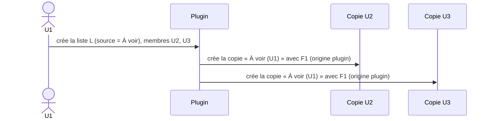
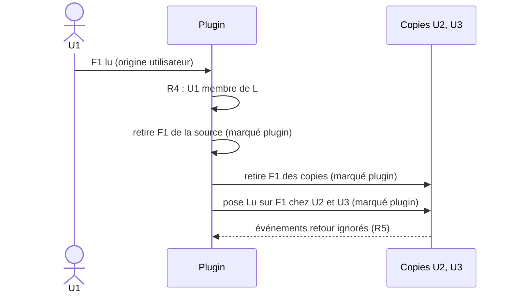
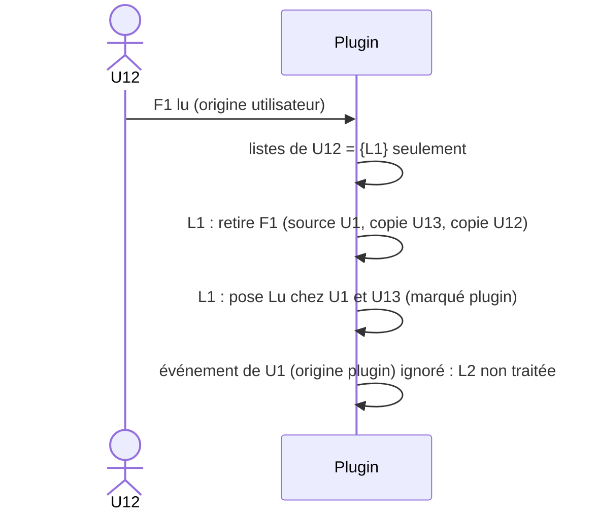
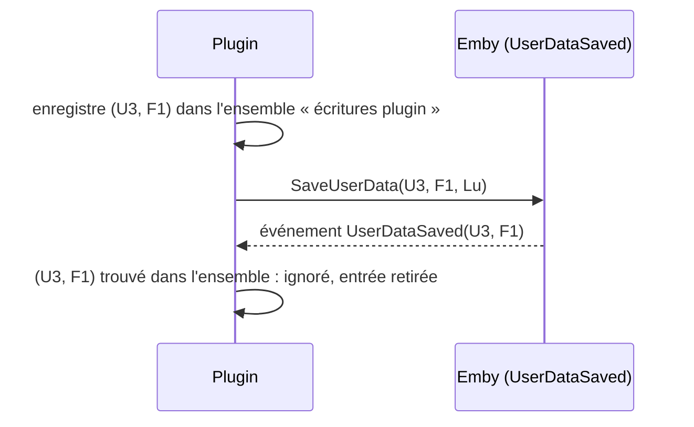

# Plugin Emby — Playlists « À voir » partagées

Document de référence fonctionnelle. Les chronogrammes ci-dessous font foi pour l'implémentation et les tests.

## 0. Résultat du spike : partage natif Emby (2026-09-26)

Analyse par réflexion des DLL de `libs/` (signatures uniquement, **pas encore testé à l'exécution**).

| Élément du SDK | Ce que ça permet |
|---|---|
| `UserItemShare { UserId, ItemId, ShareLevel }` | Partage **natif** d'un élément avec un utilisateur |
| `UserItemShareLevel` = `None`, `Read`, `Write`, `Manage`, `ManageDelete` | Niveaux de droits : `Read` = lecture seule, `Write` = ajout/retrait, `Manage` = gérer les accès |
| `ILibraryManager.SaveUserItemShares`, `IItemRepository.GetUserItemShares` / `DeleteUserItemShares` | Créer, lister, supprimer les partages |
| `Playlist.SupportsManageAccess`, `CanManageAccess`, `CanLeaveSharedContent`, `PlaylistCreationRequest.IsPublic`, `ILibraryManager.MakePublic` | Les playlists supportent nativement le partage et la publication |
| `IPlaylistManager.AddToPlaylist` / `RemoveFromPlaylist` et événements `PlaylistItemsAdded/Removed/Moved` | Modification du contenu et écoute des changements |
| `IUserDataManager.UserDataSaved` (`UserDataSaveEventArgs { User, Item, UserData, SaveReason }`), `SaveUserData` | Écoute et écriture du flag lu |

**Conséquence de conception (à confirmer à l'exécution) :** une liste partagée est **une seule playlist Emby**, partagée nativement avec les membres. Il n'y a plus de copies ni de synchronisation de contenu :
- R2 : seuls `Manage`/`ManageDelete` gèrent les accès. Donner `Write` aux membres, `Manage` au seul propriétaire.
- R3 et D1 (lecture/écriture) : assurés par Emby (niveau `Write`), sans conflit à gérer (un seul objet).
- D2 : retirer un membre = supprimer son partage ; supprimer la liste = supprimer la playlist.
- R8 : les droits de bibliothèque sont ceux d'Emby.
- **Reste à la charge du plugin** : R4 (retrait d'un média lu de toute playlist gérée dont l'utilisateur est membre, propagation du flag lu), R5 (anti-écho sur les flags), R6, R7, option `propagerLu` par liste.

**À vérifier à l'exécution sur QUALIF (`emby2`)** avant de figer le design :
1. Une playlist créée par U1 et partagée en `Write` apparaît chez U2 et U3 dans les applis clientes (web, TV, mobile).
2. U2 (`Write`) peut ajouter et retirer des médias, et U1 le voit.
3. Le plugin peut créer les partages (`SaveUserItemShares`) et retirer un média (`RemoveFromPlaylist`) pour un autre utilisateur.
4. `UserDataSaved` se déclenche à la fin de lecture et au marquage manuel ; comment distinguer une écriture du plugin (`SaveReason`).
5. Comment identifier les playlists « À voir » gérées par le plugin (liste d'identifiants dans la config du plugin, ou convention de nom).

Si un point échoue, on retombe sur le mécanisme de copies décrit ci-dessous.

## 1. Vocabulaire

| Terme | Définition |
|---|---|
| **Liste partagée** | `{ id, propriétaire, playlist source, membres[], option propagerLu }`. Un propriétaire peut en avoir plusieurs, indépendantes. |
| **Playlist source** | Playlist Emby native du propriétaire. Référence du contenu. |
| **Copie** | Playlist Emby native créée par le plugin chez chaque membre non propriétaire, miroir de la source. |
| **Membre** | Propriétaire + destinataires. |
| **Flag lu** | Champ `Played` des données utilisateur Emby, propre à un couple (utilisateur, média). |
| **Origine utilisateur** | Changement fait par l'utilisateur (lecture, marquage manuel). |
| **Origine plugin** | Changement écrit par le plugin lui-même. Il est marqué et ignoré à son retour (anti-écho). |

## 2. Règles

| # | Règle |
|---|---|
| R1 | Ajouter/retirer un média d'une liste est **indépendant** du flag lu. |
| R2 | Seul le **propriétaire** gère les membres. Un destinataire ne peut pas repartager la liste. |
| R3 | Contenu : les modifications de la playlist source (ajout/retrait explicite) sont répliquées dans les copies. |
| R4 | Quand un utilisateur **U** passe un média en lu (origine utilisateur), pour **chaque liste dont U est membre** : le média est retiré de la source et des copies, puis le flag lu est posé chez les autres membres de cette liste (si `propagerLu`). |
| R5 | Un changement d'origine **plugin** ne déclenche rien (ni retrait, ni propagation). C'est ce qui garantit l'absence de transitivité entre listes. |
| R6 | Seul le passage à **lu** se propage. Le retour à « non lu » ne se propage pas. |
| R7 | Si un membre a déjà le flag lu, le plugin n'y touche pas (compteur et date intacts). |
| R8 | Un média auquel un membre n'a pas accès (droits de bibliothèque) est ignoré silencieusement dans sa copie. |
| R9 | Retirer un média (explicite ou parce que lu) ne modifie aucun flag ; les deux causes donnent le même état de liste. |

## 3. Notation

- `▣ F1` : F1 est dans la playlist. `□` : F1 absent.
- `Lu` / `Nl` : flag lu posé / non posé.
- `(u)` : posé par l'utilisateur. `(p)` : posé par le plugin (ignoré au retour).

## 4. Scénarios

> **Lecture des tables avec le partage natif** : les colonnes « Copie Ux » désignent la playlist *telle que la voit Ux*. Avec le partage natif, c'est la même playlist pour tous : les étapes « plugin : réplique/retire des copies » deviennent un seul retrait de la playlist partagée. Les flags lu, eux, restent propres à chaque utilisateur.

### S1 — Création et partage

U1 crée la playlist `À voir` avec F1, puis la partage avec U2 et U3.



| t | Événement | Source U1 | Copie U2 | Copie U3 | Flag F1 U1 | U2 | U3 |
|---|---|---|---|---|---|---|---|
| 0 | U1 crée la playlist avec F1 | ▣ | — | — | Nl | Nl | Nl |
| 1 | U1 partage avec U2, U3 | ▣ | ▣ (p) | ▣ (p) | Nl | Nl | Nl |

### S2 — Cas 1 : le propriétaire U1 lit F1



| t | Événement | Source U1 | Copie U2 | Copie U3 | Flag U1 | U2 | U3 |
|---|---|---|---|---|---|---|---|
| 0 | état initial | ▣ | ▣ | ▣ | Nl | Nl | Nl |
| 1 | U1 lit F1 | ▣ | ▣ | ▣ | Lu (u) | Nl | Nl |
| 2 | plugin : retrait | □ | □ (p) | □ (p) | Lu | Nl | Nl |
| 3 | plugin : propagation lu | □ | □ | □ | Lu | Lu (p) | Lu (p) |
| 4 | retours d'événements | □ | □ | □ | Lu | Lu | Lu (ignorés) |

### S3 — Cas 2 : le destinataire U2 lit F1

| t | Événement | Source U1 | Copie U2 | Copie U3 | Flag U1 | U2 | U3 |
|---|---|---|---|---|---|---|---|
| 0 | état initial | ▣ | ▣ | ▣ | Nl | Nl | Nl |
| 1 | U2 lit F1 | ▣ | ▣ | ▣ | Nl | Lu (u) | Nl |
| 2 | plugin : retrait | □ (p) | □ (p) | □ (p) | Nl | Lu | Nl |
| 3 | plugin : propagation lu | □ | □ | □ | Lu (p) | Lu | Lu (p) |
| 4 | retours d'événements | □ | □ | □ | Lu | Lu | Lu (ignorés) |

### S4 — Retrait explicite par le propriétaire (aucun flag)

| t | Événement | Source U1 | Copie U2 | Copie U3 | Flag U1 | U2 | U3 |
|---|---|---|---|---|---|---|---|
| 0 | état initial | ▣ | ▣ | ▣ | Nl | Nl | Nl |
| 1 | U1 retire F1 de sa playlist | □ (u) | ▣ | ▣ | Nl | Nl | Nl |
| 2 | plugin : réplique le retrait | □ | □ (p) | □ (p) | Nl | Nl | Nl |

Aucun flag n'est modifié (R1, R9).

### S5 — Repartage interdit

| t | Événement | Résultat |
|---|---|---|
| 1 | U2 tente de partager sa copie avec U4 | Refusé. La copie est gérée par le plugin, seul U1 modifie les membres (R2). |

### S6 — Plusieurs listes, sans transitivité

Configuration :
- **L1** : propriétaire U1, membres U12, U13.
- **L2** : propriétaire U1, membres U21, U23.
- F1 est dans L1 et dans L2. Le flag propagé de F1 est noté par utilisateur.

État initial :

| Liste | Source U1 | Copies |
|---|---|---|
| L1 | ▣ | U12 ▣, U13 ▣ |
| L2 | ▣ | U21 ▣, U23 ▣ |

Flags : tous `Nl`.

#### S6a — U12 lit F1



| t | Événement | L1 (U1 / U12 / U13) | L2 (U1 / U21 / U23) | Flag U1 | U12 | U13 | U21 | U23 |
|---|---|---|---|---|---|---|---|---|
| 0 | état initial | ▣ / ▣ / ▣ | ▣ / ▣ / ▣ | Nl | Nl | Nl | Nl | Nl |
| 1 | U12 lit F1 | ▣ / ▣ / ▣ | ▣ / ▣ / ▣ | Nl | Lu (u) | Nl | Nl | Nl |
| 2 | plugin : retrait dans L1 | □ / □ / □ | ▣ / ▣ / ▣ | Nl | Lu | Nl | Nl | Nl |
| 3 | plugin : propagation à U1, U13 | □ / □ / □ | ▣ / ▣ / ▣ | Lu (p) | Lu | Lu (p) | Nl | Nl |
| 4 | retour de U1 ignoré (R5) | □ / □ / □ | ▣ / ▣ / ▣ | Lu | Lu | Lu | Nl | Nl |

Conséquence acceptée : U1 a le flag lu mais F1 reste dans L2 (pas de transitivité). L2 n'est pas modifiée.

#### S6b — U1 lit F1 (à partir de l'état initial)

U1 est membre de L1 et L2, donc les deux listes sont traitées.

| t | Événement | L1 (U1 / U12 / U13) | L2 (U1 / U21 / U23) | Flag U1 | U12 | U13 | U21 | U23 |
|---|---|---|---|---|---|---|---|---|
| 0 | état initial | ▣ / ▣ / ▣ | ▣ / ▣ / ▣ | Nl | Nl | Nl | Nl | Nl |
| 1 | U1 lit F1 | ▣ / ▣ / ▣ | ▣ / ▣ / ▣ | Lu (u) | Nl | Nl | Nl | Nl |
| 2 | plugin : retrait dans L1 et L2 | □ / □ / □ | □ / □ / □ | Lu | Nl | Nl | Nl | Nl |
| 3 | plugin : propagation | □ / □ / □ | □ / □ / □ | Lu | Lu (p) | Lu (p) | Lu (p) | Lu (p) |

#### S6c — U21 lit F1 (à partir de l'état initial)

| t | Événement | L1 | L2 (U1 / U21 / U23) | Flag U1 | U12 | U13 | U21 | U23 |
|---|---|---|---|---|---|---|---|---|
| 1 | U21 lit F1 | ▣ / ▣ / ▣ | ▣ / ▣ / ▣ | Nl | Nl | Nl | Lu (u) | Nl |
| 2 | plugin : retrait dans L2 | ▣ / ▣ / ▣ | □ / □ / □ | Nl | Nl | Nl | Lu | Nl |
| 3 | plugin : propagation | ▣ / ▣ / ▣ | □ / □ / □ | Lu (p) | Nl | Nl | Lu | Lu (p) |

L1 n'est pas modifiée.

### S7 — Anti-écho : un flag posé par le plugin ne déclenche rien



### S8 — Cas limites

| Cas | Comportement attendu |
|---|---|
| Membre a déjà Lu sur F1 | Ni compteur ni date modifiés (R7). |
| U3 repasse F1 en « non lu » | Non propagé (R6). F1 déjà retiré de la liste, il n'y revient pas. |
| F1 déjà lu par U3 avant l'ajout à la liste | Ajouté normalement (R1). Retiré dès qu'un membre le lit. |
| Membre sans accès à F1 | F1 absent de sa copie (R8). Le flag lu n'est pas posé chez lui. |
| Option `propagerLu` désactivée | R4 se limite au retrait de la liste. Aucun flag posé chez les autres. |
| Suppression d'un membre de la liste | Sa copie est supprimée (D2). |
| Suppression de la liste | Toutes les copies sont supprimées, la source reste chez le propriétaire (D2). |
| Retrait explicite chez un destinataire | Répliqué à la source puis aux autres copies (D1, lecture/écriture pour tous). |

## 5. Algorithme de référence (lecture)

```
sur UserDataSaved(user, item):
    si (user, item) ∈ écritures_plugin:
        retirer de l'ensemble ; return              # R5
    si non item.Played: return                      # R6
    pour chaque liste L où user ∈ L.membres:
        retirer item de L.source et des copies       # marqué plugin
        si L.propagerLu:
            pour chaque m ∈ L.membres \ {user}:
                si non Played(m, item) et accès(m, item):
                    marquer (m, item) ; SaveUserData(m, item, Played)   # R7, R8
```

## 6. Décisions (2026-09-26)

| # | Décision |
|---|---|
| D1 | **Droits : lecture/écriture pour tous les membres.** Tout membre peut ajouter ou retirer un média ; la modification est répliquée à la source puis aux autres copies (bidirectionnel). Seul le propriétaire gère les membres (R2). |
| D2 | **Fin de partage : la copie est supprimée** (membre retiré ou liste supprimée). La source reste chez le propriétaire. |
| D3 | **`propagerLu` : par liste**, actif par défaut. |
| D4 | **Version d'Emby Server : celle des DLL de `libs/`** (identiques à `Emby_Badges`). |
| D5 | **Site marketing : oui** (`marketing.site = "auto"`). |

## 7. Points ouverts

1. ~~Conflits d'écriture~~ : sans objet avec le partage natif (une seule playlist). À reprendre seulement si le repli sur les copies est nécessaire (dernier changement gagnant, opérations élémentaires, verrou par liste).
2. ~~Partage natif d'Emby~~ : présent dans le SDK (§0). **Reste à valider à l'exécution sur QUALIF** (5 points du §0).
3. Identification des playlists « À voir » gérées par le plugin, et stockage de l'option `propagerLu` par liste (config du plugin).
4. Anti-écho sur les flags lu : moyen de distinguer une écriture du plugin d'une action utilisateur (`SaveReason` ou ensemble d'écritures en cours).
