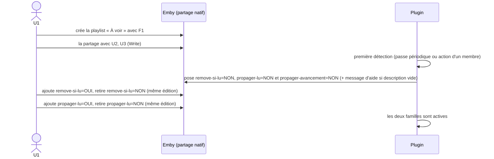
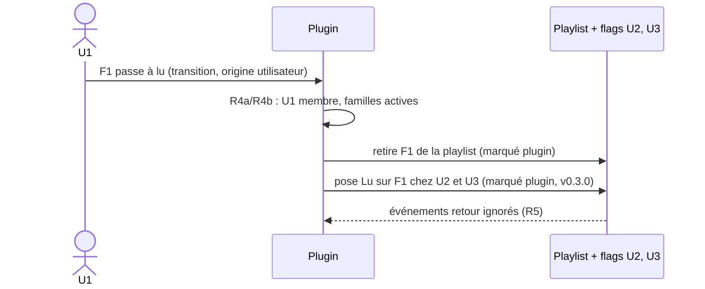
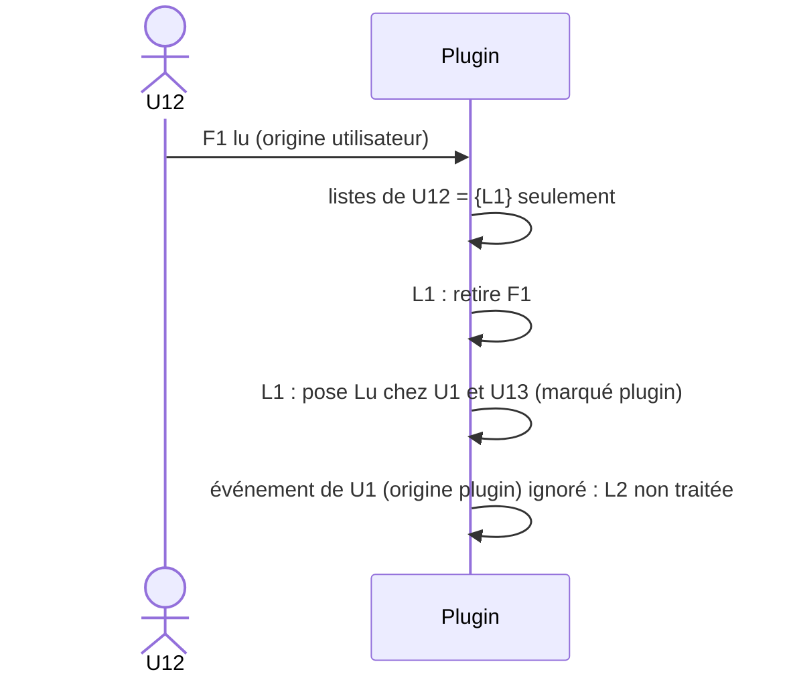
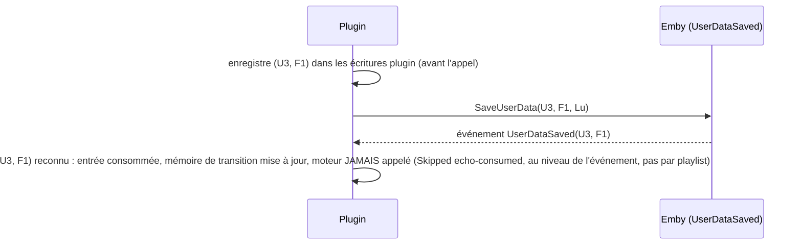
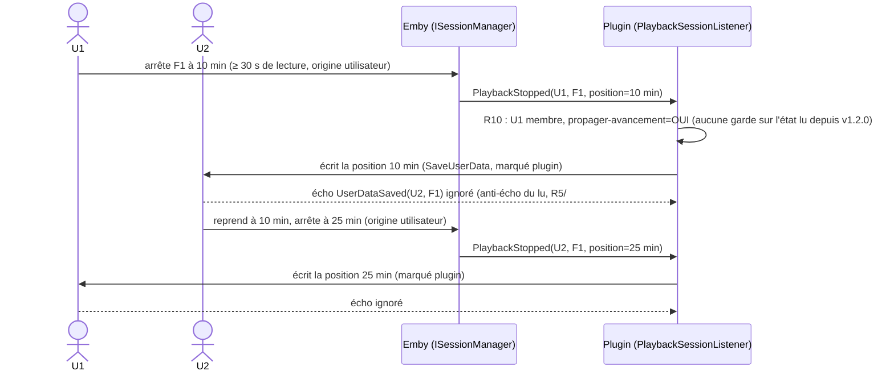
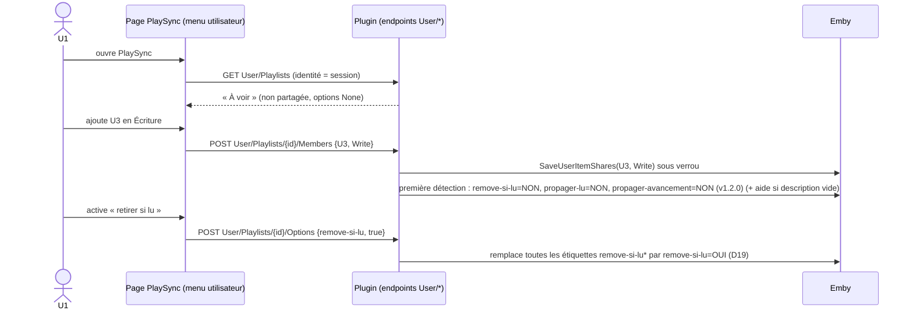

# Plugin Emby — Playlists « À voir » partagées

Document de référence fonctionnelle. Les chronogrammes ci-dessous font foi pour l'implémentation et les tests.

> **Amendement v1.2.0 (#56, #57, #55 — D21, D22)** : trois familles d'étiquettes. `propager-lu` ne propage plus que le
> **flag lu** ; la nouvelle famille `propager-avancement` propage la **position de lecture** seule ; les deux flux sont
> **indépendants** (aucune garde liée à l'état lu sur l'avancement). `remove-si-lu` n'a d'effet que si `propager-lu=OUI`
> est aussi actif. Aucune migration : une famille absente vaut NON. Création d'une playlist depuis la page PlaySync (S11).
> Les mentions historiques « `propager-lu` (lu, avancement) » des sections v0.x décrivent le comportement **jusqu'à v1.1.0**.
>
> **Amendement v1.2.1 (#58 — D23)** : l'avancement (`propager-avancement`) est aussi propagé **pendant la lecture**, à chaque
> `PlaybackProgress`, au plus une fois toutes les 10 s par couple (déclencheur, média) ; pause et arrêt restent immédiats. En
> **fin de lecture** (`PlayedToCompletion`), la position écrite chez les membres est **0** si `propager-lu=OUI` est aussi active
> sur la playlist (sinon position d'arrêt brute, S9f). Les playlists visées en fin de lecture sont celles mémorisées pendant la
> lecture, même si le média en a été retiré entre-temps. Voir R10, tableau B, S9g, §5 et U15 (§7).

## 0. Résultat du spike : partage natif Emby (2026-09-26)

Analyse par réflexion des DLL de `libs/`, puis vérification à l'exécution par REST sur QUALIF (`emby2`, Emby 4.10.0.40). Le partage natif est **confirmé** (points 1 et 2 ci-dessous : OK).

| Élément du SDK | Ce que ça permet |
|---|---|
| `UserItemShare { UserId, ItemId, ShareLevel }` | Partage **natif** d'un élément avec un utilisateur |
| `UserItemShareLevel` = `None`, `Read`, `Write`, `Manage`, `ManageDelete` | Niveaux de droits : `Read` = lecture seule, `Write` = ajout/retrait, `Manage` = gérer les accès |
| `ILibraryManager.SaveUserItemShares`, `IItemRepository.GetUserItemShares` / `DeleteUserItemShares` | Créer, lister, supprimer les partages |
| `Playlist.SupportsManageAccess`, `CanManageAccess`, `CanLeaveSharedContent`, `PlaylistCreationRequest.IsPublic`, `ILibraryManager.MakePublic` | Les playlists supportent nativement le partage et la publication |
| `IPlaylistManager.AddToPlaylist` / `RemoveFromPlaylist` et événements `PlaylistItemsAdded/Removed/Moved` | Modification du contenu et écoute des changements |
| `IUserDataManager.UserDataSaved` (`UserDataSaveEventArgs { User, Item, UserData, SaveReason }`), `SaveUserData` | Écoute et écriture du flag lu |

**Conséquence de conception (confirmée pour les points 1 et 2) :** une liste partagée est **une seule playlist Emby**, partagée nativement avec les membres. Il n'y a plus de copies ni de synchronisation de contenu :
- R2 : seuls `Manage`/`ManageDelete` gèrent les accès. Donner `Write` aux membres, `Manage` au seul propriétaire.
- R3 et D1 (lecture/écriture) : assurés par Emby (niveau `Write`), sans conflit à gérer (un seul objet).
- D2 : retirer un membre = supprimer son partage ; supprimer la liste = supprimer la playlist.
- R8 : les droits de bibliothèque sont ceux d'Emby.
- **Reste à la charge du plugin** : R4a (retrait du média lu, étiquette `remove-si-lu`, depuis v1.2.0 subordonnée à `propager-lu`), R4b (propagation du flag lu, étiquette `propager-lu`), R5 (anti-écho sur les flags), R6, R7, R10 (avancement de lecture, étiquette `propager-lu` jusqu'à v1.1.0, **`propager-avancement` depuis v1.2.0**).

### Résultats à l'exécution (REST sur `emby2`)

- **Partage** : `POST /Items/Access {ItemIds, UserIds, ItemAccess}`. La playlist a le **même Id** chez tous les membres.
- **Niveaux** : `Write` ajoute et retire des médias ; `Read` est refusé (403) à l'ajout et au retrait.
- **Flag lu** : reste propre à chaque utilisateur.
- **Repartage** : un membre `Write` ne peut pas repartager (403) : R2 est assuré nativement.
- **Lister les membres** : `GET /Users/ItemAccess?ItemId=` côté propriétaire (403 pour un membre sans droit de gestion) : membres et niveau de chacun.
- **Métadonnées** : un propriétaire non admin peut modifier nom, description et étiquettes de sa playlist (`POST /Items/{Id}`, `POST /Items/{Id}/Tags/Add`, 204). Un membre `Write` reçoit un 403 (« does not have access to ManageServer feature »). Recherche par étiquette : `GET /Items?Recursive=true&IncludeItemTypes=Playlist&Tags=<étiquette>`. Les étiquettes sont dans `TagItems` (`[{Name,Id}]`), le champ `Tags` du DTO reste `null` à la lecture.

### Condition : permission du propriétaire

Le partage est **masqué** tant que la permission utilisateur `Policy.AllowSharingPersonalItems` est à `false` (valeur par défaut) : `CanManageAccess` est absent du DTO, le menu de partage n'apparaît pas, `GET /Users/ItemAccess` renvoie une liste vide, et `MakePublic` renvoie 403.

- Elle n'est requise que pour le **propriétaire**. Les destinataires n'ont rien à activer : leurs droits viennent du niveau de partage.
- Où la régler : Tableau de bord → Utilisateurs → l'utilisateur → onglet Profil (nom d'onglet non vérifié à l'écran). Libellé : « Permettre le partage de contenus personnels tels que des listes de lecture avec d'autres utilisateurs sur ce serveur ».
- Une fois cochée : menu « … » de la playlist → « Gérer la collaboration ».
- Côté REST : `POST /Users/{id}/Policy` (politique complète relue puis renvoyée, 204).
- Le niveau `ManageDelete` n'est pas la clé : il ne débloque pas le partage.
- Les champs `CanManageAccess`, `CanEditItems`, `CanLeaveContent` dépendent des `Fields` demandés : ne pas les interpréter sans préciser `Fields`.

### Résultats du spike v0.1.0 (plugin 0.1.0.1, QUALIF `emby2`)

> **Tout ce tableau est vérifié en simulation API** (appels REST, `Sessions/Playing*`, endpoints de diagnostic `Spike/*`) avec les comptes `test_u1..u3`. **Aucune lecture réelle avec un client** n'a encore été faite. Source : `_work/reports/qa-spike-20260926-144953.md` (verdict : validé avec réserves, aucun blocage de design).

| # | Incertitude | Verdict | Conséquence de design |
|---|---|---|---|
| U1 | `UserDataSaved`, `SaveReason`, distinction plugin/utilisateur | **OK** | Le moteur détecte la **transition** `played` non lu → lu, **quel que soit le `SaveReason`** (voir essais réels ci-dessous) ; `TogglePlayed` avec `played=true` en est une transition certaine. `PlaybackFinished` est **aussi émis à l'arrêt d'une lecture non terminée** (`played=false`) : toujours lire `played`. Anti-écho : une écriture du plugin est reconnue puis consommée ; l'écriture utilisateur suivante sur le même couple est vue comme utilisateur. Réserve : une écriture enregistrée dont l'événement n'est jamais émis (donnée inchangée) reste 5 min et peut marquer à tort la suivante. |
| U2 | Retrait par le plugin sur la playlist d'un autre | **OK partiel** | Le retrait est visible immédiatement par tous les membres. Les `PlaylistItemId` **ne sont pas stables** (renumérotés à chaque modification) : résoudre l'entrée **à l'instant du retrait, par `ItemId`**, et retirer les doublons **un par un** avec relecture entre chaque. L'événement `PlaylistItemsRemoved` n'expose ni utilisateur ni média. Défauts de code du spike à corriger avant le moteur (réponse `entries` toujours vide, pas de validation d'une entrée inexistante). |
| U3 | Étiquettes et description écrites par le plugin | **OK** | Format `propager-lu=NON` / `propager-lu=OUI` **validé tel quel** (`=` et casse acceptés, retrouvé par la recherche serveur `Tags=`, coexiste avec les étiquettes du propriétaire, pas de boucle : un seul `ItemUpdated` après l'écriture du plugin). « Retirer NON puis ajouter OUI » passe par un état **sans aucune étiquette** `propager-lu*` : ne jamais poser NON sur `ItemUpdated`. « Ajouter OUI puis retirer NON » passe par {NON, OUI} (inactif, sans risque). Écart mesuré entre deux sauvegardes scriptées : 1,2 s (plancher). **Délai de grâce : au moins 2 passes de réconciliation sans étiquette, soit 10 min au défaut de 5 min.** (Validé avec `propager-lu` ; le format s'applique tel quel à `remove-si-lu`.) |
| U4 | Découverte des playlists partagées | **OK partiel** | **Aucun événement** n'est émis à la création d'un partage : découverte par **scan planifié** (réconciliation), dont la période borne le délai de prise en compte. `GetUserItemShares` fonctionne côté plugin sans contexte utilisateur (propriétaire `ManageDelete`, membres `Write`/`Read`, `ownerUserId` renseigné). Un utilisateur voit aussi les playlists **publiques** d'autres comptes : à considérer à la découverte. |
| U5 | Pose de `AllowSharingPersonalItems` par le plugin | **OK** | Faisable via `IUserManager` : valeur relue par REST, aucun autre champ de `UserPolicy` modifié, restauration identique à l'état initial (D8 réalisable). L'existence d'un événement de création d'utilisateur n'est pas établie : pose au démarrage et à chaque réconciliation. |
| U6 | Création de partages par le plugin | **OK** | Non bloquant (le propriétaire partage via l'interface native). |
| U7 | Signatures SDK réelles | **OK** | Compilation Release sans erreur ni avertissement contre les DLL du SDK 4.10 ; toutes les API utilisées ont été appelées avec succès. |
| U8 | Clients TV/mobile | **Non évalué** | Manuel (voir ci-dessous). |
| U9 | Environnement de build | **OK** | Build et tests via le SDK .NET 6 Windows en local ; CI Ubuntu inchangée. |
| U10 | Avancement de lecture | **OK** | À l'**arrêt** : `SaveReason=PlaybackFinished` avec la position d'arrêt, **même non terminé** (`played=false` ; `played=true` seulement à ≥ ~98 %). À la **pause** : `PlaybackProgress` avec la position (`IsPaused`), pas de `SaveReason` dédié. Au démarrage : `PlaybackStart`. Le plugin peut écrire la position d'un **autre** utilisateur sans toucher `Played` ni `PlayCount` ; l'écriture est reconnue comme écriture du plugin ; le média apparaît dans « reprendre la lecture » de cet utilisateur, dans les deux sens ; un tiers n'est pas affecté. Aucun arbitrage de conflit : « dernière lecture gagne ». |

### Essais réels d'un utilisateur (Emby Web 4.10.0.40, Chrome/Windows, plugin 0.1.0.2)

Source : `_work/reports/qa-real-20260926-151848.md` (lecture seule du journal). Un vrai client confirme U1 et corrige la simulation :

- **`played=true` peut arriver sur un `PlaybackProgress`**, avant le `PlaybackFinished` final : le moteur réagit à la **transition** `played` faux → vrai, pas à un `SaveReason` particulier.
- **À la fin d'un média, Emby remet `PlaybackPositionTicks` à 0** avec `played=true` : ne jamais propager une position quand `played=true` (on propage le flag lu).
- Un `PlaybackStart` reprend la **position sauvegardée**, non 0 ; le client envoie un `PlaybackProgress` **immédiat à la position 0** au démarrage, et un arrêt très court donne `PlaybackFinished` avec la position 0 : à ignorer pour l'avancement.
- Arrêt en cours de lecture : `PlaybackFinished` avec la position d'arrêt et `played=false` (aucune transition, aucun retrait).
- Un membre `Write` reçoit **403 sur l'éditeur de métadonnées** de la playlist : seul le propriétaire pose ou modifie les étiquettes.
- Non vérifié en réel : saisie d'une étiquette `...=OUI` dans l'éditeur web puis lecture par le plugin (playlist supprimée pendant l'essai ; vérifié par API seulement).

### Reste à vérifier avec un vrai client (manuel, `MANUAL.md`)

- Clients TV/mobile (U8) : visibilité de la playlist partagée, ajout/retrait, refus pour un membre `Read`, édition des étiquettes possible ou non.
- Éditeur d'étiquettes du client web (« Modifier les métadonnées » > Mot-clé) : acceptation de `=` et de la casse, remplacement NON → OUI en un seul enregistrement.
- Retrait pendant la lecture d'une file de lecture (comportement du client).
- Ouverture de la page de configuration du plugin (Tableau de bord > Plugins) : des requêtes `configurationpage?name=EmbySharedPlaylist` ont renvoyé 404 pendant le spike (non élucidé).
- Avancement avec un vrai client : « reprendre » chez l'autre membre après l'écriture du plugin (v0.3.1).
- Rendu réel de l'interface (analyse du code du client web uniquement pour le reste).

### Incertitude U11 (v0.2.0) : ré-entrance

Le plugin peut-il appeler `RemoveFromPlaylist`, `UpdateToRepositoryAsync` ou `SaveUserData` **depuis** les gestionnaires `UserDataSaved`, `PlaylistItems*` et `ItemUpdated`, sans blocage, interblocage, `database is locked` ni boucle, avec une latence acceptable (cible : p95 ≤ 300 ms, max ≤ 2 s) ? Un essai technique (#52) le tranche avant le moteur et fixe le mode d'exécution définitif (§4 R12).

## 1. Vocabulaire

| Terme | Définition |
|---|---|
| **Liste partagée** | Playlist Emby native partagée avec au moins un membre autre que son propriétaire (ligne de partage explicite). Elle est **gérée** par le plugin dès qu'elle est partagée, sans liste d'identifiants à maintenir. Un propriétaire peut en avoir plusieurs, indépendantes. Les playlists **publiques** sans partage explicite sont ignorées. |
| **Membre** | Propriétaire + destinataires du partage natif (`Write` ou `Read`). |
| **Étiquette `remove-si-lu`** | Famille d'étiquettes qui active le **retrait** du média quand il passe de non lu à lu. Seule famille avec un effet en v0.2.0. **Depuis v1.2.0 (D21), n'a d'effet que si `propager-lu` est aussi actif** (on ne retire pas un média dont on ne synchronise pas le « lu »). |
| **Étiquette `propager-lu`** | Famille d'étiquettes qui active la **propagation du flag lu** aux autres membres. Posée et lue en NON dès v0.2.0 ; effet en v0.3.0. De v0.3.1 à v1.1.0 elle couvrait aussi l'avancement ; **depuis v1.2.0 (D21) elle ne couvre que le flag lu**. |
| **Étiquette `propager-avancement`** | (v1.2.0, D21) Famille d'étiquettes qui active la **propagation de la position de lecture** aux autres membres (R10). Indépendante de `propager-lu` et de `remove-si-lu`. |
| **Valeurs** | Chaque famille s'écrit `<famille>=NON` (défaut posé par le plugin, inerte) ou `<famille>=OUI` (posé par le propriétaire). Comparaison insensible à la casse, espaces tolérés autour du `=`. Les variantes voisines (`remove-si-lu=OUIX`, `remove-si-lu-oui`) et les étiquettes étrangères sont ignorées. |
| **Famille active** | `<famille>=OUI` présent et `<famille>=NON` absent. |
| **Legacy** | Playlist partagée dont la famille concernée n'est pas active : le plugin ne fait rien pour cette famille, le comportement natif d'Emby s'applique. |
| **Transition vers lu** | Passage du flag `Played` d'un couple (utilisateur, média) de non lu à lu : marquage manuel (`TogglePlayed`) ou `played` qui passe à vrai en cours ou en fin de lecture, quel que soit le `SaveReason`. |
| **Flag lu** | Champ `Played` des données utilisateur Emby, propre à un couple (utilisateur, média). |
| **Position de lecture** | Champ `PlaybackPositionTicks` des données utilisateur, propre à un couple (utilisateur, média). |
| **Origine utilisateur** | Changement fait par l'utilisateur (lecture, marquage manuel). |
| **Origine plugin** | Changement écrit par le plugin lui-même. Il est marqué et ignoré à son retour (anti-écho). |

### Machine d'états d'une famille d'étiquettes

Elle s'applique **indépendamment** à chacune des trois familles `remove-si-lu`, `propager-lu`, `propager-avancement` : l'**état** de chaque famille est évalué seul, sur ses seules étiquettes. Depuis v1.2.0 (D21), une seule dépendance existe, sur l'**effet** et non sur l'état : le retrait (`remove-si-lu` active) n'a lieu que si `propager-lu` est aussi active (voir le tableau A, §2). La propagation du lu sans retrait et la propagation de l'avancement seule sont valides ; le retrait sans propagation du lu ne l'est plus (sans effet).

| Étiquettes de la famille présentes | État | Action du plugin |
|---|---|---|
| aucune | NON par défaut (`None`) | Poser `<famille>=NON` : **immédiatement à la première détection** de la playlist ; ensuite seulement après le **délai de grâce** ; inactif. Vaut aussi pour `propager-avancement` sur une playlist existante au passage en v1.2.0 (**aucun héritage**, D21) |
| `=NON` seule | inactif (legacy) | rien |
| `=OUI` seule | **actif** | `remove-si-lu` : retrait à la transition vers lu, **si `propager-lu` active** ; `propager-lu` : propagation du flag lu ; `propager-avancement` : propagation de la position |
| `=OUI` + `=NON` | inactif (**NON l'emporte**) | rien ; **aucune étiquette n'est supprimée** |

Règles complémentaires :

- Le plugin **ne supprime jamais** une étiquette **de lui-même** (moteur, réconciliation, première détection). Seule exception : une action **explicite** du propriétaire sur la page utilisateur (D19, v1.1.0).
- Une playlist non partagée (aucun membre) n'est jamais gérée, quelle que soit l'étiquette.
- **Première détection** : la première fois que le plugin voit une playlist partagée depuis son démarrage. Elle a lieu (1) à la passe périodique, ou (2) à l'action : une transition vers lu d'un membre sur une playlist non encore vue, ou un événement d'ajout/retrait/modification sur une playlist **non encore vue**. Le plugin marque la playlist comme « vue » **avant** d'écrire, pour ne pas réagir à ses propres écritures.
- **Grâce** : pour une playlist déjà vue, une famille absente est reposée en NON seulement après **2 passes consécutives** (`GracePasses`, soit 10 min pour une passe toutes les 5 min). Le plugin ne pose **jamais** NON sur un événement `ItemUpdated` d'une playlist déjà vue.
- Conséquence pour le propriétaire : il doit **ajouter `...=OUI` et retirer `...=NON` dans la même édition** (ou ajouter OUI d'abord). Retirer NON seul puis enregistrer laisse la famille absente : NON est reposé après la grâce. Si le propriétaire supprime toutes les étiquettes d'une famille, NON est reposé après la grâce.
- Le plugin lit les étiquettes **au moment de l'événement** (relecture fraîche, pas de cache long).

### Message d'aide

Chaque fois que la description d'une playlist gérée est **vide** (à la première détection, ou après la grâce), le plugin y écrit le message d'aide courant. Il n'écrit **jamais par-dessus** un texte existant.

**Depuis v1.2.0 (D21) — `HelpText.V3`** (message écrit sur une description vide) :

```
Playlist partagée gérée par Emby Shared Playlist.
Trois étiquettes (Modifier les métadonnées > Mot-clé) règlent son comportement. Elles sont à NON par défaut : rien ne change.
- propager-lu=OUI : quand un membre passe un média à « lu », le « lu » est posé chez les autres membres.
- remove-si-lu=OUI : un média qui passe à « lu » est retiré de la playlist (seulement si propager-lu=OUI).
- propager-avancement=OUI : la position de lecture (pause, arrêt) est recopiée chez les autres membres, sans toucher au « lu ».
Pour activer une option, remplacez NON par OUI : ajoutez l'étiquette « ...=OUI » et retirez « ...=NON » (si les deux sont présentes, NON l'emporte).
```

Remplacement (extension de D15, sans état) : à chaque première détection et à chaque passe, une description **identique caractère pour caractère** à `HelpText.V1` (v0.2.0) **ou** à `HelpText.V2` (v0.3.0) est remplacée par `HelpText.V3` ; tout autre texte n'est jamais touché. Journal `DescriptionWritten cause=v1-to-v3|v2-to-v3`.

Messages historiques — `HelpText.V1` (v0.2.0), reproduit ci-dessous ; `HelpText.V2` (v0.3.0 à v1.1.0) : voir `Reconciliation/HelpText.cs` :

```
Playlist partagée gérée par Emby Shared Playlist.
Deux étiquettes (Modifier les métadonnées > Mot-clé) règlent son comportement. Elles sont à NON par défaut : rien ne change.
- remove-si-lu=OUI : un média qui passe à « lu » est retiré de la playlist.
- propager-lu=OUI : l'état de lecture (lu, avancement) est propagé aux autres membres (fonction à venir).
Pour activer une option, remplacez NON par OUI : ajoutez l'étiquette « ...=OUI » et retirez « ...=NON » (si les deux sont présentes, NON l'emporte).
```

Le plugin ne mémorise rien : si le propriétaire vide ensuite la description, le message est **réécrit après la grâce** (comportement accepté).

## 2. Règles

| # | Règle |
|---|---|
| R1 | Ajouter/retirer un média d'une liste est **indépendant** du flag lu. |
| R2 | Seul le **propriétaire** gère les membres et les étiquettes. Un destinataire ne peut pas repartager la liste ni modifier ses métadonnées (403 natif). Depuis v1.1.0 (D20), le propriétaire peut aussi le faire depuis la page utilisateur du plugin, qui n'attribue que `Read`/`Write` et n'agit que sur ses propres playlists. |
| R3 | Contenu : la playlist est **unique** et partagée nativement ; les ajouts et retraits explicites des membres `Write` sont visibles immédiatement par tous, sans réplication. |
| R4a | **Retrait (`remove-si-lu`)** : quand un membre **U** (propriétaire, `Write` ou `Read`) fait passer un média de non lu à lu (**transition**, origine utilisateur), pour **chaque playlist partagée dont U est membre, qui contient le média et dont `remove-si-lu=OUI` est actif ET, depuis v1.2.0 (D21), `propager-lu=OUI` est actif** : toutes les entrées du média sont retirées de la playlist, **pour tous les membres**. Sinon (`remove-si-lu` NON, aucune étiquette, OUI+NON ; **ou `propager-lu` non actif**), le plugin **ne fait rien** (legacy). Livrée en **v0.2.0** ; subordonnée à `propager-lu` depuis **v1.2.0** (changement de comportement : une playlist en `remove-si-lu=OUI` + `propager-lu=NON` ne retire plus rien). |
| R4b | **Propagation du lu (`propager-lu`)** : sur la même transition, si `propager-lu=OUI` est actif, le flag lu est posé chez les autres membres. Ne dépend pas de `remove-si-lu` ; c'est R4a qui dépend d'elle (tableau A ci-dessous). N'écrit **jamais** de position (depuis v1.2.0, D21). Livrée en **v0.3.0**. |
| R4c | **Transition et relecture** : seule la **transition** non lu → lu déclenche R4a et R4b. Un média **déjà lu** que l'on relit jusqu'au bout ne déclenche **rien**. Décocher puis recocher « lu » est une transition : le média est retiré. Un arrêt en cours de lecture (`played=false`) ne déclenche rien. **État inconnu** (mémoire vide après un redémarrage d'Emby ou une éviction) : « inconnue = transition » ne vaut que pour les motifs de **lecture** (`PlaybackProgress`, `PlaybackFinished`) ; pour `Import`, `UpdateUserRating`, `UpdateHideFromResume` et tout motif inconnu, `played=true` avec mémoire inconnue est **mémorisé sans transition**, donc sans retrait (mettre en favori, importer ou masquer un film déjà vu ne le retire pas). Limite acceptée : un import légitime qui marque lu ne retire plus le média. **`TogglePlayed` avec `played=true` reste une transition certaine**, même si la mémoire dit déjà « lu » (marquer lu explicitement est un geste volontaire). Sortie manuelle d'un média lu qui est resté dans la liste : décocher/recocher « lu », ou le retirer directement. **Inchangée en v1.2.0** : relire un média déjà lu ne repropage pas le « lu » (seul l'avancement est à nouveau propagé, R10). |
| R5 | Un changement d'origine **plugin** ne déclenche rien (ni retrait, ni propagation). C'est ce qui garantit l'absence de transitivité entre listes. En v0.2.0 le plugin n'écrit aucune donnée utilisateur ; l'anti-écho du flag lu est livré avec la propagation (v0.3.0). |
| R6 | Seul le passage à **lu** se propage. Le retour à « non lu » ne se propage pas — **structurellement impossible** : le port de propagation (`IUserDataGateway`) n'expose que la lecture du flag (`IsPlayed`) et la pose de « lu » (`MarkPlayed`), aucune méthode pour marquer « non lu ». |
| R7 | Si un membre a déjà le flag lu, le plugin n'y touche pas (compteur et date intacts) : `IsPlayed` renvoie vrai, aucun appel d'écriture (journal `Skipped already-played`). |
| R8 | Un média auquel un membre n'a pas accès (droits de bibliothèque, contrôle parental) est ignoré silencieusement pour ce membre : le flag lu n'est pas posé chez lui. `IUserDataGateway.IsPlayed` renvoie `null` dans ce cas (pas d'exception, pas de champ séparé), traité comme R8 (journal `Skipped no-access`). |
| R9 | Retirer un média (explicite ou parce que lu) ne modifie aucun flag ; les deux causes donnent le même état de liste. |
| R10 | **Avancement (D9, `propager-avancement` depuis v1.2.0 — `propager-lu` de v0.3.1 à v1.1.0)** : **Version v1.2.1 (D23), qui prime sur tout le reste de cette règle** : (a) **déclencheurs** : `PlaybackStart` (ouverture de la session de lecture du couple déclencheur/média, `PlaySessionId` mémorisé, rien n'est écrit), **chaque** `PlaybackProgress` hors pause (propagation si ≥ **10 s** depuis la dernière propagation du couple, sinon ignoré sans trace), la **pause** (transition non en pause → en pause : immédiate), les `PlaybackProgress` en pause (heartbeat : ignorés) et `PlaybackStopped` (immédiat, ferme la session) ; un `PlaybackProgress` tardif d'une session fermée (même `PlaySessionId`) est ignoré ; (b) le **seuil de 30 s** (position absolue) s'applique à tous ces déclencheurs, sauf à la remise à 0 de fin de lecture ; (c) **fin de lecture** (`PlaybackStopEventArgs.PlayedToCompletion=true` ; repli : données du déclencheur relues à l'arrêt, `Played=true` et position 0) : par playlist dont `propager-avancement=OUI`, si `propager-lu=OUI` est **aussi** active, la position écrite chez les membres est **0** (plus de point de reprise, comme chez le déclencheur, dont Emby a posé le lu et remis la position à 0) ; sinon position d'arrêt brute (S9f inchangé). Seule la **configuration** de la playlist est lue, jamais l'état lu du membre : aucune course avec le flux du lu ; R4b n'écrit toujours jamais de position ; (d) **cibles mémorisées** : les playlists visées pendant la session sont retenues (mémoire seule, R11) et utilisées à l'arrêt en plus de celles qui contiennent encore le média, pour qu'un retrait par R4a survenu avant `PlaybackStopped` n'empêche pas l'écriture de fin ; les étiquettes restent relues fraîches à chaque propagation ; (e) **propagation périodique** : verrous (playlist, puis (utilisateur, média)) attendus au plus **250 ms** (jamais bloquer le pipeline de progression d'Emby) ; verrou occupé = événement ignoré sans journal (le suivant réessaie) ; aucune entrée `PositionPropagation` par événement périodique (compteurs `Diagnostics/State.PositionProgress`) ; pause, arrêt et fin de lecture gardent le délai de 5 s et le journal, avec `trigger=pause|stop|completion`. à la **pause** (transition non en pause → en pause) ou à l'**arrêt réel** d'une lecture par un membre (origine utilisateur), pour chaque playlist partagée contenant le média, dont il est membre et dont `propager-avancement=OUI` est actif, la position de lecture est écrite chez les autres membres. **Version v1.2.0 (D21), qui prime sur le reste de cette règle** : (1) **aucune garde liée à l'état lu**, ni du déclencheur ni des membres (la garde « déclencheur déjà lu » de v0.3.1, journal `trigger-already-played`, est **supprimée** ; relire un média déjà lu propage donc à nouveau la position, #57) ; (2) écriture **brute** de `PlaybackPositionTicks` (+ `LastPlayedDate`) par `SaveUserData`, jamais `Played` ni `PlayCount`, **sans appliquer de règle de fin de lecture** (`UpdatePlayState` n'est pas utilisé) : ce qu'Emby fait ensuite d'une position proche de la fin lui appartient (voir U14b, §7) ; (3) les données du membre sont modifiées sous un **verrou par couple (utilisateur, média)**, partagé avec R4b, pour qu'une écriture de position n'écrase jamais un « lu » propagé en parallèle (et inversement) ; (4) **seuil de 30 s = position absolue dans le média** (`PlaybackPositionTicks` de l'événement ≥ 30 s), pas une durée ni une avance de lecture : reprendre à 40 min et arrêter 5 s plus tard (40 min 05 s) propage. Le texte historique ci-après (« état lu connu à l'instant de l'événement consulté ») ne vaut que jusqu'à v1.1.0. **Déclencheur : `ISessionManager.PlaybackProgress`/`PlaybackStopped`, PAS `UserDataSaved`** (qui reste réservé au lu, R4a/R4b/R5/R7/R8, inchangé) : deux flux d'événements totalement indépendants, sans garantie d'ordre entre eux. La **dernière lecture gagne**, dans les deux sens. Pas de transitivité entre listes. Anti-écho : aucune garde nouvelle côté session ; l'écriture de la position déclenche un `UserDataSaved` chez le destinataire, déjà couvert par l'anti-écho du lu (R5, #21). **Aucune anticipation par ratio position/durée** : à l'arrêt, seul l'état **lu connu à l'instant de l'événement** est consulté ; un arrêt à 95–99 % non encore marqué lu propage normalement sa position, quitte à être écrasée par le passage au lu dès qu'il survient (bloquer par anticipation priverait l'autre membre d'information). **Seuil minimal ~30 s** : un arrêt ou une pause plus courte est ignoré. Sans `propager-lu=OUI` : aucune écriture. Les autres données utilisateur (favori, note) ne sont pas touchées. Livrée en **v0.3.1** (issues #44–#48). |
| R11 | **Aucun état persisté** : ni fichier, ni configuration. Le plugin garde en mémoire les playlists déjà vues et les compteurs de grâce ; après un redémarrage tout repart à zéro (première détection immédiate). « Le plugin replace ce qui manque » : étiquette absente reposée, message d'aide réécrit si la description est vide. |
| R12 | **Exécution** : le traitement d'une transition est **immédiat**, dans le gestionnaire d'événement, sous un **verrou par playlist** (jamais deux verrous à la fois), **sans file**. La passe périodique et tous les gestionnaires prennent le même verrou. Le plugin n'utilise que les appels internes d'Emby (jamais de SQL). Une exception n'échappe jamais au gestionnaire. L'essai de ré-entrance (U11, #52) fixe le mode définitif : immédiat, sinon repli sur un autre fil (`Task.Run`) toujours sous le verrou. |

### Matrices des étiquettes (v1.2.0, D21) : deux tableaux indépendants

Les deux tableaux correspondent à deux flux d'événements **indépendants** (`UserDataSaved` pour A, `ISessionManager` pour B), traités en parallèle, **sans ordre garanti** entre eux. Aucun tableau ne lit l'étiquette de l'autre ni l'état lu pour décider. « Non active » = NON, absente ou OUI+NON.

**Tableau A — un membre fait passer un média à lu (transition, R4a/R4b)**

| `propager-lu` | `remove-si-lu` | Effet |
|---|---|---|
| non active | (toute valeur) | **Rien** (legacy). Depuis v1.2.0, même avec `remove-si-lu=OUI` : aucun retrait (**changement** par rapport à v0.2.0–v1.1.0, où le retrait avait lieu seul) |
| **OUI** | non active | Flag lu posé chez les autres membres, le média **reste** dans la liste |
| **OUI** | **OUI** | Retrait de la playlist + flag lu posé chez les autres membres |

**Tableau B — un membre lit (v1.2.1), met en pause ou arrête une lecture, position ≥ 30 s (R10)**

| `propager-avancement` | Effet |
|---|---|
| non active | Rien |
| **OUI** | Position brute écrite chez chaque autre membre qui a accès au média, **quel que soit l'état lu** de quiconque — pendant la lecture (au plus une fois toutes les 10 s, v1.2.1, D23), à la pause et à l'arrêt. Aucun flag lu n'est posé par le plugin |

**Tableau B' — fin de lecture (`PlayedToCompletion`, v1.2.1, D23)**, playlists mémorisées pendant la lecture comprises (même si le média en a été retiré)

| `propager-avancement` | `propager-lu` | Position écrite chez les autres membres |
|---|---|---|
| non active | (toute valeur) | Rien |
| **OUI** | **OUI** | **0** (plus de point de reprise ; le « lu » vient du tableau A) — seuil 30 s non appliqué |
| **OUI** | non active | Position d'arrêt brute (S9f), seuil 30 s appliqué |

Seule dépendance entre tableaux introduite par D23 : B' lit l'**étiquette** `propager-lu` de la playlist (configuration), jamais l'état lu d'un membre ; l'ordre entre les deux flux reste indifférent.

Effet natif éventuel : si Emby pose lui-même le « lu » chez un membre à la suite d'une position proche de la fin écrite par le plugin (à établir par U14b, §7), ce « lu » est une **origine plugin** (R5) : il ne déclenche ni retrait, ni propagation, ni aucun effet dans les autres listes du membre (S6 préservé ; voir S9f).

Historique (jusqu'à v1.1.0) : matrice 2×2 `remove-si-lu` × `propager-lu` où les deux étaient indépendantes (le retrait seul était possible) et où `propager-lu` couvrait aussi l'avancement.

## 3. Notation

- `▣ F1` : F1 est dans la playlist. `□` : F1 absent.
- `Lu` / `Nl` : flag lu posé / non posé.
- `(u)` : posé par l'utilisateur. `(p)` : posé par le plugin (ignoré au retour).
- Sauf mention contraire, les scénarios supposent `remove-si-lu=OUI` et `propager-lu=OUI` (la propagation est livrée en v0.3.0 ; en v0.2.0 seules les lignes de retrait ont lieu). Les scénarios d'avancement (S9*) supposent `propager-avancement=OUI` depuis v1.2.0.

## 4. Scénarios

> Il n'y a qu'**une seule playlist** par liste, partagée nativement. Les flags lu et les positions de lecture, eux, restent propres à chaque utilisateur.

### S1 — Création, partage et pose des étiquettes

U1 crée la playlist `À voir` avec F1, la partage avec U2 et U3 (`Write`), puis active les deux options.



| t | Événement | Playlist | Étiquettes | Flag F1 U1 | U2 | U3 |
|---|---|---|---|---|---|---|
| 0 | U1 crée la playlist avec F1 | ▣ | (non partagée) | Nl | Nl | Nl |
| 1 | U1 partage avec U2, U3 | ▣ (visible par U2, U3) | aucune | Nl | Nl | Nl |
| 2 | plugin : première détection | ▣ | `remove-si-lu=NON`, `propager-lu=NON`, `propager-avancement=NON` (v1.2.0) (p) + message d'aide | Nl | Nl | Nl |
| 3 | U1 : ajoute les deux `=OUI`, retire les deux `=NON` | ▣ | `remove-si-lu=OUI`, `propager-lu=OUI` : **actives** (u) | Nl | Nl | Nl |

### S2 — Cas 1 : le propriétaire U1 lit F1 (retrait et propagation)



| t | Événement | Playlist | Flag U1 | U2 | U3 |
|---|---|---|---|---|---|
| 0 | état initial | ▣ | Nl | Nl | Nl |
| 1 | U1 lit F1 jusqu'au bout | ▣ | Lu (u) | Nl | Nl |
| 2 | plugin : retrait (R4a) | □ (p) | Lu | Nl | Nl |
| 3 | plugin : propagation lu (R4b, v0.3.0) | □ | Lu | Lu (p) | Lu (p) |
| 4 | retours d'événements | □ | Lu | Lu | Lu (ignorés) |

### S3 — Cas 2 : le destinataire U2 lit F1

| t | Événement | Playlist | Flag U1 | U2 | U3 |
|---|---|---|---|---|---|
| 0 | état initial | ▣ | Nl | Nl | Nl |
| 1 | U2 lit F1 | ▣ | Nl | Lu (u) | Nl |
| 2 | plugin : retrait (R4a) | □ (p) | Nl | Lu | Nl |
| 3 | plugin : propagation lu (R4b, v0.3.0) | □ | Lu (p) | Lu | Lu (p) |
| 4 | retours d'événements | □ | Lu | Lu | Lu (ignorés) |

Un membre `Read` (U3) qui passe F1 à lu déclenche aussi le retrait : la playlist étant unique, F1 disparaît pour tous.

### S3b — `remove-si-lu=OUI`, `propager-lu=NON` : aucun effet depuis v1.2.0 (D21)

| t | Événement | Playlist | Flag U1 | U2 | U3 |
|---|---|---|---|---|---|
| 0 | état initial | ▣ | Nl | Nl | Nl |
| 1 | U2 lit F1 jusqu'au bout | ▣ | Nl | Lu (u) | Nl |
| 2 | plugin : R4a subordonnée à `propager-lu` → **rien** (journal `Skipped inactive`) | ▣ | Nl | Lu | Nl |

**Changement de comportement v1.2.0** : jusqu'à v1.1.0, la ligne 2 retirait F1 (« retrait seul »). Le retrait n'a plus lieu sans la propagation du « lu » (on ne retire pas un média que les autres membres n'ont pas vu marqué lu). Aucune migration : une playlist dans cet état doit recevoir `propager-lu=OUI` pour retrouver le retrait.

### S3c — Propagation seule (v0.3.0) : `remove-si-lu=NON`, `propager-lu=OUI`

| t | Événement | Playlist | Flag U1 | U2 | U3 |
|---|---|---|---|---|---|
| 0 | état initial | ▣ | Nl | Nl | Nl |
| 1 | U2 lit F1 jusqu'au bout | ▣ | Nl | Lu (u) | Nl |
| 2 | plugin : propagation lu (R4b) | ▣ | Lu (p) | Lu | Lu (p) |

F1 reste dans la liste : sans `remove-si-lu=OUI`, pas de retrait. Depuis v1.2.0, la propagation du lu ne touche jamais la position (R4b ; la position relève de `propager-avancement`, tableau B).

### S3d — Legacy : aucune étiquette `=OUI`

| t | Événement | Playlist | Flag U1 | U2 | U3 |
|---|---|---|---|---|---|
| 0 | état initial (`=NON` posées, ou `OUI`+`NON`) | ▣ | Nl | Nl | Nl |
| 1 | U2 lit F1 jusqu'au bout | ▣ | Nl | Lu (u) | Nl |

Le plugin ne fait rien : F1 reste dans la liste, aucun flag posé (comportement natif d'Emby).

### S3e — Transition et relecture (R4c)

`remove-si-lu=OUI`. F1 est ▣ dans la playlist alors que U2 l'a déjà lu (ajouté après coup).

| t | Événement | Playlist | Flag U2 | Effet |
|---|---|---|---|---|
| 0 | F1 est ▣, U2 l'a déjà lu (`Lu`) | ▣ | Lu | — |
| 1 | U2 relit F1 jusqu'au bout | ▣ | Lu | Aucune transition : **rien** |
| 2 | U2 décoche « lu » | ▣ | Nl | Aucune transition vers lu : rien |
| 3 | U2 recoche « lu » (`TogglePlayed`) | □ (p) | Lu | Transition : retrait |
| 4 | U2 arrête un autre média F2 à 47 % (`played=false`) | ▣ F2 | Nl | Rien |
| 5 | Emby redémarre (mémoire vide) ; U2 met en favori F3, déjà vu et ▣ dans la playlist (`UpdateUserRating`, `played=true`) | ▣ F3 | Lu | État inconnu, motif hors lecture : mémorisé, **aucun retrait** |
| 6 | Même redémarrage ; U2 relit F3 (`PlaybackProgress` avec `played=true`, mémoire inconnue) | □ F3 (p) | Lu | Motif de lecture, mémoire inconnue : transition, retrait (idempotent) |
| 7 | U2 clique « marquer lu » sur F4 déjà lu selon la mémoire (`TogglePlayed`, `played=true`) | □ F4 (p) | Lu | `TogglePlayed` : transition certaine, retrait |

### S4 — Retrait explicite par le propriétaire (aucun flag)

| t | Événement | Playlist | Flag U1 | U2 | U3 |
|---|---|---|---|---|---|
| 0 | état initial | ▣ | Nl | Nl | Nl |
| 1 | U1 retire F1 de sa playlist | □ (u) | Nl | Nl | Nl |

Le retrait est natif : U2 et U3 voient immédiatement la playlist sans F1. Aucun flag n'est modifié (R1, R9).

### S5 — Repartage et étiquettes interdits aux destinataires

| t | Événement | Résultat |
|---|---|---|
| 1 | U2 (`Write`) tente de partager la playlist avec U4 | Refusé (403 natif). Seul U1 modifie les membres (R2). |
| 2 | U2 (`Write`) tente de modifier les étiquettes de la playlist | Refusé (403 natif). Seul le propriétaire pose les étiquettes. |

### S6 — Plusieurs listes, sans transitivité

Configuration :
- **L1** : propriétaire U1, membres U12, U13.
- **L2** : propriétaire U1, membres U21, U23.
- Les deux playlists portent `remove-si-lu=OUI` et `propager-lu=OUI` (propagation : v0.3.0). F1 est dans L1 et dans L2. Le flag lu de F1 est noté par utilisateur.

État initial :

| Liste | Playlist |
|---|---|
| L1 | ▣ (membres U1, U12, U13) |
| L2 | ▣ (membres U1, U21, U23) |

Flags : tous `Nl`.

#### S6a — U12 lit F1 (transition non lu → lu)



| t | Événement | L1 | L2 | Flag U1 | U12 | U13 | U21 | U23 |
|---|---|---|---|---|---|---|---|---|
| 0 | état initial | ▣ | ▣ | Nl | Nl | Nl | Nl | Nl |
| 1 | U12 lit F1 | ▣ | ▣ | Nl | Lu (u) | Nl | Nl | Nl |
| 2 | plugin : retrait dans L1 | □ | ▣ | Nl | Lu | Nl | Nl | Nl |
| 3 | plugin : propagation à U1, U13 | □ | ▣ | Lu (p) | Lu | Lu (p) | Nl | Nl |
| 4 | retour de U1 ignoré (R5) | □ | ▣ | Lu | Lu | Lu | Nl | Nl |

Conséquence acceptée : U1 a le flag lu mais F1 reste dans L2 (pas de transitivité). L2 n'est pas modifiée.

#### S6b — U1 lit F1 (à partir de l'état initial)

U1 est membre de L1 et L2, donc les deux listes sont traitées.

| t | Événement | L1 | L2 | Flag U1 | U12 | U13 | U21 | U23 |
|---|---|---|---|---|---|---|---|---|
| 0 | état initial | ▣ | ▣ | Nl | Nl | Nl | Nl | Nl |
| 1 | U1 lit F1 | ▣ | ▣ | Lu (u) | Nl | Nl | Nl | Nl |
| 2 | plugin : retrait dans L1 et L2 | □ | □ | Lu | Nl | Nl | Nl | Nl |
| 3 | plugin : propagation | □ | □ | Lu | Lu (p) | Lu (p) | Lu (p) | Lu (p) |

#### S6c — U21 lit F1 (à partir de l'état initial)

| t | Événement | L1 | L2 | Flag U1 | U12 | U13 | U21 | U23 |
|---|---|---|---|---|---|---|---|---|
| 1 | U21 lit F1 | ▣ | ▣ | Nl | Nl | Nl | Lu (u) | Nl |
| 2 | plugin : retrait dans L2 | ▣ | □ | Nl | Nl | Nl | Lu | Nl |
| 3 | plugin : propagation | ▣ | □ | Lu (p) | Nl | Nl | Lu | Lu (p) |

L1 n'est pas modifiée.

### S7 — Anti-écho : un flag posé par le plugin ne déclenche rien (livré avec la propagation, v0.3.0)



L'entrée est reconnue **avant** toute autre garde (elle passe après le drapeau de ré-entrance `WriteScope`, mais avant le tracker de transition) : même reconnu comme écho, l'événement met à jour la mémoire de transition (pour ne pas fausser une future vraie transition), mais le moteur de retrait/propagation n'est **jamais** invoqué pour un écho — condition nécessaire à l'absence de transitivité entre listes (S6a-c).

### S8 — Cas limites

| Cas | Comportement attendu |
|---|---|
| Membre a déjà Lu sur F1 | Ni compteur ni date modifiés (R7). |
| U3 repasse F1 en « non lu » | Non propagé (R6). F1 déjà retiré de la liste, il n'y revient pas. |
| F1 déjà lu par U3 avant l'ajout à la liste | Ajouté normalement (R1). Il n'est retiré qu'à une **transition** vers lu (R4c). |
| Après un redémarrage d'Emby ou une éviction de la mémoire : U3 met en favori, importe ou masque un film déjà vu (`UpdateUserRating`, `Import`, `UpdateHideFromResume`, motif inconnu) | `played=true` avec mémoire inconnue : mémorisé, **aucun retrait** (R4c). Un import légitime qui marque lu ne retire plus le média (limite acceptée). |
| Même situation avec un motif de lecture (`PlaybackProgress`, `PlaybackFinished`) | Mémoire inconnue = transition : retrait (idempotent). |
| `TogglePlayed` avec `played=true`, même si la mémoire dit déjà « lu » | Transition certaine : retrait. |
| Média présent plusieurs fois dans la playlist | Toutes les entrées sont retirées, une à la fois (entrée résolue par `ItemId`, relecture entre chaque). |
| Membre sans accès à F1 | Le flag lu n'est pas posé chez lui (R8). |
| Famille non active (`=NON`, aucune étiquette, OUI+NON) | Legacy pour cette famille : le plugin ne fait rien (ni retrait, ni flag, ni position). |
| `=OUI` + `=NON` | **NON l'emporte** : inactif. Le plugin ne supprime aucune étiquette. |
| Aucune étiquette d'une famille | Le plugin pose `<famille>=NON` (première détection, ou après la grâce) et traite la famille comme NON. |
| Propriétaire supprime toutes les étiquettes d'une famille | NON est reposé après la grâce (2 passes). |
| Propriétaire retire NON puis ajoute OUI en deux sauvegardes | La famille n'est pas reposée pendant la grâce (jamais sur `ItemUpdated` d'une playlist vue) : le remplacement aboutit. |
| Propriétaire vide la description | Le message d'aide est réécrit après la grâce (accepté). Un texte existant n'est jamais écrasé. |
| Playlist non partagée, ou publique sans partage explicite | Jamais gérée, quelle que soit l'étiquette. |
| Membre `Read` fait passer F1 à lu | Retrait pour tous (si `remove-si-lu=OUI` et, depuis v1.2.0, `propager-lu=OUI`). |
| `remove-si-lu=OUI` avec `propager-lu` non active (v1.2.0) | Aucun retrait (D21, S3b). L'étiquette reste en place, inerte ; aucune étiquette n'est modifiée par le plugin. |
| Passage en v1.2.0 d'une playlist existante | `propager-avancement` absente : `=NON` posé à la première détection (aucun héritage de `propager-lu`, D21). L'avancement ne se propage plus tant que le propriétaire n'active pas « Propager l'avancement ». |
| Retrait d'un membre du partage | Le partage natif est supprimé pour ce membre (D2). |
| Suppression de la playlist | La playlist est supprimée pour tous (D2). |
| Redémarrage du serveur | Aucun état persisté : première détection immédiate de toutes les playlists partagées, sans doublon d'étiquette. |
| Évènements simultanés sur la même playlist | Sérialisés par le verrou de la playlist : chaque retrait est appliqué une seule fois. |
| Écho des écritures du plugin (`ItemUpdated`, `PlaylistItemsRemoved`) | Ignoré (playlist déjà vue, drapeau de ré-entrance). |

### S9 — Avancement : U1 commence, U2 poursuit (R10)

U1 et U2 sont membres de la playlist `À voir` (`propager-avancement=OUI` depuis v1.2.0 ; `propager-lu=OUI` jusqu'à v1.1.0) qui contient F1. Le déclencheur est `ISessionManager` (`PlaybackSessionListener`), pas `UserDataSaved` : un flux d'événements distinct de celui du lu.



| t | Événement | Playlist | Position U1 | Position U2 |
|---|---|---|---|---|
| 0 | état initial | ▣ | 0 | 0 |
| 1 | U1 lit F1 et arrête à 10 min (`PlaybackStopped`, ≥ 30 s) | ▣ | 10 min (u) | 0 |
| 2 | plugin : propagation de l'avancement | ▣ | 10 min | 10 min (p) |
| 3 | retour d'événement (`UserDataSaved` chez U2) | ▣ | 10 min | 10 min (ignoré) |
| 4 | U2 reprend à 10 min, arrête à 25 min | ▣ | 10 min | 25 min (u) |
| 5 | plugin : propagation (dernière lecture gagne) | ▣ | 25 min (p) | 25 min |
| 6 | retour d'événement | ▣ | 25 min | 25 min (ignoré) |
| 7 | U2 termine F1 (transition non lu → lu, `UserDataSaved`) | ▣ | 25 min | Lu (u) |
| 8 | plugin : flux du lu, indépendant (tableau A : si `propager-lu=OUI`, R4b pose Lu chez U1 ; si en plus `remove-si-lu=OUI`, R4a retire F1) | □ (p) | Lu (p) | Lu |

Depuis v1.2.0, les lignes 1–6 n'ont lieu que si `propager-avancement=OUI`, et la ligne 8 que si `propager-lu=OUI` (retrait : `remove-si-lu=OUI` en plus). L'arrêt final de U2 (ligne 7, `PlaybackStopped` en fin de média) propage aussi sa position à U1 (tableau B, S9f), sans ordre garanti avec la ligne 8 ; le verrou (utilisateur, média) garantit qu'aucune des deux écritures chez U1 n'efface l'autre.

**Depuis v1.2.1 (D23)** : en plus des lignes 1–6, la position de chacun est recopiée chez l'autre **pendant** sa lecture (au plus toutes les 10 s, tableau B), et l'arrêt final de U2 à la ligne 7 est une **fin de lecture** (tableau B') : si `propager-lu=OUI`, la position écrite chez U1 est **0** (U1 : Lu, sans point de reprise, comme U2) ; sinon position d'arrêt brute. Lecture continue sans pause : voir S9g.

### S9b — Pause réelle (pas seulement l'arrêt)

`propager-avancement=OUI` (v1.2.0 ; `propager-lu=OUI` avant). U1 lit F1 et le **met en pause** (sans arrêter la lecture) à 8 min, plus de 30 s après le début.

| t | Événement | Position U1 | U2 |
|---|---|---|---|
| 0 | état initial | 0 | 0 |
| 1 | U1 met F1 en pause à 8 min (`ISessionManager.PlaybackProgress`, transition non-pause → pause) | 8 min (u) | 0 |
| 2 | plugin : propagation (même règle qu'à l'arrêt) | 8 min | 8 min (p) |

Depuis v1.2.1 (D23), la pause reste **immédiate** (elle n'attend pas l'intervalle de 10 s de la propagation périodique) ; les `PlaybackProgress` reçus pendant la pause (heartbeat) n'écrivent rien. Avant la pause, U2 a déjà reçu la position de U1 au fil de la lecture (au plus toutes les 10 s).

### S9c — Arrêt proche de la fin, non encore marqué lu

`propager-avancement=OUI` (v1.2.0 ; `propager-lu=OUI` avant). F1 dure 100 min. U1 arrête à 97 min (97 %), sans que `played` ne soit passé à vrai à l'instant de l'événement.

| t | Événement | Position U1 | U2 | Effet |
|---|---|---|---|---|
| 0 | état initial | 0 | 0 | — |
| 1 | U1 arrête F1 à 97 min, état lu connu = non lu | 97 min (u) | 0 | R10 : propagation normale, **aucune anticipation** sur le ratio position/durée |
| 2 | plugin : propagation de l'avancement | 97 min | 97 min (p) | — |
| 3 | Emby marque F1 lu pour U1 peu après (`UserDataSaved`, transition) | Lu (u) | 97 min | Flux indépendant : le tableau A (R4a/R4b, selon `propager-lu`/`remove-si-lu`) s'applique pour U1 ; la position propagée à U2 n'est pas écrasée rétroactivement |

Depuis v1.2.1 (D23), cet arrêt à 97 % **n'est pas** une fin de lecture (`PlayedToCompletion=false`) : la position d'arrêt est propagée comme ci-dessus (tableau B, pas B').

Sans `propager-avancement=OUI` (v1.2.0 ; `propager-lu=OUI` avant), seules les lignes des actions utilisateur ont lieu : aucune écriture de position par le plugin. Propagation livrée en **v0.3.1** (#44–#48) ; comportement de `SaveReason`, écriture pour un autre utilisateur et « reprendre la lecture » à valider par le spike U10 (#44).

### S9d — Relecture d'un média déjà lu (v1.2.0, #57)

`propager-avancement=OUI`, `propager-lu=OUI`, `remove-si-lu=NON`. F1 est ▣ et **déjà lu** par U1 et U2 (première lecture propagée). U2 le relit.

| t | Événement | Flag U1 / U2 | Position U1 | Position U2 | Effet |
|---|---|---|---|---|---|
| 0 | état initial | Lu / Lu | 0 | 0 | — |
| 1 | U2 relance F1, met en pause à 20 min | Lu / Lu | 0 | 20 min (u) | — |
| 2 | plugin : propagation de l'avancement (tableau B) | Lu / Lu | 20 min (p) | 20 min | **Propagée malgré l'état lu** (la garde « déclencheur déjà lu » de v0.3.1 est supprimée) |
| 3 | U2 arrête à 45 min | Lu / Lu | 20 min | 45 min (u) | — |
| 4 | plugin : propagation | Lu / Lu | 45 min (p) | 45 min | U1 voit « Reprendre à 45 min » sur un média lu (état natif « en revisionnage ») |
| 5 | U2 termine la relecture | Lu / Lu | 45 min → **0 (p)** (v1.2.1) | 0 (Emby) | Flux du lu : **aucune transition** (R4c) : ni retrait, ni propagation du flag. Flux avancement : **fin de lecture** (tableau B', v1.2.1) : `propager-lu=OUI` ⇒ position **0** écrite chez U1 (v1.2.0 : position d'arrêt brute, voir S9f) |

Jusqu'à v1.1.0, les lignes 2 et 4 n'avaient pas lieu (`Skipped trigger-already-played`) : c'est le défaut signalé par #57.

### S9e — Avancement sans lu, et lu sans avancement (v1.2.0, D21)

| Étiquettes actives | U2 arrête F1 à 30 min | U2 termine F1 (transition vers lu) |
|---|---|---|
| `propager-avancement=OUI` seule | Position 30 min écrite chez U1 | Rien pour le flag (tableau A : legacy) ; seule la position d'arrêt est propagée (S9f) |
| `propager-lu=OUI` seule | Rien | Lu posé chez U1 (R4b) ; aucune position écrite par le plugin |
| `propager-lu=OUI` + `remove-si-lu=OUI` (sans avancement) | Rien | Retrait + Lu chez U1 |

### S9f — Position proche de la fin propagée ; « lu » natif éventuel chez le membre (v1.2.0)

`propager-avancement=OUI`, `remove-si-lu=OUI`, `propager-lu=NON`. U2 termine F1 (100 min) ; le client rapporte l'arrêt à 99 min 40 s.

| t | Événement | Playlist | U2 | U1 |
|---|---|---|---|---|
| 1 | U2 termine F1 : Emby pose Lu chez U2 et remet sa position à 0 (données de U2) | ▣ | Lu (u) | Nl |
| 2 | Flux du lu (tableau A) : `propager-lu` non active → **aucun retrait, aucun flag** (D21) | ▣ | Lu | Nl |
| 3 | Flux avancement : `PlaybackStopped` à 99 min 40 s → position brute écrite chez U1 (`SaveUserData`, aucune règle de fin appliquée par le plugin) | ▣ | Lu | 99 min 40 s (p) |
| 4 | Écho `UserDataSaved(U1)` | ▣ | Lu | ignoré (R5) |

Résultat attendu tant que U14b (§7) n'a pas établi le contraire : **U1 reste `Nl`** et voit « Reprendre à 99 min 40 s » ; le plugin ne pose jamais le « lu » via l'avancement. **Si U14b montre qu'Emby pose lui-même le « lu » sur cette écriture**, ce « lu » est d'origine plugin : l'écho est consommé (`PluginWriteTracker`, puis `WriteScope` pour un éventuel second événement émis sur le même fil), la mémoire de transition de U1 passe à « lu », et **ni R4a ni R4b ne sont déclenchés** — ni dans cette playlist, ni dans les autres listes de U1 (pas de transitivité, S6 préservé). Réserve : si Emby émettait ce « lu » par un événement **séparé et hors du fil de l'écriture**, il serait classé « utilisateur » et déclencherait le tableau A dans **toutes** les listes de U1 : ce serait une violation de S6, à bloquer (U14b vérifie le nombre et le fil des événements ; durcissement prévu : anti-écho compté par écriture).

**v1.2.1 (D23)** : S9f est **inchangé** pour `propager-lu=NON` (tableau B', dernière ligne). Variante `propager-lu=OUI` (avec ou sans `remove-si-lu`) : la ligne 2 pose Lu chez U1 (tableau A), et la ligne 3 est une **fin de lecture** : position **0** écrite chez U1 (au lieu de 99 min 40 s) — U1 est Lu, sans « Reprendre », exactement comme U2 ; voir S9g.

### S9g — Lecture continue sans pause jusqu'au bout, avec retrait (v1.2.1, #58, D23)

`propager-avancement=OUI`, `propager-lu=OUI`, `remove-si-lu=OUI`. F1 (100 min) est ▣. U1 et U2 membres ; U2 avait une position de 20 min (d'une lecture antérieure). U1 lit F1 d'une traite, **sans pause**, jusqu'au bout. C'est le défaut corrigé par v1.2.1 : en v1.2.0, U2 recevait le « lu » mais gardait « Reprendre à 20 min » (aucune pause, et le média était déjà retiré de la playlist quand `PlaybackStopped` arrivait : aucune cible).

```mermaid
sequenceDiagram
    actor U1
    participant S as Emby (ISessionManager)
    participant P as Plugin
    actor U2
    U1->>S: démarre F1 (PlaybackStart, PlaySessionId=s1)
    S->>P: PlaybackStart(U1, F1, s1)
    P->>P: ouvre la session (U1, F1, s1), mémorise les cibles (playlist ▣)
    loop toutes les ~10 s, position ≥ 30 s
        S->>P: PlaybackProgress(U1, F1, pos, IsPaused=faux)
        P->>U2: écrit pos (≥ 10 s depuis la dernière propagation ; marqué plugin)
        U2-->>P: écho UserDataSaved ignoré (R5)
    end
    U1->>S: fin du média
    S->>S: Emby : U1 Lu, position U1 = 0
    S->>P: UserDataSaved(U1, F1, PlaybackFinished, played) — flux du lu
    P->>U2: tableau A : Lu chez U2 (R4b) ; retrait de F1 (R4a)
    S->>P: PlaybackStopped(U1, F1, s1, PlayedToCompletion=vrai)
    P->>P: ferme s1 ; cibles = mémorisées (▣, même si F1 retiré)
    P->>U2: tableau B' : propager-lu=OUI ⇒ position 0
    S->>P: PlaybackProgress tardif (U1, F1, s1)
    P->>P: session s1 fermée ⇒ ignoré
```

| t | Événement | Playlist | U1 | U2 |
|---|---|---|---|---|
| 0 | état initial | ▣ | Nl, 0 | Nl, 20 min |
| 1 | U1 démarre F1 ; `PlaybackStart` | ▣ | Nl, 0 (u) | Nl, 20 min |
| 2 | `PlaybackProgress` à 10 s | ▣ | 10 s | inchangé (< 30 s, seuil) |
| 3 | `PlaybackProgress` à 40 s | ▣ | 40 s | 40 s (p) |
| 4 | `PlaybackProgress` à 45 s | ▣ | 45 s | inchangé (< 10 s depuis la dernière propagation) |
| 5 | … `PlaybackProgress` successifs | ▣ | 99 min | ~99 min (p), avec au plus ~10 s de retard |
| 6 | fin : Emby pose Lu chez U1, position 0 (`UserDataSaved PlaybackFinished`) | ▣ | Lu, 0 (u) | ~99 min |
| 7 | flux du lu (tableau A) : Lu chez U2 ; retrait de F1 | □ (p) | Lu, 0 | Lu (p), ~99 min |
| 8 | `PlaybackStopped`, `PlayedToCompletion` : tableau B' sur la playlist mémorisée | □ | Lu, 0 | Lu, **0 (p)** |
| 9 | `PlaybackProgress` tardif de la session fermée | □ | Lu, 0 | inchangé (ignoré) |

Si les lignes 7 et 8 arrivent dans l'autre ordre, le résultat est le même (verrou (utilisateur, média) ; B' ne lit que les étiquettes). Avec `propager-lu=NON` : pas de ligne 7, et la ligne 8 écrit la position d'arrêt brute (S9f). Avec `propager-avancement=NON` : seules les lignes utilisateur et la ligne 7 (si `propager-lu=OUI`) ont lieu ; U2 garde « Reprendre à 20 min » sur un média lu (comportement assumé : la position relève de `propager-avancement`).

### S10 — Page utilisateur : partager et activer une option (v1.1.0, D19/D20)

U1 (permission de partage accordée) possède la playlist `À voir` (F1), non partagée ; U2 n'a pas la permission.



| t | Événement | Playlist | Étiquettes | Résultat |
|---|---|---|---|---|
| 0 | état initial | ▣ (non partagée) | aucune | page : « non partagée », options indisponibles |
| 1 | U1 ajoute U3 (`Write`) | ▣ partagée U3 | `remove-si-lu=NON`, `propager-lu=NON`, `propager-avancement=NON` (v1.2.0) (p) | première détection immédiate |
| 2 | U1 active « retirer si lu » | ▣ | `remove-si-lu=OUI` (u, via page), `propager-lu=NON` | famille active ; **depuis v1.2.0 sans effet tant que `propager-lu` n'est pas active** (S10b) |
| 3 | U1 réactive alors que `remove-si-lu=OUI` + `Remove-si-lu = non` coexistent (édition manuelle) | ▣ | `remove-si-lu=OUI` seule | conflit résolu, `removed=2` |
| 4 | U2 (sans permission) | — | — | entrée de menu absente ; `User/*` → 403 |
| 5 | U4 appelle `User/Playlists/{id}/Members` sur `À voir` (non propriétaire) | inchangée | inchangées | 404 (indiscernable d'une playlist inexistante) |
| 6 | U1 retire U3 (dernier membre) | ▣ (non partagée) | inchangées (inertes) | playlist non gérée |

### S10b — Page utilisateur : trois options et dépendance « Retirer si lu » → « Propager le lu » (v1.2.0, D21)

Playlist partagée, trois étiquettes à NON. L'ordre d'affichage est « Retirer si lu », « Propager le lu », « Propager l'avancement ».

| t | Action de U1 sur la page | Étiquettes après écriture | Affichage de « Retirer si lu » | Effet moteur |
|---|---|---|---|---|
| 0 | — | `remove-si-lu=NON`, `propager-lu=NON`, `propager-avancement=NON` | désactivé, grisé, mention « Nécessite « Propager le lu » » | aucun |
| 1 | active « Propager le lu » | `propager-lu=OUI` | réactivé (cochable) | R4b |
| 2 | active « Retirer si lu » | `remove-si-lu=OUI` | coché | R4a + R4b |
| 3 | désactive « Propager le lu » | `propager-lu=NON` ; **`remove-si-lu=OUI` conservé** (D19 : chaque interrupteur ne remplace que sa famille) | coché mais grisé, mention « Inactif tant que « Propager le lu » est désactivé » | aucun retrait, aucun flag |
| 4 | réactive « Propager le lu » | `propager-lu=OUI` | coché, actif | R4a + R4b à nouveau |
| 5 | active « Propager l'avancement » | `propager-avancement=OUI` | inchangé | tableau B, indépendant |

L'API `POST .../Options` accepte `remove-si-lu` quel que soit l'état de `propager-lu` : l'étiquette est un réglage, la dépendance est appliquée à l'évaluation (moteur) et **signalée** par l'interface. Le grisage est purement côté page (Q résiduelle, voir le rapport du planner).

### S11 — Page utilisateur : créer une playlist (v1.2.0, #55, D22)

U1 (permission de partage accordée) possède déjà la playlist « À voir ».

```mermaid
sequenceDiagram
    actor U1
    participant W as Page PlaySync
    participant P as Plugin (User/*)
    participant E as Emby
    U1->>W: « Nouvelle playlist », nom « Films du dimanche »
    W->>P: POST User/Playlists {Name}
    P->>P: CanShare(U1) ; nom valide (1–100 après trim) ; verrou de création de U1 (attente ≤ 1 s, sinon 409 busy)
    P->>P: ListOwnedPlaylists(U1) une seule fois, sous le verrou
    P->>P: quota : U1 possède moins de 10 playlists (MaxOwnedPlaylists)
    P->>P: unicité : aucun nom possédé par U1 égal (NFC, casse ignorée, espaces de bord ignorés)
    P->>E: IPlaylistManager.CreatePlaylist(Name, User=U1, ItemIdList=[], MediaType=Video)
    E-->>P: playlist créée, ligne ManageDelete de U1
    P-->>W: 200 : playlist non partagée, sans membres, options None
    W->>W: insère la carte « non partagée » (ajouter un membre = S10)
```

| t | Événement | Résultat |
|---|---|---|
| 1 | U1 crée « Films du dimanche » | 200 ; playlist vide, **non partagée**, donc **non gérée** : aucune étiquette, aucun message d'aide (D6). Journal `PlaylistCreated`. |
| 2 | U1 recrée «  films du DIMANCHE » | 409 `name-exists` (comparaison après trim, NFC, casse ignorée) |
| 3 | U1 crée « » ou un nom de 101 caractères | 400 `invalid-name` |
| 4 | U1 crée « À voir » alors que U4 possède aussi « À voir » | 200 : l'unicité est **par propriétaire** |
| 5 | U2 (sans permission) appelle `POST User/Playlists` | 403 `sharing-disabled` |
| 6 | U1 ajoute U3 à la nouvelle playlist | S10 : premier partage, première détection, trois étiquettes à NON |
| 7 | U5 possède déjà 10 playlists (dont 7 créées nativement dans Emby) et demande « Nouvelle » | 409 `limit-reached`, message sous le champ ; aucune playlist créée, supprimée ni modifiée |
| 8 | U6 possède 12 playlists (antérieures à v1.2.0) | Création refusée (`limit-reached`) tant qu'il en possède 10 ou plus ; ses 12 playlists restent intactes et gérées normalement |
| 9 | U5, à 10 playlists, demande un nom qu'il possède déjà | 409 `limit-reached` (le quota est vérifié avant l'unicité) |
| 9b | U1 envoie deux créations simultanées (deux onglets) | La seconde attend le verrou au plus 1 s : 409 `busy` si la première n'est pas terminée, sinon `name-exists` (même nom) ou création (autre nom, quota permettant) |
| 10 | U1 crée « Road-trip » ; Emby met plus de 5 s à répondre | 500 `internal` ; Emby termine la création ensuite. Au rechargement, « Road-trip » apparaît (non partagée). Un nouvel essai « Road-trip » → 409 `name-exists` : pas de doublon |

## 5. Algorithme de référence (lecture)

```
sur UserDataSaved(user, item, saveReason, played):
    si WriteScope actif (écriture du plugin en cours sur ce fil): return   # ignoré, rien mémorisé
    si (user, item) ∈ écritures_plugin (anti-écho #21, v0.3.0):
        consommer l'entrée ; mémoriser played du couple (mémoire de transition) ; return   # R5 : moteur JAMAIS appelé (Skipped echo-consumed)
    si non transition_vers_lu(user, item, saveReason, played): return   # chemin rapide en mémoire, aucun accès base
    pour chaque playlist L partagée où user ∈ L.membres et item ∈ L:
        prendre le verrou de L ; relire L (étiquettes, contenu)
        si L non vue: première_détection(L)                 # pose des défauts, L marquée vue avant d'écrire
        si famille(L, remove-si-lu) = OUI et famille(L, propager-lu) = OUI:   # R4a (v1.2.0, D21 : subordonnée à propager-lu)
            tant qu'une entrée de item existe (plafond 50):
                relire ; retirer une entrée résolue par ItemId
        si famille(L, propager-lu) = OUI:                   # R4b (v0.3.0), même verrou/relecture ; flag lu SEUL, jamais de position
            pour chaque m ∈ L.membres \ {user}:
                état = IsPlayed(m, item)                     # null = pas d'accès (bibliothèque, contrôle parental)
                si état = null: Skipped no-access ; continuer            # R8
                si état = vrai: Skipped already-played ; continuer       # R7 : ni compteur ni date touchés
                sous verrou(m, item) [v1.2.0 ; non obtenu : Skipped lock-busy (UserId=m), lockBusy++ ; continuer] : relire ; inscrire (m, item) dans écritures_plugin (compteur +1) ; SaveUserData(m, item, Played)   # anti-écho AVANT l'écriture ; inscription annulée si l'écriture n'a pas lieu
            une entrée Journal « Propagation » par playlist (même si aucun membre propagé)
        libérer le verrou

transition_vers_lu(user, item, saveReason, played):
    si saveReason = PlaybackStart: mémoriser played du couple ; return faux
    si saveReason = TogglePlayed et played: mémoriser ; return vrai   # transition certaine, même si la mémoire dit « lu »
    si non played: mémoriser ; return faux
    si dernière valeur connue = vrai: return faux           # déjà lu relu : aucune transition (R4c)
    si dernière valeur connue = faux: mémoriser ; return vrai
    # mémoire inconnue (redémarrage, éviction) :
    si saveReason ∈ {PlaybackProgress, PlaybackFinished}: mémoriser ; return vrai   # inconnue = transition, motifs de lecture seulement (retrait idempotent)
    mémoriser ; return faux                                 # Import, UpdateUserRating, UpdateHideFromResume, motif inconnu : mémorisé sans transition

sur ISessionManager.PlaybackStart(user, item, playSessionId):   # v1.2.1 (D23)
    session(user, item) = {playSessionId, pausé=inconnu, dernière_propagation=jamais, fermée=faux, cibles=∅}   # mémoire seule, LRU (R11)

sur ISessionManager.PlaybackProgress(user, item, playSessionId, position, pausé):   # R10 (v1.2.1, D23 ; flux indépendant de UserDataSaved)
    si session(user, item) absente ou d'un autre playSessionId: l'ouvrir comme sur PlaybackStart
    si session fermée (même playSessionId): return                       # Progress tardif après l'arrêt : ignoré
    si pausé et session.pausé ≠ vrai: déclencheur = pause                # transition : immédiate
    sinon si pausé: session.pausé = vrai ; return                         # heartbeat en pause : rien
    sinon si maintenant − session.dernière_propagation ≥ 10 s: déclencheur = périodique
    sinon: session.pausé = faux ; compteur Throttled++ ; return           # sans trace
    session.pausé = pausé
    si position absente: [pause : Skipped no-position] ; return
    si position < 30 s (position ABSOLUE): [pause : Skipped too-short] ; return   # périodique : sans trace
    propager(user, item, position, déclencheur, session)

sur ISessionManager.PlaybackStopped(user, item, playSessionId, position, playedToCompletion):
    fin = playedToCompletion (repli : données de user relues : Played et position = 0)
    fermer session(user, item) ; cibles = session.cibles
    si non fin: vérifier position (no-position / too-short comme ci-dessus) ; propager(user, item, position, arrêt, cibles)
    sinon: propager(user, item, position, fin, cibles)

propager(user, item, position, déclencheur, session/cibles):
    délai = 250 ms si déclencheur = périodique, sinon 5 s
    playlists = (playlists partagées où user ∈ L.membres et item ∈ L) ∪ cibles mémorisées   # périodique : cibles mémorisées suffisent, résolution complète au plus toutes les 5 min
    pour chaque L, sous verrou(L, délai) [non obtenu : périodique → LockBusy++ ; return sans trace ; sinon Skipped lock-busy] :
        relire L ; si famille(L, propager-avancement) ≠ OUI: [non périodique : Skipped inactive] ; continuer
        mémoriser L dans session.cibles
        valeur = 0 si déclencheur = fin et famille(L, propager-lu) = OUI   # tableau B' (D23) ; seuil 30 s non appliqué
                 sinon position (si déclencheur = fin et position < 30 s : rien)
        # AUCUNE garde sur l'état lu (ni déclencheur ni membres) ; aucune anticipation sur ratio position/durée
        pour chaque m ∈ L.membres \ {user} avec accès:
            sous verrou(m, item, délai) [non obtenu : lockBusy++ ; continuer] : relire ; si position(m) = valeur: same-position ; continuer
            inscrire (m, item) dans écritures_plugin ; SaveUserData(m, item, PlaybackPositionTicks = valeur, jamais Played/PlayCount)   # écho couvert (R5)
        si déclencheur ≠ périodique: une entrée Journal « PositionPropagation » (… trigger=pause|stop|completion)
    si déclencheur = périodique: session.dernière_propagation = maintenant ; Propagated++

famille(L, f):
    tags = étiquettes de L (casse ignorée, espaces autour de « = » tolérés)
    si "f=NON" ∈ tags: return NON                           # NON l'emporte
    si "f=OUI" ∈ tags: return OUI
    return NON                                              # absente : NON posé par le plugin

première_détection(L):                                      # sous le verrou de L, une seule lecture-écriture
    pour chaque famille f absente (remove-si-lu, propager-lu, propager-avancement): ajouter "f=NON"   # v1.2.0 : aucun héritage
    si description vide: écrire le message d'aide (V3)
    sinon si description = V1 ou V2 (caractère pour caractère): la remplacer par V3   # D15 étendue, sans état
    # jamais de suppression ; chaque ajout re-vérifié au moment de l'écriture

passe périodique (tâche planifiée Emby : démarrage + 5 min):
    pour chaque playlist L partagée (GetUserItemShares), sous son verrou:
        si L non vue: première_détection(L)
        sinon:
            pour chaque famille absente: compteur++ ; à 2 passes consécutives: ajouter "f=NON" ; compteur = 0
            si description vide: idem (compteur « description »)
        # jamais de pose sur ItemUpdated d'une playlist vue ; jamais de suppression d'étiquette
```

## 6. Décisions (2026-09-26)

| # | Décision |
|---|---|
| D1 | **Droits : lecture/écriture pour les membres `Write`**, assurés par le partage natif d'Emby sur une playlist unique. Seul le propriétaire gère les membres et les étiquettes (R2). |
| D2 | **Fin de partage** : retirer un membre supprime son partage natif ; supprimer la liste supprime la playlist. |
| D3 | **Deux familles d'étiquettes indépendantes** (`remove-si-lu` pour le retrait, `propager-lu` pour la propagation de l'état des médias). L'ancienne règle « `propager-lu` = retrait » est **abandonnée**. Pour chaque famille : sans `=OUI` seule, le plugin ne fait rien (legacy) ; **NON l'emporte** sur OUI ; le plugin **ne supprime jamais** d'étiquette ; famille absente = NON posé (première détection immédiate, ensuite après 2 passes, jamais sur `ItemUpdated` d'une playlist déjà vue). **Amendée par D21 (v1.2.0)** : trois familles ; `remove-si-lu` n'a d'effet que si `propager-lu` est active. |
| D4 | **Version d'Emby Server : celle des DLL de `libs/`** (identiques à `Emby_Badges`). |
| D5 | **Site marketing : oui** (`marketing.site = "auto"`). |
| D6 | **Playlist « gérée » = partagée avec au moins un membre** autre que le propriétaire. Aucune liste d'identifiants dans la config du plugin. |
| D7 | **Permission propriétaire** : `AllowSharingPersonalItems` requise pour le propriétaire uniquement (voir §0). |
| D8 | **Permission posée automatiquement** : le plugin pose `AllowSharingPersonalItems=true` pour tous les utilisateurs (existants et nouveaux), avec un interrupteur de configuration (`AutoEnableSharing`, **actif par défaut**). Un décochage manuel de la permission par un administrateur est **réactivé à la passe suivante de réconciliation** (5 min au plus, tant que l'interrupteur est actif) : seul le décochage de l'**interrupteur global** empêche de futures activations. Désactiver l'interrupteur **ne révoque jamais** un accès déjà accordé. Cette décision **élargit les droits** des utilisateurs : à auditer (issue #29). Livrée en v0.4.0. |
| D9 | **Avancement de lecture** : la position de lecture est propagée aux autres membres quand `propager-lu=OUI` est actif (R10), sur pause ou arrêt réel, **via `ISessionManager`** (point d'entrée `PlaybackSessionListener`), indépendamment du flux `UserDataSaved` du lu. Dernière lecture gagne, pas de transitivité, seuil minimal ~30 s, aucune anticipation sur l'état lu. Livrée en v0.3.1. **Amendée par D21 (v1.2.0)** : famille `propager-avancement`, plus aucune garde liée à l'état lu, écriture brute, verrou (utilisateur, média). **Amendée par D23 (v1.2.1)** : propagation aussi pendant la lecture (≤ 1 / 10 s), remise à 0 en fin de lecture si `propager-lu=OUI`. |
| D10 | **Retrait sur la transition non lu → lu** (R4c) : marquage manuel, ou `played` qui passe à vrai en cours/fin de lecture quel que soit le `SaveReason`. Un média déjà lu relu ne déclenche rien ; décocher puis recocher « lu » retire (`TogglePlayed` avec `played=true` est toujours une transition). **État inconnu** : « inconnue = transition » ne vaut que pour les motifs de lecture ; `Import`, `UpdateUserRating`, `UpdateHideFromResume` et tout motif inconnu sont mémorisés sans transition (favori, import ou masquage d'un film déjà vu ne le retire pas ; limite acceptée : un import légitime qui marque lu ne retire plus le média). Un membre en lecture seule (`Read`) déclenche le retrait pour tous. Les playlists publiques sans partage explicite sont ignorées. |
| D11 | **Aucun état persisté** (R11) : mémoire seulement (playlists vues, compteurs de grâce). « Le plugin replace ce qui manque » : une description vidée ou des étiquettes supprimées sont reposées après la grâce (accepté). |
| D12 | **Exécution immédiate sous verrou par playlist, sans file** (R12), appels internes d'Emby uniquement ; passe périodique pour ce qu'aucun événement ne signale (partage créé sans action, repose après grâce). Mode définitif fixé par l'essai de ré-entrance U11 (#52). |
| D13 | **Message d'aide** (FR seul) écrit chaque fois que la description est vide, jamais par-dessus un texte. **Effet visible au démarrage de v0.2.0** : pose des deux `=NON` et du message sur **toutes** les playlists partagées existantes, comptes réels inclus. |
| D14 | **v0.2.0 reste en QUALIF seulement.** La propagation du lu (v0.3.0, #20) est indépendante de `remove-si-lu` (matrice 2×2) ; la propagation de l'avancement est en v0.3.1 (#45). |
| D15 | **Mise à jour du message d'aide en v0.3.0** (#51) : quand `propager-lu` devient effectif, le plugin remplace le texte « fonction à venir » **uniquement si la description est encore identique, caractère pour caractère, au message d'aide de v0.2.0** ; sinon il ne touche à rien. La comparaison est faite **à chaque première détection et à chaque passe de réconciliation** (pas seulement une fois) : cohérent avec R11 (aucun état mémorisé, y compris pour ce remplacement). |
| D16 | **Période de réconciliation** : celle de la tâche planifiée d'Emby (déclencheurs par défaut : démarrage, puis toutes les 5 min ; modifiable au tableau de bord), et non un champ de configuration du plugin. La passe prend **le même verrou par playlist** que les gestionnaires d'événements. Elle borne le délai de prise en compte d'un nouveau partage et la grâce (2 passes). |
| D17 | **R8 vérifié en conditions réelles sur QUALIF** (compte de test à droits de bibliothèque restreints), pas seulement en unitaire — décision utilisateur du 2026-09-27, à l'inverse de la recommandation initiale (unitaire suffisant). |
| D18 | **`PlaylistLocks` (verrou par playlist, R12) n'est jamais borné** : contrairement à `SeenPlaylists` (borne explicite, R11), le dictionnaire des verrous ne retire jamais une entrée. Croissance non bornée en théorie (une entrée par playlist partagée jamais vue depuis le démarrage), jugée **négligeable en pratique** sur un serveur personnel. **Décision consciente, pas un oubli** : une éviction active romprait potentiellement l'exclusion mutuelle si mal implémentée (verrou repris par une autre instance pendant qu'il est encore tenu) ; le coût/risque dépasse le bénéfice mémoire réel. |
| D19 | **Bascule d'une option par le propriétaire (v1.1.0, #39)** : sur la page utilisateur, une action **explicite** du propriétaire remplace **atomiquement**, en une seule écriture sous le verrou de la playlist (R12), **toutes** les étiquettes d'une famille (toutes variantes reconnues : casse, espaces) par une seule étiquette canonique `<famille>=OUI` ou `<famille>=NON` ; les autres étiquettes sont intactes ; relecture après écriture. **D3 reste vraie pour tout comportement automatique** (le plugin ne supprime jamais une étiquette de lui-même). La bascule n'est proposée que sur une playlist partagée (une playlist non partagée n'est pas gérée). Journal `MarkerSet`. |
| D20 | **Page utilisateur (v1.1.0, #39)** : entrée « PlaySync » du **menu utilisateur** Emby, FR/EN, **masquée** pour un compte sans `AllowSharingPersonalItems` (le plugin ne contourne jamais cette permission ; endpoints en 403). Elle liste **uniquement les playlists dont l'utilisateur est propriétaire** (partagées ou non) et permet : ajouter un membre (sélecteur des comptes actifs), changer son niveau (`Read`/`Write` seulement, jamais `Manage`), le retirer (D2), partager une playlist non encore partagée (première détection immédiate), basculer les deux options (D19 ; trois depuis v1.2.0, D21) et, depuis v1.2.0, créer une playlist (D22). La **description n'est pas gérée** par la page. Le menu natif « Gérer la collaboration » reste équivalent. Le plugin écrit donc des partages pour le compte du propriétaire (`SaveUserItemShares`/`DeleteUserItemShares`) : autorisation calculée côté serveur (identité de session, propriété vérifiée, 404 indiscernable pour une playlist non possédée) ; **audit sécurité obligatoire** avant livraison. |
| D21 | **Décorrélation lu / avancement (v1.2.0, #56 + #57)** — décision utilisateur du 2026-09-29. (1) **Trois familles** : `remove-si-lu`, `propager-lu` (**flag lu seul**, R4b), `propager-avancement` (**position seule**, R10). Chaque état est évalué sur ses seules étiquettes (machine d'états §1, D3). (2) « Propager l'avancement » n'agit **que** sur la position ; « Propager le lu » n'agit **que** sur le lu. Les deux flux (`UserDataSaved` et `ISessionManager`) sont traités en parallèle, sans ordre garanti, et **aucun ne dépend de l'état lu ni de l'étiquette de l'autre** : la garde v0.3.1 « déclencheur déjà lu » (`trigger-already-played`) est **supprimée**, ce qui corrige #57 (relecture d'un média déjà lu). (3) **« Retirer si lu » dépend de « Propager le lu »** : R4a n'a lieu que si `remove-si-lu` **et** `propager-lu` sont actives (on ne retire pas un média dont on ne synchronise pas le « lu »). Changement de comportement pour les playlists en `remove-si-lu=OUI` + `propager-lu=NON` : plus aucun retrait (documenté, sans migration). (4) Le plugin écrit la position **brute** (`SaveUserData`, jamais `Played`/`PlayCount`, jamais `UpdatePlayState`) : ce qu'Emby fait d'une position proche de la fin lui appartient ; un « lu » éventuellement posé par Emby à la suite d'une écriture du plugin est d'**origine plugin** (R5 : ni retrait, ni propagation, ni transitivité). La transition « lu » manuelle et R4c sont **inchangées**. (5) Écritures de R4b et R10 chez un même membre sérialisées par un **verrou par couple (utilisateur, média)**, le plus interne, jamais imbriqué avec un autre verrou du même type ; relecture, inscription anti-écho et écriture dans la même section. Verrou non obtenu dans le délai : ce membre seul est passé (`Skipped lock-busy` avec `UserId`=membre, compteur `lockBusy` des journaux `Propagation`/`PositionPropagation`), sans nouvelle tentative (il sera traité au prochain événement). **Anti-écho compté** : `PluginWriteTracker` tient un **compteur** par couple (une inscription par écriture, une consommation par écho, annulation si l'écriture n'a pas lieu, TTL de 5 min depuis la dernière inscription), pour que deux écritures successives chez un même membre (position puis lu) soient chacune reconnues comme origine plugin (R5). (6) **Aucun héritage, aucune rétrocompatibilité** : `propager-avancement` absente ⇒ `=NON` posé comme pour toute famille ; une playlist qui avait `propager-lu=OUI` perd la propagation de l'avancement jusqu'à activation explicite. (7) Message d'aide `HelpText.V3` (trois étiquettes) ; remplacement de V1 ou V2 par V3 uniquement si la description leur est identique (D15). (8) Page : trois interrupteurs « Retirer si lu », « Propager le lu », « Propager l'avancement » ; « Retirer si lu » signalé comme inactif tant que « Propager le lu » est désactivé (S10b). **Amendée par D23 (v1.2.1)** : déclencheurs de l'avancement étendus à la lecture en cours ; en fin de lecture, le flux avancement lit l'**étiquette** `propager-lu` (tableau B'), jamais l'état lu. |
| D22 | **Création de playlist depuis la page PlaySync (v1.2.0, #55)** : `POST User/Playlists {Name}` crée pour le **demandeur** (identité de session, jamais un paramètre) une playlist **vide**, **non partagée** (donc non gérée : aucune étiquette ni message d'aide avant le premier partage, D6), type de média **Vidéo** fixe, via `IPlaylistManager.CreatePlaylist`. Nom : espaces de bord retirés, normalisation Unicode NFC, longueur 1 à 100 caractères, sans caractère de contrôle (400 `invalid-name`). **Unicité par propriétaire** : refus 409 `name-exists` si une playlist **possédée** par le demandeur porte déjà le même nom, comparaison après trim + NFC, **insensible à la casse** (`OrdinalIgnoreCase`), espaces internes significatifs ; vérification et création sérialisées par un verrou de création propre au demandeur (`create:<demandeur>`), **attendu au plus 1 s** (audit M2, décision utilisateur) avant 409 `busy`. Justification utilisateur : le propriétaire ne voit pas les noms des playlists des futurs membres, deux listes homonymes chez lui seraient indiscernables sur la page. Les playlists créées nativement hors plugin ne sont pas soumises à cette règle (Emby autorise les doublons). Même porte que D20 (403 `sharing-disabled`). **Quota (v1.2.0, audit sécurité M1, décision utilisateur)** : la création est refusée (409 `limit-reached`) si le demandeur **possède déjà 10 playlists ou plus**. La valeur est une **constante nommée unique** côté serveur (`UserPlaylistService.MaxOwnedPlaylists = 10`), jamais recopiée ailleurs (la page n'affiche pas le nombre). Le décompte porte sur **toutes** les playlists dont le demandeur est propriétaire (`ListOwnedPlaylists` : partagées ou non, **y compris celles créées hors de la page**, nativement dans Emby), recalculé à chaque demande puisque le plugin ne mémorise rien (R11). Un compte qui en possède déjà plus de 10 ne peut plus en créer depuis la page ; **rien n'est supprimé ni modifié** ; la création native d'Emby n'est pas limitée par le plugin. **Ordre des vérifications** : `CanShare` (403) → nom (400) → verrou `create:<demandeur>` (409 `busy`) → lecture unique de `ListOwnedPlaylists` sous le verrou → **quota** (409 `limit-reached`) → **unicité** (409 `name-exists`) → création. Justification : le quota dépend du compte et non du nom saisi ; le vérifier avant l'unicité évite de faire changer de nom à l'utilisateur pour se heurter ensuite à la limite, et les deux contrôles réutilisent la même liste (coût nul). **Délai de la création** : si l'appel à Emby dépasse le délai d'attente (5 s), la page reçoit 500 `internal`, mais Emby peut terminer la création après coup (playlist « orpheline » du point de vue de la réponse, pleinement possédée par le demandeur) : elle apparaît au prochain rechargement de la page ; un nouvel essai avec le même nom est refusé par l'unicité (`name-exists`) — aucun doublon —, et cette playlist compte dans le quota. Délai d'attente du verrou `create:` : **1 s** (audit M2, décision utilisateur ; au lieu des 5 s du verrou de playlist) — une requête concurrente du même compte reçoit 409 `busy` au plus vite et n'occupe pas un fil de requête ; le délai de 5 s de l'appel Emby `CreatePlaylist` est **inchangé**. Journal `PlaylistCreated`. **Audit sécurité obligatoire** (nouvelle écriture non-admin). Faisabilité (liste vide, ligne `ManageDelete` immédiate) à confirmer par U14 (§7). |
| D23 | **Avancement synchronisé en continu (v1.2.1, #58)** — décision du 2026-09-30 (GATE 2, autonomie utilisateur), corrige « le lu est posé chez les membres mais pas la position » après une lecture continue jusqu'au bout. (1) Le flux avancement (R10) écoute aussi `PlaybackStart` et **chaque** `PlaybackProgress` : la position est propagée pendant la lecture, **au plus une fois toutes les 10 s** par couple (déclencheur, média) (constante, pas de configuration), à l'image de VirtualLib (`PlaybackEventForwarder`, relais de chaque progression) mais limitée parce que chaque propagation écrit en base chez N membres. Pause (transition) et arrêt restent immédiats ; heartbeat en pause ignoré. (2) **Seuil de 30 s** (position absolue) conservé pour tous les déclencheurs, sauf la remise à 0. (3) **Fin de lecture** (`PlayedToCompletion`) : position **0** chez les membres si `propager-lu=OUI` est aussi active sur la playlist (miroir de l'état natif du déclencheur : lu, sans point de reprise) ; sinon position d'arrêt brute (S9f, v1.2.0, inchangé : le membre non lu garde « Reprendre » près de la fin). Seule l'étiquette est lue, jamais l'état lu d'un membre (D21 point 2 préservé pour les états ; R4b n'écrit jamais de position). (4) **Session de lecture en mémoire** (R11) par couple, identifiée par `PlaySessionId` : cibles mémorisées (robuste au retrait R4a survenu avant `PlaybackStopped`), Progress tardif d'une session fermée ignoré. (5) **Charge et verrous** : sur un Progress périodique, verrous attendus au plus 250 ms, verrou occupé = ignoré sans trace ; cibles mémorisées réutilisées (résolution complète au plus toutes les 5 min), étiquettes toujours relues fraîches. (6) **Journal** : aucune entrée par Progress périodique (la borne de 500 serait saturée) ; compteurs `Diagnostics/State.PositionProgress {Propagated, Throttled, LockBusy}` ; `PositionPropagation.Detail` gagne `trigger=pause|stop|completion`. (7) Anti-écho inchangé (compteur par couple, D21 point 5) ; nos écritures ne produisent jamais d'événement de session (pas de boucle). Lecture simultanée du même média par un membre : dernier écrit gagne (accepté). (8) Message d'aide `HelpText.V3` **inchangé** (« pause, arrêt » reste vrai) ; seule la description de l'option « Propager l'avancement » sur la page utilisateur change (maquette `docs/mockup/v1.2.1/ui`). (9) Validation QUALIF : spike U15 (§7). |

## 7. Points ouverts

1. **Ré-entrance (U11, #52)** : mode d'exécution définitif (immédiat dans le gestionnaire, ou repli `Task.Run` sous verrou) selon l'essai (latence p95 ≤ 300 ms, aucun `database is locked`, aucune boucle).
2. **Clients** : TV/mobile (U8), édition des étiquettes (`=`, casse, remplacement NON → OUI en une sauvegarde) dans l'éditeur web réel et sur TV/mobile, page de configuration du plugin (404 observé), retrait pendant la lecture d'une file.
3. **Anti-écho** (v0.3.0, #21) : une entrée d'écriture plugin dont l'événement n'est jamais émis reste 5 min et peut marquer à tort l'écriture utilisateur suivante.
4. **D8 (v0.4.0)** : comptes désactivés et profils enfants inclus ? (Réactivation après décochage manuel : tranchée, voir D8 — réappliquée à la passe suivante tant que l'interrupteur global est actif.) Événement de création d'utilisateur non établi.
5. **Avancement (D9, v0.3.1)** : lectures simultanées (deux membres qui arrêtent presque en même temps) ; ordre relatif entre l'écriture de position et la transition vers lu de l'autre flux (`ISessionManager` vs `UserDataSaved`, sans garantie).
6. **Langue du message d'aide** : français seul jusqu'à la localisation FR/EN.
7. **U14 — création de playlist (v1.2.0, #55, QUALIF, avant le développement de #55)** : (a) `IPlaylistManager.CreatePlaylist` accepte-t-il une liste d'éléments **vide** avec `MediaType=Video` ? (b) la ligne de partage `ManageDelete` du créateur est-elle posée **immédiatement** (condition pour `ListOwnedPlaylists`/`GetOwned`) ? (c) la playlist est-elle visible et alimentable depuis l'interface native ? (d) aucun événement de la création ne déclenche le moteur (playlist non partagée). Si (a) échoue : cadrage à reprendre (création avec un premier média).
8. **U14b — position proche de la fin écrite par le plugin (v1.2.0, #56)** : après `SaveUserData` d'une position brute à ~95 % puis ~99,5 % de la durée chez un membre non lu, relire `Played`, `PlayCount`, `PlaybackPositionTicks` ; compter les `UserDataSaved` émis et leur fil. **Résultat attendu (analyse du SDK)** : Emby **ne pose pas** le « lu » — la règle native (`MaxResumePct`, 90 % par défaut → lu + position 0) est appliquée par `UserDataManager.UpdatePlayState`, appelé par le gestionnaire de session sur les événements de lecture, pas par `SaveUserData` ; le membre voit alors « Reprendre » près de la fin et reste « non lu » (S9f). Si l'essai montre le contraire, vérifier que l'écho est unique et sur le fil de l'écriture. Durcissement déjà livré (v1.2.0, D21 point 5) : anti-écho **compté** par écriture. **Hypothèse résiduelle** : Emby émet **au plus un** `UserDataSaved` par `SaveUserData` du plugin ; si une seule écriture en produisait deux hors du fil de l'écriture, le second serait classé « utilisateur » (violation possible de S6) — c'est ce que U14b doit infirmer.
9. **Concurrence lu / avancement chez un même membre (v1.2.0, D21)** : sans la garde v0.3.1, R4b et R10 écrivent la même donnée (utilisateur, média) quasi simultanément en fin de média ; couvert par le verrou (utilisateur, média) du plugin ; un membre dont le verrou n'est pas obtenu dans le délai est passé pour cet événement (`lockBusy`, jamais bloquant) ; une lecture réelle simultanée du membre reste en « dernier écrit gagne » (point 5).
10. **U15 — avancement continu et fin de lecture (v1.2.1, #58, D23, QUALIF)** : (a) valeur de `PlaybackStopEventArgs.PlayedToCompletion` à la fin naturelle d'une lecture (API `Sessions/Playing/Stopped` à 100 % et une lecture réelle Emby Web) ; sinon, le repli (données du déclencheur relues : `Played=true`, position 0) est-il fiable ? (b) ordre observé entre `UserDataSaved(PlaybackFinished)` et `PlaybackStopped` (attendu : UserDataSaved d'abord) ; (c) cadence réelle des `PlaybackProgress` d'Emby Web (attendu ~10 s) et présence de Progress après `PlaybackStopped` ; (d) durée du gestionnaire `PlaybackProgress` sous charge (p95 ≤ 300 ms, max ≤ 2 s, `Diagnostics/State.Handler`) ; (e) aucun écho mal classé (S6/S7) malgré le volume d'écritures. **Non bloquant pour le développement** (le repli couvre (a)) ; bloquant pour la validation QUALIF de S9g.

### Risques documentés (v0.2.0)

- **Repli de retrait par identifiant de média** (`RemoveListItemsByItemIds`) : non vérifié en réel ; il retire **tous les doublons d'un coup** ; le résultat est vérifié par relecture de la playlist.
- **Écriture d'étiquettes concurrente d'un propriétaire** : une édition du propriétaire peut être écrasée si elle tombe dans la fenêtre (très courte) de la lecture-écriture du plugin. Atténuation : relecture après écriture, erreur journalisée si une étiquette a disparu ; le plugin ne supprime jamais d'étiquette.
- **Budget du gestionnaire** : le traitement dans le gestionnaire d'événement est borné par un budget global de **10 s** ; le coût de l'énumération des playlists partagées s'ajoute sur le fil d'Emby (à mesurer sur QUALIF).
- **Limite acceptée** : un import légitime qui marque un média lu ne le retire plus de la liste (R4c, état inconnu).

### Condition de livraison

La sonde de ré-entrance (U11) et les endpoints `Spike/*` (issue #15) doivent être **retirés avant tout tag `v0.2.0`**. La sonde ne doit **jamais** être livrée en production.

## 8. Guide utilisateur

### Prérequis

La permission « Permettre le partage de contenus personnels tels que des listes de lecture avec d'autres utilisateurs sur ce serveur » est nécessaire côté **propriétaire** pour partager une playlist. Depuis la v0.4.0, le plugin la pose **automatiquement** pour tous les comptes (interrupteur `AutoEnableSharing` dans la configuration du plugin, actif par défaut). Si un administrateur la décoche manuellement (Tableau de bord → Utilisateurs → l'utilisateur → onglet Profil), elle est **réactivée à la passe suivante de réconciliation** (5 min au plus) tant que l'interrupteur global reste actif ; seul le décochage de cet interrupteur empêche de futures activations, sans jamais révoquer un accès déjà accordé. Les destinataires n'ont rien à activer.

### Partager une liste

1. Le propriétaire crée sa playlist « À voir ».
2. Menu « … » de la playlist → **Gérer la collaboration**.
3. Choisir pour chaque utilisateur le niveau **Écriture** (peut ajouter et retirer des médias) ou **Lecture** (consultation seule).

Seul le propriétaire gère les membres. Un membre en écriture ne peut ni repartager la liste ni modifier son nom, sa description ou ses **étiquettes**.

### Ce que fait le plugin sur une liste partagée

Dès qu'une playlist est partagée, le plugin lui ajoute trois étiquettes (deux avant v1.2.0), **`remove-si-lu=NON`**, **`propager-lu=NON`** et **`propager-avancement=NON`**, et, si la description est vide, un message d'aide (voir §1). **Tant que les étiquettes sont à `NON`, rien ne change** : Emby se comporte comme d'habitude. Au démarrage de la version 0.2.0, ces étiquettes et ce message sont posés sur toutes les playlists déjà partagées.

### Activer une option

**Remplacez `NON` par `OUI`** pour l'option voulue :

1. Menu « … » de la playlist → **Modifier les métadonnées**.
2. Section **Mot-clé** (Étiquette) → **Ajouter** `<option>=OUI` (`remove-si-lu`, `propager-lu` ou `propager-avancement`), et **retirer** `<option>=NON`, **dans la même édition**.
3. Enregistrer. Sans `OUI`, rien ne change.

Les trois options (depuis la version 1.2.0) :
- **`propager-lu=OUI`** : quand un membre fait passer un média à « lu », le « lu » est **posé chez les autres membres**. Elle ne touche jamais la position de lecture ;
- **`remove-si-lu=OUI`** : quand un membre (propriétaire, écriture ou lecture) fait passer un média à « lu », il est **retiré de la liste pour tous** — **uniquement si `propager-lu=OUI` est aussi actif** (sinon rien : on ne retire pas un média dont on ne partage pas le « lu ») ;
- **`propager-avancement=OUI`** : la **position de lecture** (au-delà des 30 premières secondes du média) est **recopiée chez les autres membres** pendant la lecture (environ toutes les 10 s, depuis v1.2.1), à la pause et à l'arrêt : commencez avec un compte, poursuivez avec l'autre (la dernière lecture gagne). Cela vaut aussi quand vous revoyez un média déjà lu. Cette option **ne pose jamais le « lu »**. Si vous terminez un film : avec `propager-lu=OUI`, les autres membres le voient lu, **sans** point de reprise (position remise à 0, depuis v1.2.1) ; sans `propager-lu`, ils reçoivent une position proche de la fin (en principe : « Reprendre » près de la fin, sans « lu » — ce qu'Emby en fait relève d'Emby). Pour partager le « lu », activez `propager-lu`.

**Changements de la version 1.2.0 à connaître** : jusqu'à la 1.1.0, `propager-lu=OUI` recopiait aussi la position ; il faut désormais activer `propager-avancement=OUI` (aucune reprise automatique). Et une playlist en `remove-si-lu=OUI` sans `propager-lu=OUI` ne retire plus rien.

Bon à savoir :
- Seul le **propriétaire** peut modifier les étiquettes.
- Seule la **transition** non lu → lu retire le média : relire jusqu'au bout un média déjà lu ne le retire pas. Pour sortir à la main un média lu resté dans la liste, décochez puis recochez « lu », ou retirez-le directement.
- Si `OUI` et `NON` sont présents ensemble, **NON l'emporte** : rien ne se passe. Le plugin ne supprime jamais vos étiquettes.
- Retirer `NON` seul ne suffit pas : ajoutez `OUI`. Si vous supprimez toutes les étiquettes d'une option, le plugin repose `NON` après quelques minutes (10 min environ) ; de même, le message d'aide est réécrit si vous videz la description.
- La casse et les espaces autour du `=` sont sans importance.
- Les playlists publiques non partagées explicitement sont ignorées.

### Limites

Ces écrans sont décrits d'après le code du client web (non testés dans un navigateur). Le comportement des applis TV et mobile n'est **pas garanti**, en particulier l'édition des étiquettes : visibilité et retrait fonctionnent, mais poser ou modifier `remove-si-lu`/`propager-lu` depuis TV/mobile reste à vérifier manuellement (issue #28, en cours). Le message écrit dans la description d'une playlist gérée (texte exact : `HelpText.V3` depuis v1.2.0, `HelpText.V2` avant) décrit les trois options.

## 9. Page utilisateur PlaySync (v1.1.0, #39 ; v1.2.0, #55/#56)

### Accès et permission

Depuis la v1.1.0, le propriétaire d'une playlist dispose d'une page dédiée **« PlaySync »** dans son menu utilisateur (menu « Avatar » en haut à droite, client web d'Emby). La page est **masquée** pour un compte sans la permission « Permettre le partage de contenus personnels » (`AllowSharingPersonalItems`) — même permission que pour la gestion native « Gérer la collaboration », et automatiquement posée par le plugin depuis v0.4.0 (si `AutoEnableSharing=true` dans la configuration). Sans cette permission, les endpoints du plugin renvoient 403.

### Gérer ses playlists

La page liste **uniquement les playlists dont l'utilisateur est propriétaire** — partagées ou non.

### Créer une playlist (v1.2.0, #55)

1. En tête de page, **« Nouvelle playlist »**, saisir un nom (1 à 100 caractères).
2. Valider : la playlist est créée **vide** et **non partagée**, de type vidéo ; elle apparaît dans la liste avec la mention « non partagée ».
3. Ajoutez des médias depuis Emby (« Ajouter à une playlist ») et des membres depuis sa carte (voir « Ajouter un membre ») : les options deviennent disponibles au premier partage.

Deux de vos playlists ne peuvent pas porter le même nom (la casse et les espaces en début/fin sont ignorés) : message « Vous avez déjà une playlist portant ce nom ». D'autres comptes peuvent avoir une playlist du même nom.

Vous ne pouvez pas créer de playlist depuis cette page si vous en possédez déjà 10 (toutes vos playlists comptent, y compris celles créées directement dans Emby) : message « Vous possédez déjà le nombre maximal de playlists. Supprimez-en une pour pouvoir en créer une nouvelle. » Aucune de vos playlists n'est supprimée ni modifiée. Si la création semble échouer (« Une erreur est survenue »), rechargez la page avant de réessayer : la playlist a pu être créée malgré tout.

**État d'une playlist non partagée :**
- Affichée, mais marquée « non partagée ».
- Boutons pour ajouter un premier membre (options grisées/inactives, car une playlist non gérée n'a pas d'étiquettes).

**État d'une playlist partagée :**
- Affichée avec la liste de ses membres actuels (colonne « Compte ») et leur niveau de droits (colonne « Accès » : Lecture ou Écriture).
- **Le propriétaire n'apparaît pas dans la liste** (géré uniquement natif Emby).

### Ajouter un membre

1. Dans la section d'une playlist, ouvrir le sélecteur de comptes ("Ajouter un membre", le cas échéant).
2. Choisir un compte actif dans la liste (hors l'utilisateur courant).
3. Sélectionner le niveau : **Écriture** (peut ajouter et retirer des médias) ou **Lecture** (consultation seule).
4. Ajouter.

**Effet immédiat :**
- Le membre apparaît dans la liste avec son niveau.
- S'il s'agit du **premier partage** de cette playlist, le plugin pose immédiatement les étiquettes `remove-si-lu=NON`, `propager-lu=NON` et `propager-avancement=NON` (première détection), et écrit un message d'aide si la description est vide.
- Le partage apparaît immédiatement dans le menu natif « Gérer la collaboration » de la playlist (côté propriétaire et côté membre).
- Un membre en Lecture ne peut **pas** ajouter de médias à la playlist (refusé par Emby, 403).

### Changer le niveau d'un membre

1. Dans la colonne « Accès » de la ligne du membre, basculer entre **Lecture** et **Écriture**.
2. Le changement est immédiat.

Le changement apparaît aussi dans « Gérer la collaboration » natif.

### Retirer un membre

1. Cliquer sur le bouton « Retirer » de la ligne du membre.
2. Une **boîte de dialogue de confirmation** (native Emby, jamais `alert()`) s'affiche.
3. Confirmer.

**Effet immédiat :**
- Le membre disparaît de la liste sur cette page.
- Il ne peut plus accéder à la playlist (partage supprimé).
- Retrouver dans « Gérer la collaboration » natif : le partage a disparu.
- **Si c'était le dernier membre**, la playlist redevient « non partagée » et les options de gestion (retrait/propagation) deviennent inactives.

### Basculer une option (retrait/propagation)

Sur une playlist partagée, trois **interrupteurs** (toggle, v1.2.0 ; deux avant) activent ou désactivent les options :

1. **« Retirer si lu »** (`remove-si-lu`) — quand un membre passe un média à « lu », il est retiré de la liste pour tous. **Nécessite « Propager le lu »** : tant que celle-ci est désactivée, l'interrupteur est grisé avec la mention « Nécessite « Propager le lu » » (s'il était déjà activé, il reste coché, grisé, « Inactif tant que « Propager le lu » est désactivé ») — voir S10b.
2. **« Propager le lu »** (`propager-lu`) — le « lu » est posé chez les autres membres.
3. **« Propager l'avancement »** (`propager-avancement`) — la position de lecture est recopiée chez les autres membres pendant la lecture (environ toutes les 10 s, v1.2.1), à la pause et à l'arrêt, sans jamais toucher au « lu ».

**En cliquant sur un interrupteur :**
- Le toggle bascule immédiatement (hors délai réseau).
- Le plugin remplace **atomiquement toutes les étiquettes de cette famille** par la valeur sélectionnée (`...=OUI` ou `...=NON`). Les autres étiquettes de la playlist ne sont pas touchées.
- **Si un conflit existe** (à la fois `...=OUI` et `...=NON` présentes, édition manuelle antérieure), la bascule résout le conflit en supprimant NON et en gardant OUI seule.

**Bon à savoir :**
- « Propager le lu » et « Propager l'avancement » sont indépendantes : l'une sans l'autre est un usage valide. « Retirer si lu » n'agit qu'avec « Propager le lu ».
- Une playlist non partagée n'a pas d'étiquettes de gestion : les options restent grisées.
- Un propriétaire **ne peut pas éditer la description** depuis cette page (elle reste gérée uniquement par le menu natif « Modifier les métadonnées »).
- Les clients TV et mobile : visibilité de la page non testée exhaustivement. Le rendu peut différer, mais l'ajout/retrait/changement de niveau doivent fonctionner (même API que le côté web).

### Cas : compte sans permission

Un compte sans `AllowSharingPersonalItems` :
- Ne voit **pas** l'entrée « PlaySync » dans le menu utilisateur (ou accès 403 si lien direct).
- Reçoit 403 sur tous les endpoints `User/*` du plugin.

Un administrateur peut cocher la permission pour ce compte (Tableau de bord → Utilisateurs → l'utilisateur → onglet Profil), ou l'interrupteur `AutoEnableSharing` la posera automatiquement à la prochaine passe (v0.4.0+).

### Journal

Le plugin enregistre deux nouveaux types d'événements dans son journal de diagnostic (accessible via `Tableau de bord → Plugins → Emby Shared Playlist → Diagnostics` si activé) :

- **`ShareChanged`** : ajout ou retrait d'un membre sur une playlist (identifiants uniquement, pas de détail du niveau ou du compte).
- **`MarkerSet`** : bascule d'une option (retrait/propagation) via la page utilisateur (identifiants uniquement).
- **`PlaylistCreated`** (v1.2.0) : création d'une playlist depuis la page (identifiants uniquement).
- **`OwnerLost`** (v1.1.0) : incident rare lors du retrait du dernier membre d'une playlist — signale une incohérence d'intégrité détectée. À documenter auprès de l'administrateur si ce journal apparaît.
