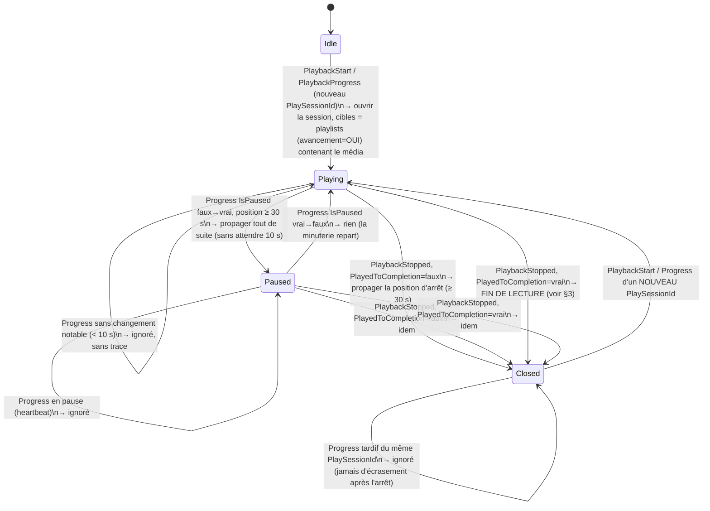

# Maquette de conception — synchronisation continue de l'avancement

<!--
  composant : plugin (flux avancement : PlaybackSessionListener → PlaybackPositionEngine)
  feature   : v1.2.1 — BUGFIX : avancement propagé à chaque PlaybackProgress (limité à 1 fois / 10 s), remise à 0 en fin de lecture
  version   : v1.2.1
  type      : conception
  issue     : #58
  complete  : aucune (première maquette de conception de ce flux)
  remplace  : aucune
  Spécification : docs/chronogrammes.md R10, D9, D21 → nouvelle décision D23 ; S9, S9b, S9c, S9d, S9f, nouveau S9g
-->

## 1. Machine d'états d'une session de lecture du déclencheur (clé = utilisateur, média ; PlaySessionId mémorisé)



## 2. Chronogramme — lecture continue sans pause (le cas du bug)

```mermaid
sequenceDiagram
    participant U1 as U1 (déclencheur)
    participant S as Emby SessionManager
    participant P as Plugin (flux avancement)
    participant U2 as U2 (membre)
    U1->>S: lecture de F1 (100 min), pas de pause
    loop toutes les ~10 s (rapports du client)
        S->>P: PlaybackProgress(U1, F1, pos, IsPaused=faux)
        P->>P: ≥ 30 s ? ≥ 10 s depuis la dernière écriture ?
        P->>U2: SetPosition(pos) (PluginWriteTracker + verrou (U2, F1))
    end
    Note over U2: U2 suit l'avancement de U1 en continu (au plus 10 s de retard)
    U1->>S: fin du média
    S->>S: Emby : U1 Played=vrai, position U1 = 0 (UserDataSaved PlaybackFinished)
    S-->>P: flux du lu (UserDataSaved) : si propager-lu=OUI → U2 lu ; si remove-si-lu=OUI → F1 retiré
    S->>P: PlaybackStopped(U1, F1, PlayedToCompletion=vrai)
    P->>P: cibles = playlists mémorisées à l'ouverture (même si F1 a été retiré entre-temps)
    alt propager-lu=OUI sur la playlist
        P->>U2: SetPosition(0) — reflet du comportement natif d'Emby (média lu = plus de point de reprise)
    else propager-lu=NON
        P->>U2: SetPosition(position d'arrêt) — comportement S9f inchangé (« Reprendre à 99 % »)
    end
```

## 3. Règle de fin de lecture (PlayedToCompletion=vrai)

| propager-avancement | propager-lu | Position écrite chez les membres | Seuil 30 s |
|---|---|---|---|
| NON | * | rien | — |
| OUI | OUI | **0** (plus de point de reprise, comme chez le déclencheur) | non appliqué |
| OUI | NON | position d'arrêt brute (S9f v1.2.0 inchangé) | appliqué |

## 4. Paramètres (constantes, pas de configuration)

| Paramètre | Valeur | Rôle |
|---|---|---|
| Intervalle minimal entre deux propagations d'un même couple (déclencheur, média) | 10 s | évite de surcharger les écritures et les verrous |
| Seuil de position absolue | 30 s (inchangé) | ignore le Progress à 0 du démarrage |
| Délai d'attente des verrous sur un Progress | 250 ms | ne jamais bloquer le pipeline de progression d'Emby ; verrou occupé = ignoré sans trace (le suivant réessaie) |
| Délai d'attente des verrous sur Pause/Stop/fin | 5 s (inchangé) | événements discrets |
